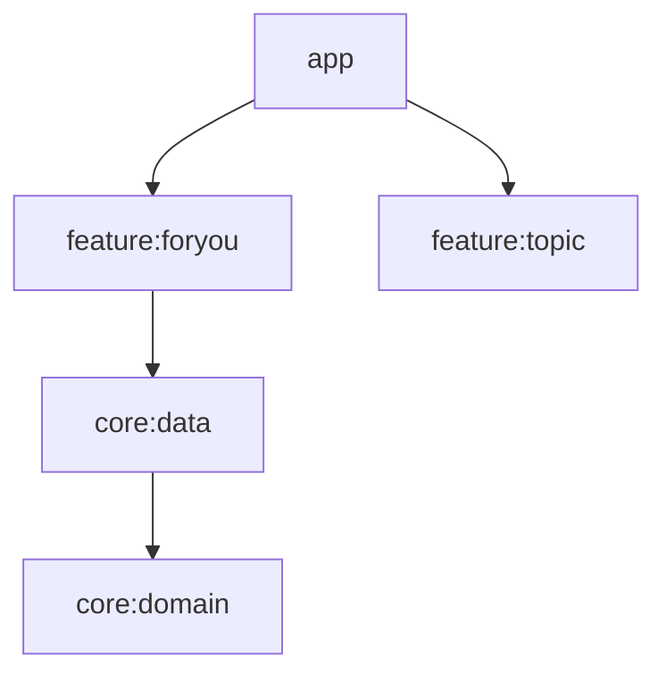
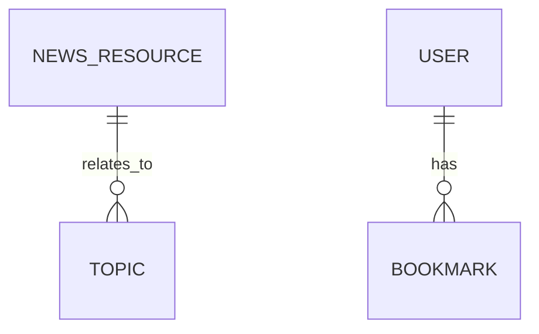
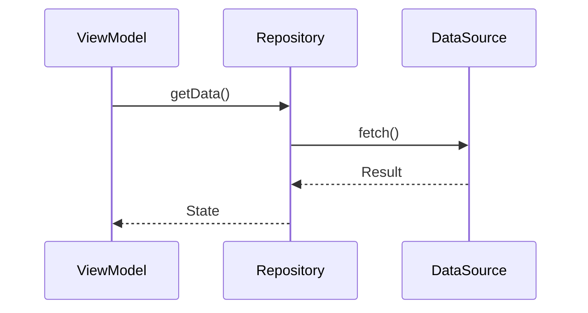
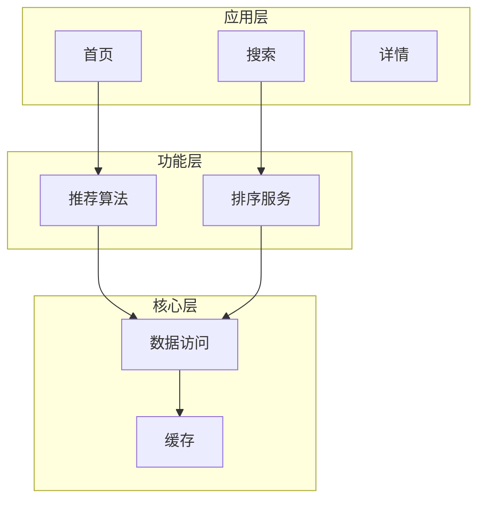
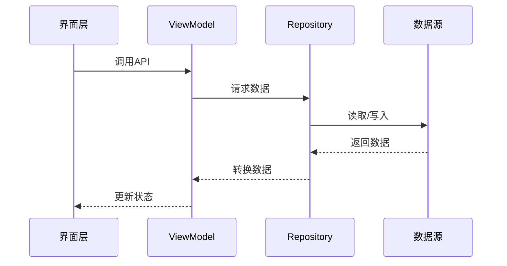
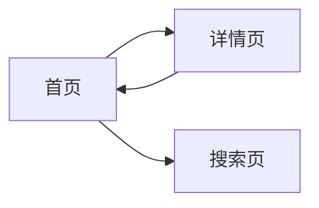

# 项目架构逆向工程

> TL;DR - 快速执行：检测项目类型 → 扫描模块 → 生成文档 → 确认结果

## 概述

本 skill 对项目架构进行全面的逆向工程，帮助新团队成员快速理解项目结构，使 AI Agent 能够高效分析代码库。

**核心能力**：自动检测项目类型 | 提取模块依赖 | 检测循环依赖 | 生成可视化文档 | 分析页面导航 | 增量更新 | 人工更正

**详细配置**：`references/` 目录（项目类型检测、特定章节、详细模板）
- references/quick-ref.md：快速参考卡片（常用检测命令、编译目标速查）

## 执行预估

| 项目规模 | 模块数量 | 预计耗时 | 说明 |
|----------|----------|----------|------|
| 小型 | ≤5 | 1-2分钟 | 快速扫描 |
| 中型 | 6-20 | 3-5分钟 | 标准分析 |
| 大型 | 21-50 | 5-10分钟 | 分批处理 |
| 超大 | >50 | >10分钟 | 拆分为多个模块分别分析 |

**提示**：大型项目建议分批处理，每批≤20个模块

## 何时使用

### 推荐场景
| 场景 | 使用 | 说明 |
|------|------|------|
| 分析项目结构 | ✅ | 快速了解项目整体架构 |
| 生成架构文档 | ✅ | 为团队提供项目文档 |
| 检测模块依赖 | ✅ | 识别循环依赖和优化机会 |
| 分析页面导航 | ✅ | 理解页面跳转关系 |
| 新人入职 | ✅ | 帮助新成员快速上手 |
| AI Agent 分析 | ✅ | 辅助 AI 理解代码库 |
| 项目重构前 | ✅ | 评估重构影响范围 |

### 不适用场景
| 场景 | 使用 |
|------|------|
| 代码编写/重构 | ❌ | 不负责实际编码 |
| Bug 修复 | ❌ | 不处理代码问题 |

### 典型使用示例
1. **新人入职**："帮我分析一下这个项目的结构，我是新来的"
2. **文档更新**："这个项目已经有架构文档了，帮我更新一下"
3. **架构评审**："帮我检查一下项目中是否有循环依赖"
4. **专项分析**："帮我分析这个Android项目的模块依赖关系"

## 文档输出

| 类型 | 路径 | 命名 |
|------|------|------|
| 根文档 | `docs/` | `{项目名称}项目架构文档.md` |
| 模块文档 | `<模块>/docs/` | `{模块名称}模块架构.md` |

**示例**：nowinandroid → `docs/nowinandroid项目架构文档.md`

**输出文件结构**：
```
{项目根目录}/
├── docs/
│   └── {项目名称}项目架构文档.md    # 根文档（21章）
├── {模块A}/
│   └── docs/
│       └── {模块A名称}模块架构.md  # 模块文档（11章）
├── {模块B}/
│   └── docs/
│       └── {模块B名称}模块架构.md
└── ...
```

## 章节速查

### 根文档（21章）

| # | 章节 | 格式 |
|---|------|------|
| 1 | 文档修订历史 | 表格 |
| 2 | 项目架构概览 | 文本 |
| 3 | 项目简介 | 文本 |
| 4 | 术语与缩略语 | 表格 |
| 5 | 技术栈 | 表格 |
| 6 | 模块依赖关系图 | Mermaid graph TD |
| 7 | 依赖关系分析 | 文本 + 表格 |
| 8 | 模块简略介绍 | 表格 |
| 9 | 主要组件功能介绍 | 文本 + 表格 |
| 10 | 主页面架构 | Mermaid flowchart |
| 11 | 页面跳转详情 | 表格 |
| 12 | **主要业务流程图** | Mermaid flowchart + 时序图 |
| 13 | 数据库设计 | Mermaid erDiagram + 表格（含外键/索引） |
| 14 | 核心数据类关系图 | Mermaid classDiagram |
| 15 | 架构决策记录(ADR) | 文本 |
| 16 | 接口设计 | 表格 |
| 17 | 部署与运维方案 | 文本 |
| 18 | 安全设计 | 文本 |
| 19 | 风险与应对措施 | 表格 |
| 20 | 模块文档索引 | Markdown链接 |
| 21 | 项目编译指南 | 表格 + 文本 |

### 模块文档（11章）

| # | 章节 | 格式 |
|---|------|------|
| 1 | 模块概述 | 文本 |
| 2 | 依赖关系 | 表格 |
| 3 | 业务流程 | Mermaid flowchart |
| 4 | 数据流 | Mermaid sequenceDiagram |
| 5 | **核心功能流程图** | Mermaid flowchart + 时序图 |
| 6 | 数据依赖关系 | 表格 |
| 7 | 依赖场景说明 | 表格 |
| 8 | 页面与路由 | 表格 |
| 9 | 导航调用示例 | 代码块 |
| 10 | 关键类和方法 | 表格 |
| 11 | 测试策略 | 文本 |

## 分析流程

> ⚠️ **必须按顺序执行检查点 0 → 1 → 2**

### 📋 检查点 0：增量检测（必须）

**输入**：工作目录
**输出**：执行策略 + 检测报告

```
1. 扫描 docs/*.项目架构文档.md → 识别根文档
2. 扫描 */docs/*模块架构.md → 识别模块文档
3. 比对生成策略：
   ┌────────────────────────────────────────┐
   │ [A] 全量生成：docs/ + 所有模块docs/ 均不存在
   │ [B] 补充生成：根文档存在，模块文档部分缺失
   │ [C] 增量更新：根文档 + 所有模块文档均存在
   │ [D] 重建根文档：根文档不存在，模块文档存在
   └────────────────────────────────────────┘
4. 输出：检测报告（存在/缺失列表 + 策略）
```

### 🔍 检查点 1：项目类型确认（必须）

```
1. 文件签名检测：
   ┌────────────────────────────────────────┐
   │ Android：build.gradle + AndroidManifest.xml
   │ iOS：.xcworkspace / .swift 文件
   │ Java后端：pom.xml + Spring Boot
   │ Vue.js：package.json + .vue
   │ React：package.json + .jsx/.tsx
   │ Flutter：pubspec.yaml
   │ Node.js：package.json + server.js
   │ HarmonyOS：hvigorfile.ts + oh-package.json5
   └────────────────────────────────────────┘
2. 加载配置：references/project-types-config.md
   - 项目类型检测配置
   - 特定章节配置
   - 分析流程配置
   - 编译指南配置（包含各项目类型的编译目标、用途和命令）
3. 确认范围：全部模块 / 指定模块 → 用户确认
```

### 项目扫描

```
1. 扫描目录（深度≤5）
2. 解析构建文件：
   ┌────────────────────────────────────────┐
   │ Android：settings.gradle.kts → include列表
   │ iOS：Podfile / Package.swift
   │ Java：pom.xml / build.gradle
   │ 前端：package.json → dependencies
   └────────────────────────────────────────┘
3. 提取依赖 → 输出依赖矩阵表格
4. 循环依赖检测：
   ┌────────────────────────────────────────┐
   │ Android：./gradlew dependencyInsight
   │ iOS：SPM/CocoaPods
   │ 前端：ES Module 分析
   └────────────────────────────────────────┘
5. 导航分析：
   ┌────────────────────────────────────────┐
   │ Android：nav*.xml, NavHost, navigate()
   │ iOS：UINavigationController, SwiftUI
   │ Vue：router/index.ts, useRouter()
   │ React：App.tsx, react-router, Link
   └────────────────────────────────────────┘
6. 生成图表（Mermaid）
7. 加载模板：references/{项目类型}-template.md
```

### 文档生成

```
【全量生成 A】
  1. mkdir docs/
  2. 生成根文档（20章 + 项目类型特定章节）
  3. mkdir {模块}/docs/ × N
  4. 生成所有模块文档（10章）

【补充生成 B】
  1. 读取现有根文档
  2. 生成缺失的模块文档
  3. 更新根文档（8、19、20章）

【增量更新 C】
  1. 对比代码 vs 文档时间戳
  2. 只更新变化的模块文档
  3. 更新根文档相关章节（包含第20章编译指南）

【重建根文档 D】
  1. 基于已有模块文档重建根文档
  2. 补充缺失的 8、10、11、19、20 章

最后：检查根文档完整性 → 补充缺失章节
```

### ✅ 检查点 2：结果确认（必须）

**输入**：生成的架构文档摘要
**输出**：用户确认或修改请求

**确认问题清单**：
```
┌─────────────────────────────────────────────────────────────┐
│ 文档完整性检查                                             │
├─────────────────────────────────────────────────────────────┤
│ [ ] 根文档（21章）是否完整？                               │
│ [ ] 所有模块文档是否已生成？                               │
│ [ ] 模块文档索引（第20章）是否正确链接？                   │
├─────────────────────────────────────────────────────────────┤
│ 内容准确性检查                                             │
├─────────────────────────────────────────────────────────────┤
│ [ ] 模块依赖关系是否正确？                                 │
│ [ ] 技术栈信息是否准确？                                   │
│ [ ] 数据库设计（含外键/索引）是否完整？                    │
├─────────────────────────────────────────────────────────────┤
│ 可视化检查                                                 │
├─────────────────────────────────────────────────────────────┤
│ [ ] Mermaid图表是否可读？                                 │
│ [ ] 页面导航流程图是否清晰？                               │
│ [ ] 业务流程图是否完整？                                   │
└─────────────────────────────────────────────────────────────┘
```

**确认方式**：
- 完全满足：回复 `{"确认": "满足需求"}`
- 需要修改：回复具体问题，如 `{"修改": {"章节": "第7章", "问题": "依赖关系图缺少XX模块"}}`
- 进入人工更正：回复 `{"更正": "需要人工审核"}`

### 🔧 检查点 3：人工更正（可选）

```
1. 展示文档
2. 收集反馈：
   - [章节X] 的 [内容] → [新内容]
   - [图表Y] 调整 [修改点]
   - [模块Z] 描述 → [正确描述]
3. 执行更正
4. 重复直到满意
```

## Mermaid 规范

### 模块依赖图


### 数据库ER图


### 数据流图


### 业务流程图


### 核心功能时序图


### 导航流程图


| 图表 | 语法 | 节点格式 |
|------|------|----------|
| 依赖图 | `graph TD/LR` | `A[名称] --> B[名称]` |
| 业务流程图 | `flowchart TB/SUB` | `A[名称] --> B[名称]` + `subgraph` |
| 时序图 | `sequenceDiagram` | `participant` + `->>` |
| ER图 | `erDiagram` | `T1 \|\|--o{ T2 : rel` |
| 流程图 | `flowchart LR/TB` | `A[名称] --> B[名称]` |

## 文档格式规范

### 根文档头部
```markdown
# {项目名称} 项目架构文档

## 1. 文档修订历史

| 版本 | 修订人 | 修订时间 | 修订内容 |
|------|--------|----------|----------|
| v1.0 | - | {日期} | 初始版本 |
```

### 模块文档头部
```markdown
# {模块名称} 模块架构

## 1. 模块概述

- **模块名称**：{模块名}
- **所在层级**：{App/Feature/Core层}
- **核心职责**：{一句话描述}
```

### 依赖表格
```markdown
| 依赖模块 | 说明 |
|----------|------|
| core:data | 数据访问层 |
| core:domain | 业务逻辑层 |
```

### 路由表格
```markdown
| 路由 | 参数 | 说明 |
|------|------|------|
| `forYou` | 无 | 为你推荐首页 |
| `topic/{topicId}` | topicId | 话题详情 |
```

### 导航调用示例
```kotlin
// 导航到详情页
navController.navigate("topic/${topicId}")

// 接收路由参数
val topicId: String = checkNotNull(savedStateHandle["topicId"])
```

### 数据库表格格式
```markdown
| 表名 | 字段名 | 类型 | 约束 | 外键 | 索引 | 说明 |
|------|--------|------|------|------|------|------|
| news_resource | id | INTEGER | PRIMARY KEY AUTOINCREMENT | - | ✅ | 主键 |
| news_resource | topic_id | INTEGER | NOT NULL | topic(id) | ✅ | 关联话题 |
```

### 外键关联关系
```markdown
| 父表 | 父字段 | 子表 | 子字段 | 关系类型 | 级联操作 |
|------|--------|------|--------|----------|----------|
| topic | id | news_resource | topic_id | 一对多 | CASCADE DELETE |
```

### 索引设计
```markdown
| 表名 | 索引名 | 字段 | 类型 | 说明 |
|------|--------|------|------|------|
| news_resource | idx_topic_id | topic_id | 普通索引 | 加速话题查询 |
| user | uk_email | email | 唯一索引 | 邮箱唯一约束 |
```

## 异常处理

| 场景 | 条件 | 处理 |
|------|------|------|
| 文件不可读 | 权限/不存在 | 跳过 + 警告 |
| 构建解析失败 | 格式损坏 | 目录结构推断 |
| 模块过多 | >50 | 分批（≤20/批） |
| 表过多 | >100 | 只主要表（≥3引用） |
| 非标准结构 | 无法识别 | 输出已扫描 + 询问 |
| 增量失败 | 文档损坏 | 备份 + 全量生成 |
| 导航缺失 | 无路由文件 | 跳过 + 警告 |
| 混合类型 | 多类型共存 | 列出 + 询问 |
| 空目录 | 只有配置 | 确认路径 |
| 循环依赖 | 检测到循环 | 输出矩阵 + 建议 |
| 网络失败 | 远程获取 | 本地缓存 + 提示 |
| 用户中断 | 放弃确认 | 暂停 + 等待 |
| 用户中断后恢复 | Ctrl+C / 超时 | 保留已扫描结果，下次跳过已处理 |

## 参考文档

| 文件 | 用途 |
|------|------|
| references/quick-ref.md | 快速参考卡片（检测命令速查、编译目标） |
| references/template.md | 通用模板 |
| references/project-types-config.md | 类型检测 + 特定章节 + 异常映射 |
| references/build-guide-*.md | 各项目类型编译指南（8个独立文件） |
| references/android-template.md | Android 详细模板 |
| references/ios-template.md | iOS 详细模板 |
| references/java-backend-template.md | Java 后端详细模板 |
| references/vue-template.md | Vue.js 详细模板 |
| references/react-template.md | React 详细模板 |
| references/flutter-template.md | Flutter 详细模板 |
| references/nodejs-template.md | Node.js 详细模板 |
| references/harmonyos-template.md | HarmonyOS Next 详细模板 |

## 工具与资源

### 资源使用原则
- ✅ 高效使用：按需加载，不预加载所有资源
- ✅ 路径安全：所有文件操作都经过安全校验
- ✅ 错误恢复：失败时自动降级到备选方案
- ✅ 用户确认：关键操作前必须获得用户确认
