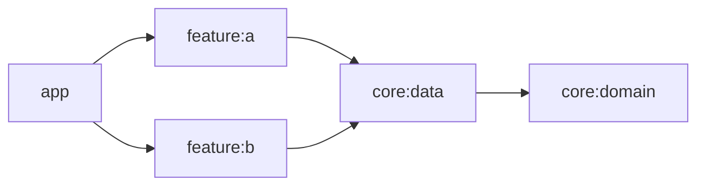
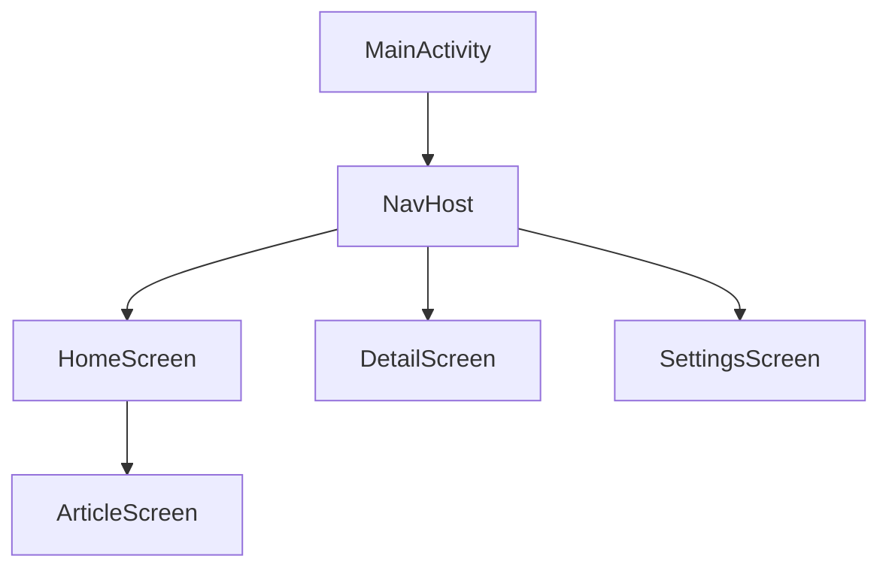
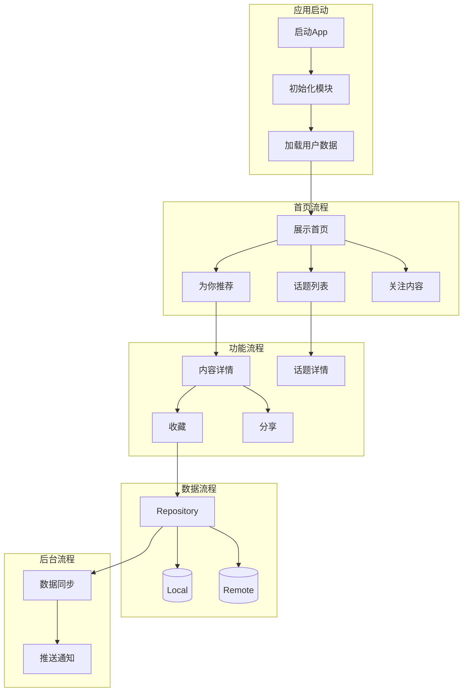
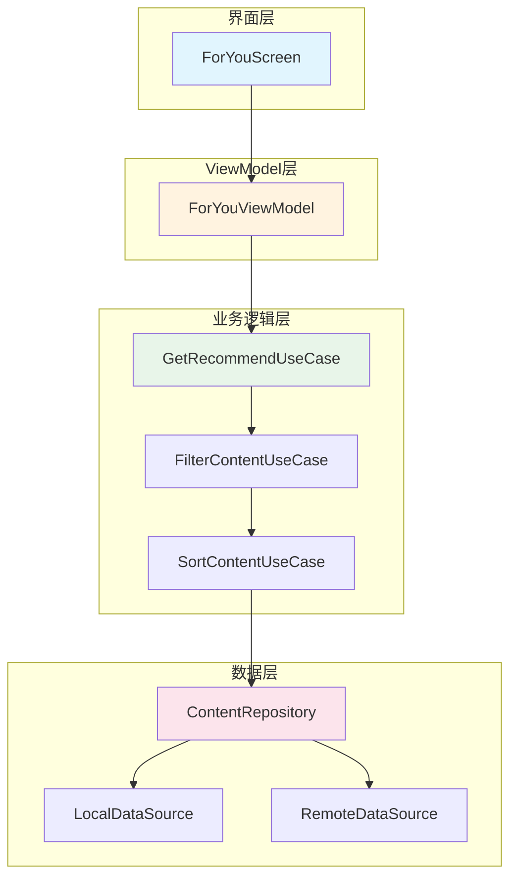
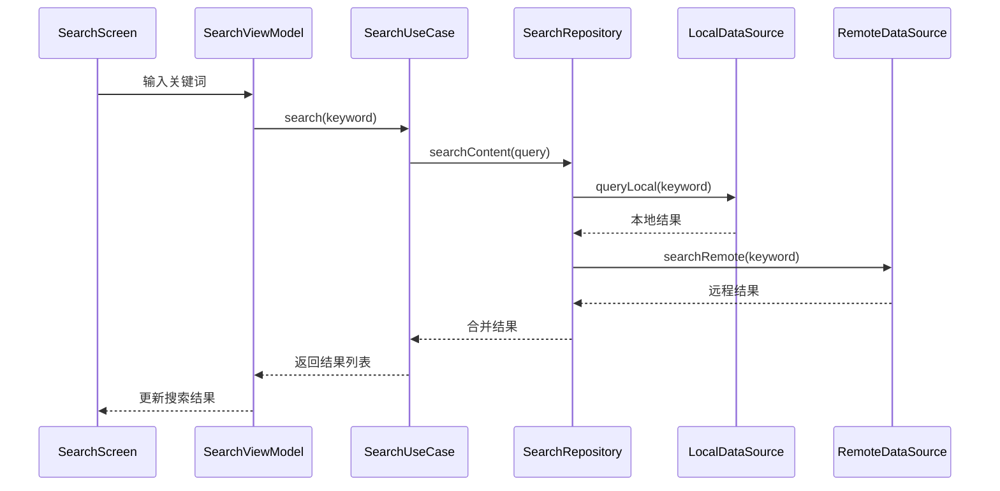

# Android 项目架构模板

本文档为 Android 项目提供详细的架构文档模板。

## Android 特定章节

### A1. 技术栈详情

| 类别 | 技术 | 版本 | 说明 |
|------|------|------|------|
| 编程语言 | Kotlin | 1.9.x | 主要开发语言 |
| UI 框架 | Jetpack Compose | BOM 2024.02 | 现代声明式 UI |
| 依赖注入 | Hilt | 2.50+ | Google 官方 DI 方案 |
| 数据库 | Room | 2.6.x | 本地持久化 |
| 网络 | Retrofit + OkHttp | 2.9.x / 4.12.x | 网络请求 |
| 状态管理 | ViewModel + StateFlow | - | 生命周期感知状态管理 |
| 导航 | Navigation Compose | 2.7.x | 声明式导航 |
| 异步 | Kotlin Coroutines + Flow | 1.7.x | 异步编程 |
| 构建 | Gradle (Kotlin DSL) | 8.x | 构建工具 |
| CI/CD | GitHub Actions | - | 持续集成 |

### A2. 架构模式

#### MVVM + Clean Architecture
```
┌─────────────────────────────────────────┐
│                 UI Layer                │
│  ┌─────────────┐  ┌─────────────────┐  │
│  │   Compose   │  │   ViewModel     │  │
│  │     UI      │  │   + StateFlow    │  │
│  └─────────────┘  └─────────────────┘  │
└─────────────────────────────────────────┘
                    │
┌─────────────────────────────────────────┐
│              Domain Layer              │
│  ┌─────────────┐  ┌─────────────────┐  │
│  │  Use Cases  │  │    Repository   │  │
│  │             │  │    Interface    │  │
│  └─────────────┘  └─────────────────┘  │
└─────────────────────────────────────────┘
                    │
┌─────────────────────────────────────────┐
│               Data Layer                │
│  ┌─────────────┐  ┌─────────────────┐  │
│  │  Repository │  │   Data Sources │  │
│  │   Impl      │  │ (Local/Remote)  │  │
│  └─────────────┘  └─────────────────┘  │
└─────────────────────────────────────────┘
```

### A3. 模块分类

| 层级 | 模块 | 职责 |
|------|------|------|
| 应用层 | app | 应用入口、Activity、Application |
| 功能层 | feature:* | 独立功能模块（feature:authors, feature:settings 等） |
| 核心层 | core:* | 共享基础设施（core:data, core:domain, core:network 等） |
| 构建逻辑 | build-logic | Gradle 插件和构建变体配置 |

### A4. 循环依赖检测

使用 Gradle 命令检测循环依赖：
```bash
./gradlew dependencyInsight --configuration runtimeClasspath --dependency <module-name>
```

#### 检测结果记录
{记录检测结果：无循环依赖 / 存在循环依赖}

#### 循环依赖矩阵


### A5. Room 数据库设计

#### 实体定义
```kotlin
@Entity(
    tableName = "news_resource",
    foreignKeys = [
        ForeignKey(
            entity = TopicEntity::class,
            parentColumns = ["id"],
            childColumns = ["topic_id"],
            onDelete = ForeignKey.CASCADE
        )
    ],
    indices = [Index(value = ["topic_id"])]
)
data class NewsResourceEntity(
    @PrimaryKey val id: Long,
    val title: String,
    @ColumnInfo(name = "topic_id") val topicId: Long
)
```

#### DAO 接口
```kotlin
@Dao
interface NewsResourceDao {
    @Query("SELECT * FROM news_resource")
    fun getAll(): Flow<List<NewsResourceEntity>>
    
    @Query("SELECT * FROM news_resource WHERE topic_id = :topicId")
    fun getByTopic(topicId: Long): Flow<List<NewsResourceEntity>>
}
```

#### 数据表结构

| 表名 | 字段名 | 类型 | 约束 | 外键 | 索引 | 说明 |
|------|--------|------|------|------|------|------|
| news_resource | id | LONG | PRIMARY KEY | - | ✅ | 主键 |
| news_resource | title | TEXT | NOT NULL | - | - | 标题 |
| news_resource | topic_id | LONG | NOT NULL | topic(id) | ✅ | 关联话题ID |
| topic | id | LONG | PRIMARY KEY | - | ✅ | 主键 |
| topic | name | TEXT | NOT NULL | - | - | 话题名称 |

#### 外键关联关系

| 父表 | 父字段 | 子表 | 子字段 | 关系类型 | 级联操作 |
|------|--------|------|--------|----------|----------|
| topic | id | news_resource | topic_id | 一对多 | CASCADE DELETE |

#### 索引设计

| 表名 | 索引名 | 字段 | 类型 | 说明 |
|------|--------|------|------|------|
| news_resource | idx_topic_id | topic_id | 普通索引 | 加速话题查询 |
| user | uk_email | email | 唯一索引 | 邮箱唯一约束 |

### A6. Hilt 依赖注入

#### 模块示例
```kotlin
@Module
@InstallIn(SingletonComponent::class)
object NetworkModule {
    @Provides
    @Singleton
    fun provideOkHttpClient(): OkHttpClient = ...
}
```

### A7. Navigation 结构



### A8. 依赖优化建议

{基于依赖分析结果的优化建议}

### A9. 主要业务流程图

#### 12.1 项目整体业务流程



#### 12.2 核心功能模块流程

##### 推荐流程（以 feature:foryou 为例）



##### 搜索流程（以 feature:search 为例）



#### 12.3 业务流程说明

| 流程名称 | 涉及模块 | 核心类/方法 | 功能描述 |
|----------|----------|-------------|----------|
| 应用启动 | app | Application.onCreate() | 初始化 Hilt、全局配置 |
| 首页加载 | feature:foryou | ForYouViewModel.load() | 获取推荐内容列表 |
| 内容详情 | feature:foryou | DetailScreen | 展示文章/视频详情 |
| 话题浏览 | feature:topic | TopicViewModel | 话题内容分页加载 |
| 搜索功能 | feature:search | SearchUseCase | 本地+远程联合搜索 |
| 收藏功能 | feature:bookmarks | BookmarkRepository | 数据的本地持久化 |
| 数据同步 | core:data | SyncManager | 离线数据与服务器同步 |

## 标准章节参考

详见 [template.md](./template.md) 中的标准章节结构。
