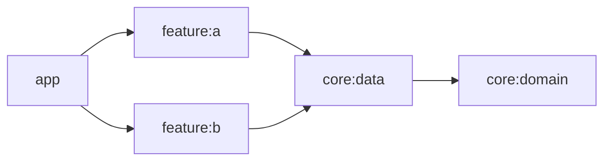
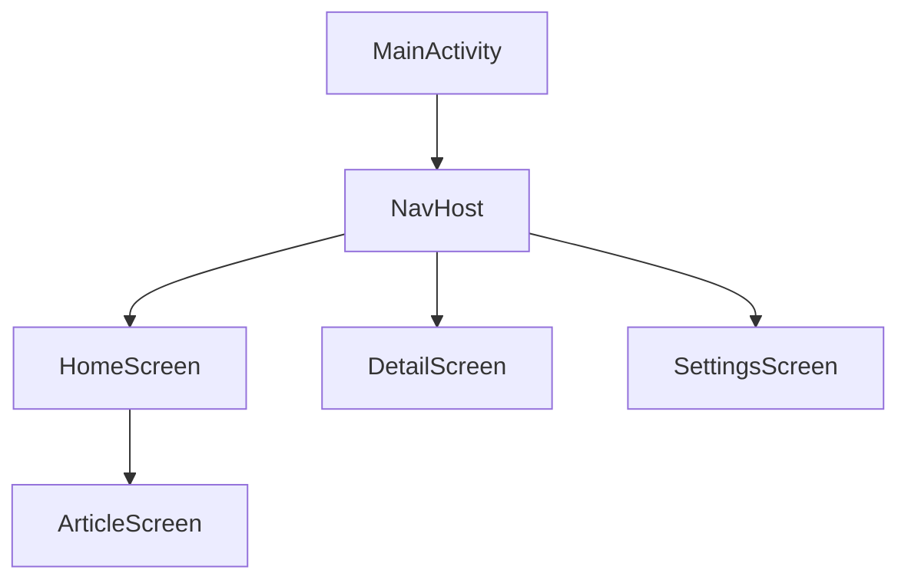
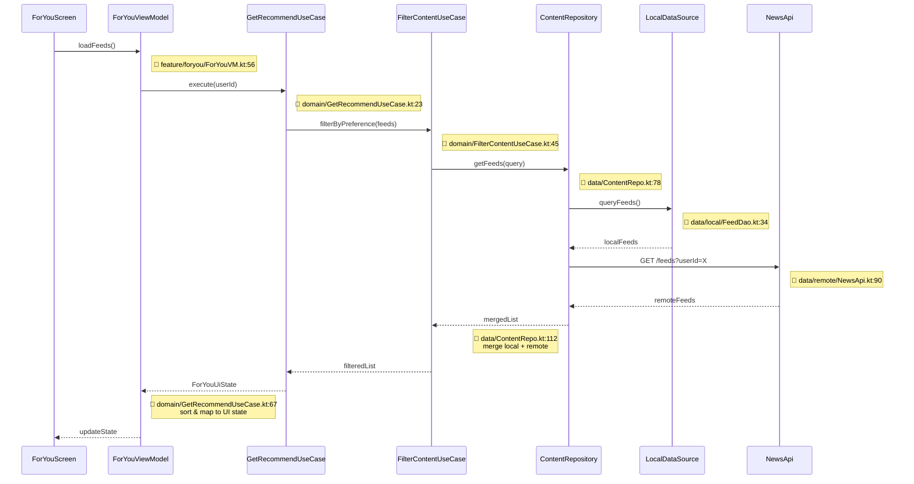
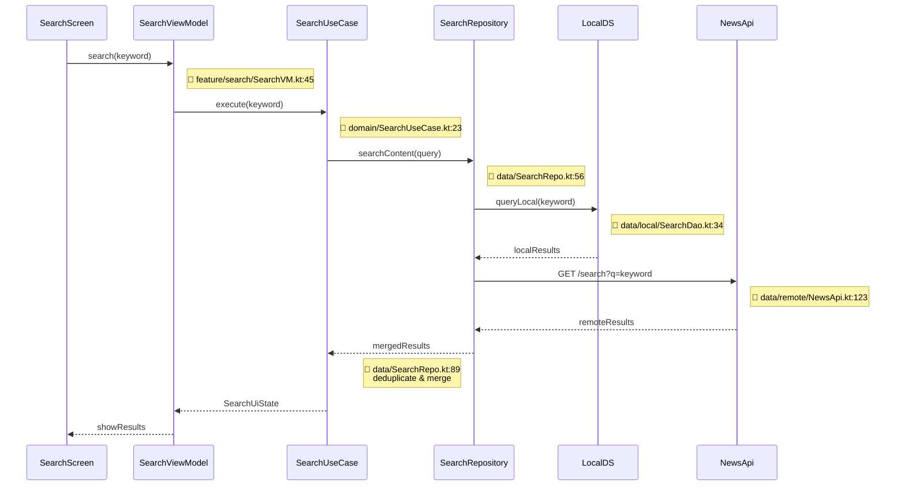
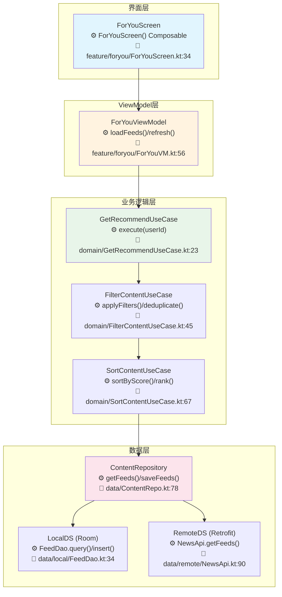
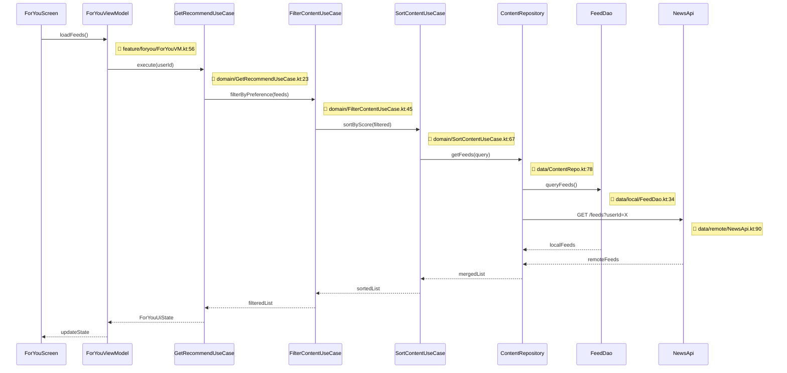

# Android 项目架构模板

本文档为 Android 项目提供详细的架构文档模板。

## Android 特定章节

### A1. 技术栈详情

| 类别 | 技术 | 版本 | 说明 |
|------|------|------|------|
| 编程语言 | Kotlin | 1.9.x | 主要开发语言 |
| UI 框架 | Jetpack Compose | BOM 2024.02 | 现代声明式 UI |
| 依赖注入 | Hilt | 2.50+ | Google 官方 DI 方案 |
| 数据库 | Room | 2.6.x | 本地持久化 |
| 网络 | Retrofit + OkHttp | 2.9.x / 4.12.x | 网络请求 |
| 状态管理 | ViewModel + StateFlow | - | 生命周期感知状态管理 |
| 导航 | Navigation Compose | 2.7.x | 声明式导航 |
| 异步 | Kotlin Coroutines + Flow | 1.7.x | 异步编程 |
| 构建 | Gradle (Kotlin DSL) | 8.x | 构建工具 |
| CI/CD | GitHub Actions | - | 持续集成 |

### A2. 架构模式

#### MVVM + Clean Architecture
```
┌─────────────────────────────────────────┐
│                 UI Layer                │
│  ┌─────────────┐  ┌─────────────────┐  │
│  │   Compose   │  │   ViewModel     │  │
│  │     UI      │  │   + StateFlow    │  │
│  └─────────────┘  └─────────────────┘  │
└─────────────────────────────────────────┘
                    │
┌─────────────────────────────────────────┐
│              Domain Layer              │
│  ┌─────────────┐  ┌─────────────────┐  │
│  │  Use Cases  │  │    Repository   │  │
│  │             │  │    Interface    │  │
│  └─────────────┘  └─────────────────┘  │
└─────────────────────────────────────────┘
                    │
┌─────────────────────────────────────────┐
│               Data Layer                │
│  ┌─────────────┐  ┌─────────────────┐  │
│  │  Repository │  │   Data Sources │  │
│  │   Impl      │  │ (Local/Remote)  │  │
│  └─────────────┘  └─────────────────┘  │
└─────────────────────────────────────────┘
```

### A3. 模块分类

| 层级 | 模块 | 职责 |
|------|------|------|
| 应用层 | app | 应用入口、Activity、Application |
| 功能层 | feature:* | 独立功能模块（feature:authors, feature:settings 等） |
| 核心层 | core:* | 共享基础设施（core:data, core:domain, core:network 等） |
| 构建逻辑 | build-logic | Gradle 插件和构建变体配置 |

### A4. 循环依赖检测

使用 Gradle 命令检测循环依赖：
```bash
./gradlew dependencyInsight --configuration runtimeClasspath --dependency <module-name>
```

#### 检测结果记录
{记录检测结果：无循环依赖 / 存在循环依赖}

#### 循环依赖矩阵


### A5. Room 数据库设计

#### 实体定义
```kotlin
@Entity(
    tableName = "news_resource",
    foreignKeys = [
        ForeignKey(
            entity = TopicEntity::class,
            parentColumns = ["id"],
            childColumns = ["topic_id"],
            onDelete = ForeignKey.CASCADE
        )
    ],
    indices = [Index(value = ["topic_id"])]
)
data class NewsResourceEntity(
    @PrimaryKey val id: Long,
    val title: String,
    @ColumnInfo(name = "topic_id") val topicId: Long
)
```

#### DAO 接口
```kotlin
@Dao
interface NewsResourceDao {
    @Query("SELECT * FROM news_resource")
    fun getAll(): Flow<List<NewsResourceEntity>>
    
    @Query("SELECT * FROM news_resource WHERE topic_id = :topicId")
    fun getByTopic(topicId: Long): Flow<List<NewsResourceEntity>>
}
```

#### 数据表结构

| 表名 | 字段名 | 类型 | 约束 | 外键 | 索引 | 说明 |
|------|--------|------|------|------|------|------|
| news_resource | id | LONG | PRIMARY KEY | - | ✅ | 主键 |
| news_resource | title | TEXT | NOT NULL | - | - | 标题 |
| news_resource | topic_id | LONG | NOT NULL | topic(id) | ✅ | 关联话题ID |
| topic | id | LONG | PRIMARY KEY | - | ✅ | 主键 |
| topic | name | TEXT | NOT NULL | - | - | 话题名称 |

#### 外键关联关系

| 父表 | 父字段 | 子表 | 子字段 | 关系类型 | 级联操作 |
|------|--------|------|--------|----------|----------|
| topic | id | news_resource | topic_id | 一对多 | CASCADE DELETE |

#### 索引设计

| 表名 | 索引名 | 字段 | 类型 | 说明 |
|------|--------|------|------|------|
| news_resource | idx_topic_id | topic_id | 普通索引 | 加速话题查询 |
| user | uk_email | email | 唯一索引 | 邮箱唯一约束 |

### A6. Hilt 依赖注入

#### 模块示例
```kotlin
@Module
@InstallIn(SingletonComponent::class)
object NetworkModule {
    @Provides
    @Singleton
    fun provideOkHttpClient(): OkHttpClient = OkHttpClient.Builder()
}
```

### A7. Navigation 结构



### A8. 依赖优化建议

{基于依赖分析结果的优化建议}

### A9. 主要业务流程图

> ⚠️ **每个节点必须标注方法名和代码位置（文件:行号）**

#### 12.1 项目整体业务流程

```mermaid
flowchart TB
    subgraph App[应用启动]
        LAUNCH[启动App<br/>⚙️ Application.onCreate()<br/>📁 NowInAndroidApp.kt:45]
        INIT[初始化模块<br/>⚙️ HiltApplication.triggerInit()<br/>📁 core/HiltHelper.kt:23]
        LOAD[加载用户数据<br/>⚙️ UserRepo.getCurrentUser()<br/>📁 data/UserRepo.kt:89]
        LAUNCH --> INIT
        INIT --> LOAD
    end

    subgraph HomeFlow[首页流程]
        LOAD --> HOME[展示首页<br/>⚙️ MainActivity.onCreate()<br/>📁 ui/MainActivity.kt:67]
        HOME --> FORYOU[为你推荐<br/>⚙️ ForYouViewModel.loadFeeds()<br/>📁 feature/foryou/ForYouVM.kt:56]
        HOME --> TOPIC[话题列表<br/>⚙️ TopicViewModel.loadTopics()<br/>📁 feature/topic/TopicVM.kt:45]
        HOME --> INTEREST[关注内容<br/>⚙️ InterestVM.loadFollowed()<br/>📁 feature/interest/InterestVM.kt:34]
    end

    subgraph FeatureFlow[功能流程]
        FORYOU --> DETAIL[内容详情<br/>⚙️ NewsDetailScreen.render()<br/>📁 ui/detail/NewsDetailScreen.kt:78]
        TOPIC --> TOPIC_DETAIL[话题详情<br/>⚙️ TopicDetailScreen.render()<br/>📁 ui/topic/TopicDetailScreen.kt:56]
        DETAIL --> BOOKMARK[收藏<br/>⚙️ BookmarkVM.toggleBookmark()<br/>📁 feature/bookmark/BookmarkVM.kt:89]
        DETAIL --> SHARE[分享<br/>⚙️ ShareUtil.shareNews()<br/>📁 util/ShareUtil.kt:34]
    end

    subgraph DataFlow[数据流程]
        BOOKMARK --> REPO[Repository<br/>⚙️ NewsRepo.saveBookmark()<br/>📁 data/NewsRepo.kt:112]
        REPO --> LOCAL[(Room DB<br/>⚙️ BookmarkDao.insert()<br/>📁 data/local/BookmarkDao.kt:45)]
        REPO --> REMOTE[(Remote API<br/>⚙️ NewsApi.bookmark()<br/>📁 data/remote/NewsApi.kt:78)]
    end

    subgraph Background[后台流程]
        REPO --> SYNC[数据同步<br/>⚙️ SyncManager.startSync()<br/>📁 core/SyncManager.kt:56]
        SYNC --> NOTIFY[推送通知<br/>⚙️ FcmService.onMessageReceived()<br/>📁 service/FcmService.kt:34]
    end
```

##### 12.1.1 业务流程步骤详解 ★

| 步骤编号 | 步骤名称 | 核心方法/API | 输入参数 | 返回结果 | 代码位置 | 说明 |
|----------|----------|-------------|----------|----------|----------|------|
| 1 | 启动App | `Application.onCreate()` | - | `void` | `NowInAndroidApp.kt:45` | 初始化 Hilt DI、全局配置 |
| 2 | 初始化模块 | `HiltApplication.triggerInit()` | `Application` | `void` | `core/HiltHelper.kt:23` | 懒加载初始化所有模块 |
| 3 | 加载用户数据 | `UserRepo.getCurrentUser()` | - | `Flow<User?>` | `data/UserRepo.kt:89` | 从本地/缓存获取当前用户 |
| 4 | 展示首页 | `MainActivity.onCreate(Bundle?)` | `savedInstanceState` | `void` | `ui/MainActivity.kt:67` | setContent 组合 Compose UI |
| 5 | 为你推荐 | `ForYouVM.loadFeeds()` | - | → `ForYouUiState` | `feature/foryou/ForYouVM.kt:56` | 加载推荐内容流 |
| 6 | 话题列表 | `TopicVM.loadTopics()` | - | → `TopicsUiState` | `feature/topic/TopicVM.kt:45` | 加载话题列表 |
| 7 | 关注内容 | `InterestVM.loadFollowed()` | - | → `InterestUiState` | `feature/interest/InterestVM.kt:34` | 加载关注用户内容 |
| 8 | 内容详情 | `NewsDetailScreen.render()` | `newsId: String` | `@Composable` | `ui/detail/NewsDetailScreen.kt:78` | 展示文章/视频详情 |
| 9 | 收藏 | `BookmarkVM.toggleBookmark(News)` | `news: NewsResource` | `Unit` | `feature/bookmark/BookmarkVM.kt:89` | 切换收藏状态 |
| 10 | 分享 | `ShareUtil.shareNews(News)` | `news: NewsResource` | `Unit` | `util/ShareUtil.kt:34` | 调用系统分享 Intent |
| 11 | 数据同步 | `SyncManager.startSync()` | - | `Job` | `core/SyncManager.kt:56` | WorkManager 定时后台同步 |
| 12 | 推送通知 | `FcmService.onMessageReceived()` | `RemoteMessage` | `Unit` | `service/FcmService.kt:34` | 处理 FCM 推送消息 |

##### 12.1.2 关键步骤代码示例

###### 步骤 5：为你推荐数据加载

```kotlin
// 📁 feature/foryou/ForYouVM.kt:56
fun loadFeeds() {
    viewModelScope.launch {
        _uiState.update { it.copy(isLoading = true) }                 // L58
        getRecommendUseCase.execute(currentUserId)                     // L60 → GetRecommendUseCase
            .combine(filterContentUseCase.filterByPreference())       // L61 → FilterContentUseCase
            .collect { result ->
                _uiState.update { it.copy(                            // L63
                    feeds = result,
                    isLoading = false
                )}
            }
    }
}
```

###### 步骤 9：收藏功能 — Repository 层

```kotlin
// 📁 data/NewsRepo.kt:112
suspend fun saveBookmark(news: NewsResource) {
    withContext(ioDispatcher) {
        bookmarkDao.insert(news.toBookmarkEntity())                  // L115: Room 本地写入
    }
    newsApi.bookmark(news.id)                                         // L117: Retrofit API 远程同步
}
```

#### 12.2 核心功能模块流程（时序图）★

##### 推荐流程（以 feature:foryou 为例）



**步骤详解**：

| 步骤 | 调用者 | 被调用者 | 方法签名 | 参数 | 返回 | 代码位置 | 说明 |
|------|--------|----------|----------|------|------|----------|------|
| 1 | ForYouScreen | ForYouViewModel | `loadFeeds()` | - | `Unit` | `feature/foryou/ForYouVM.kt:56` | 页面可见时触发加载 |
| 2 | ForYouViewModel | GetRecommendUseCase | `execute(String userId)` | `userId`: 当前用户ID | `Flow<ForYouUiState>` | `domain/GetRecommendUseCase.kt:23` | 编排推荐流程 |
| 3 | GetRecommendUseCase | FilterContentUseCase | `filterByPreference(List feeds)` | `feeds`: 原始内容列表 | `List<FilteredFeed>` | `domain/FilterContentUseCase.kt:45` | 按偏好过滤 |
| 4 | FilterContentUseCase | ContentRepository | `getFeeds(FeedQuery)` | `query`: 查询参数 | `List<FeedEntity>` | `data/ContentRepo.kt:78` | 获取内容数据 |
| 5 | ContentRepository | LocalDataSource | `queryFeeds()` | - | `List<FeedEntity>` | `data/local/FeedDao.kt:34` | Room 本地查询 |
| 6 | ContentRepository | NewsApi | `GET /feeds?userId=X` | `userId`: 用户ID | `List<FeedDTO>` | `data/remote/NewsApi.kt:90` | Retrofit 远程请求 |
| 7 | ContentRepository | (合并) | `merge local + remote` | - | `List<FeedEntity>` | `data/ContentRepo.kt:112` | 本地优先去重合并 |
| 8 | FilterContentUseCase | (过滤) | 业务过滤 | - | `List<FilteredFeed>` | `domain/FilterContentUseCase.kt:67` | 去重+偏好排序 |
| 9 | GetRecommendUseCase | (映射) | `sort & map to UI state` | - | `ForYouUiState` | `domain/GetRecommendUseCase.kt:67` | Entity→UiState |

**关键代码示例**：

```kotlin
// 📁 domain/GetRecommendUseCase.kt:23 - 推荐编排
operator fun invoke(userId: String): Flow<ForYouUiState> = flow {
    emit(ForYouUiState.Loading)
    val remote = newsApi.getFeeds(userId)                        // L26: 远程获取
    val local = feedDao.queryFeeds()                              // L27: 本地缓存
    val merged = (remote + local).distinctBy { it.id }            // L29: 去重合并
    val filtered = filterContentUseCase.filterByPreference(merged)// L30: 偏好过滤
    emit(ForYouUiState.Success(filtered))                         // L32: 发射成功状态
}.catch { e ->
    emit(ForYouUiState.Error(e))
}
```

##### 搜索流程（以 feature:search 为例）



**步骤详解**：

| 步骤 | 调用者 | 被调用者 | 方法签名 | 参数 | 返回 | 代码位置 | 说明 |
|------|--------|----------|----------|------|------|----------|------|
| 1 | SearchScreen | SearchViewModel | `search(String keyword)` | `keyword`: 搜索词 | `Unit` | `feature/search/SearchVM.kt:45` | 用户输入触发搜索 |
| 2 | SearchViewModel | SearchUseCase | `execute(String keyword)` | `keyword`: 搜索词 | `Flow<SearchUiState>` | `domain/SearchUseCase.kt:23` | 搜索编排 |
| 3 | SearchUseCase | SearchRepository | `searchContent(String query)` | `query`: 查询字符串 | `List<SearchResult>` | `data/SearchRepo.kt:56` | 数据检索 |
| 4 | SearchRepository | LocalDataSource | `queryLocal(String keyword)` | `keyword`: 关键词 | `List<SearchResult>` | `data/local/SearchDao.kt:34` | Room FTS 全文搜索 |
| 5 | SearchRepository | NewsApi | `GET /search?q={keyword}` | `q`: 搜索关键词 | `SearchResponse` | `data/remote/NewsApi.kt:123` | Retrofit GET 请求 |
| 6 | SearchRepository | (合并) | `deduplicate & merge` | - | `List<SearchResult>` | `data/SearchRepo.kt:89` | 本地+远程去重合并 |

**关键代码示例**：

```kotlin
// 📁 data/SearchRepo.kt:89 - 搜索合并去重
suspend fun searchContent(query: String): List<SearchResult> {
    val local = withContext(ioDispatcher) {
        searchDao.queryLocal(query)                              // L93: Room FTS 查询
    }
    val remote = try {
        newsApi.search(query)                                    // L96: Retrofit API
    } catch (e: Exception) {
        emptyList()                                              // L98: 远程失败兜底
    }
    return (local + remote).distinctBy { it.id }                 // L100: 按ID去重
}
```

#### 12.3 核心功能流程图（分层）★

##### 推荐功能分层流程



**配套时序图**（同 12.2.1 推荐流程时序图，此处展示分层流转）：



**步骤与API详解**：

| 步骤 | 组件 | 核心方法 | 参数类型 | 返回类型 | 代码位置 | 关键逻辑 |
|------|------|----------|----------|----------|----------|----------|
| 1 | ForYouScreen | `@Composable ForYouScreen()` | - | `@Composable` | `feature/foryou/ForYouScreen.kt:34` | Compose声明式渲染 |
| 2 | ForYouViewModel | `loadFeeds()` | - | `Unit` → `StateFlow<ForYouUiState>` | `feature/foryou/ForYouVM.kt:56` | viewModelScope启动协程加载 |
| 3 | GetRecommendUseCase | `execute(userId: String)` | `userId`: 用户ID | `Flow<ForYouUiState>` | `domain/GetRecommendUseCase.kt:23` | 推荐流程编排 |
| 4 | FilterContentUseCase | `filterByPreference(List)` | `List<FeedEntity>` | `List<FilteredFeed>` | `domain/FilterContentUseCase.kt:45` | 按用户偏好过滤+去重 |
| 5 | SortContentUseCase | `sortByScore(List)` | `List<FilteredFeed>` | `List<FilteredFeed>` | `domain/SortContentUseCase.kt:67` | 热度/时间排序 |
| 6 | ContentRepository | `getFeeds(FeedQuery)` | `FeedQuery` | `List<FeedEntity>` | `data/ContentRepo.kt:78` | 数据聚合入口 |
| 7 | FeedDao | `queryFeeds()` | - | `List<FeedEntity>` | `data/local/FeedDao.kt:34` | Room DAO 查询 |
| 8 | NewsApi | `GET /feeds?userId=X` | `userId`: 查询参数 | `List<FeedDTO>` | `data/remote/NewsApi.kt:90` | Retrofit 远程请求 |

#### 12.4 业务流程说明（含代码位置、API详情）★

| 流程名称 | 涉及模块 | 入口方法 | 核心API链路 | 参数/返回 | 代码位置 | 功能描述 |
|----------|----------|----------|-------------|-----------|----------|----------|
| 应用启动 | app | `Application.onCreate()` | `HiltApplication.triggerInit()` → `UserRepo.getCurrentUser()` | `Bundle?` → `Unit` | `app/NowInAndroidApp.kt:45` | 初始化 Hilt、全局配置 |
| 首页加载 | feature:foryou | `ForYouVM.loadFeeds()` | `GetRecommendUseCase.execute()` → `ContentRepo.getFeeds()` → `GET /feeds` | `String` → `ForYouUiState` | `feature/foryou/ForYouVM.kt:56` | 获取推荐内容列表 |
| 内容详情 | feature:foryou | `DetailScreen.render()` | `DetailVM.loadDetail()` → `ContentRepo.getById()` → Room+API | `Long` → `DetailUiState` | `ui/detail/NewsDetailScreen.kt:78` | 展示文章/视频详情 |
| 话题浏览 | feature:topic | `TopicVM.loadTopics()` | `TopicUseCase.execute()` → `TopicRepo.getTopics()` → `GET /topics` | `Int` → `TopicsUiState` | `feature/topic/TopicVM.kt:45` | 话题内容分页加载 |
| 搜索功能 | feature:search | `SearchVM.search()` | `SearchUseCase.execute()` → `SearchRepo.searchContent()` → Room FTS + `GET /search` | `String` → `SearchUiState` | `feature/search/SearchVM.kt:45` | 本地+远程联合搜索 |
| 收藏功能 | feature:bookmark | `BookmarkVM.toggle()` | `NewsRepo.saveBookmark()` → `BookmarkDao.insert()` + `POST /bookmark` | `NewsResource` → `Unit` | `feature/bookmark/BookmarkVM.kt:89` | 本地持久化+远程同步 |
| 数据同步 | core:data | `SyncManager.startSync()` | `SyncWorker.doWork()` → `NewsApi.sync()` → `FeedDao.upsert()` | - → `Result` | `core/SyncManager.kt:56` | WorkManager定时后台同步 |

## 标准章节参考

详见 [template.md](./template.md) 中的标准章节结构。
