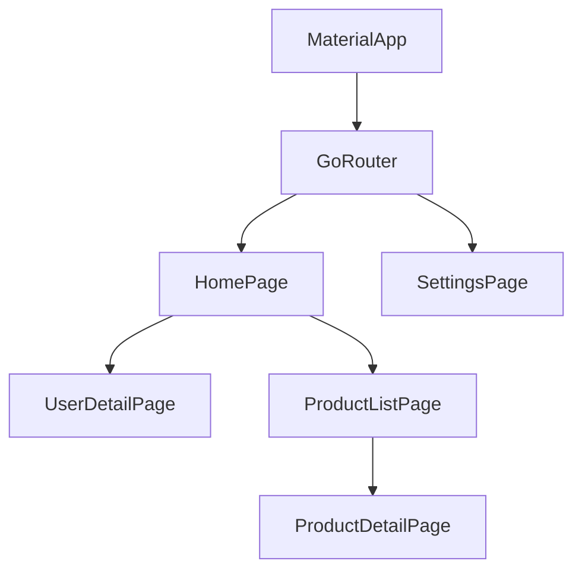
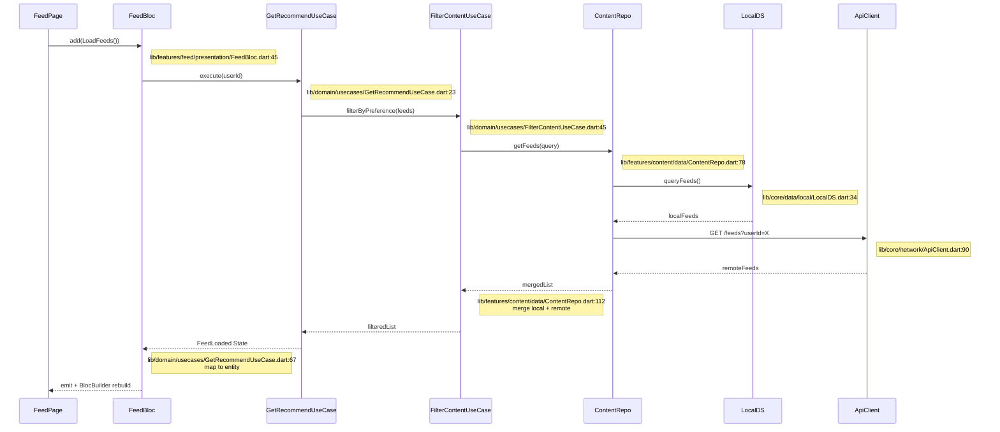
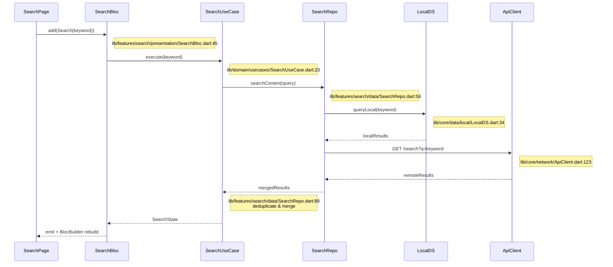
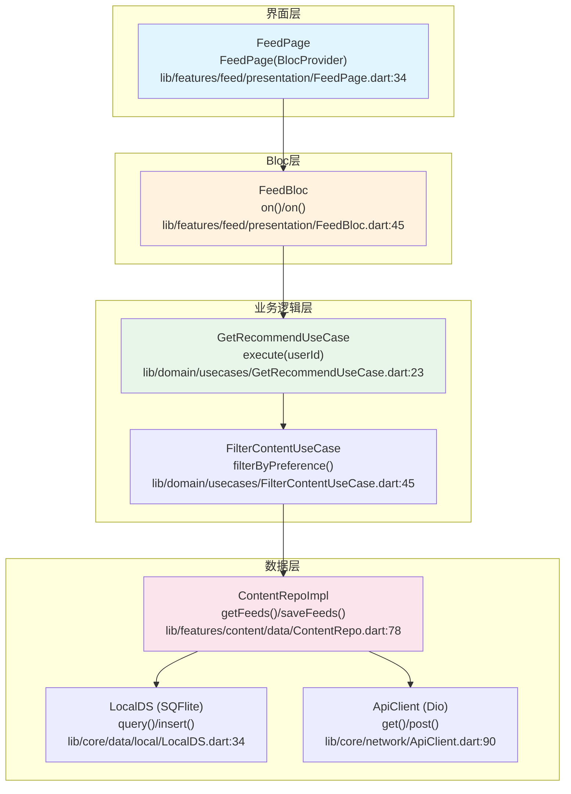
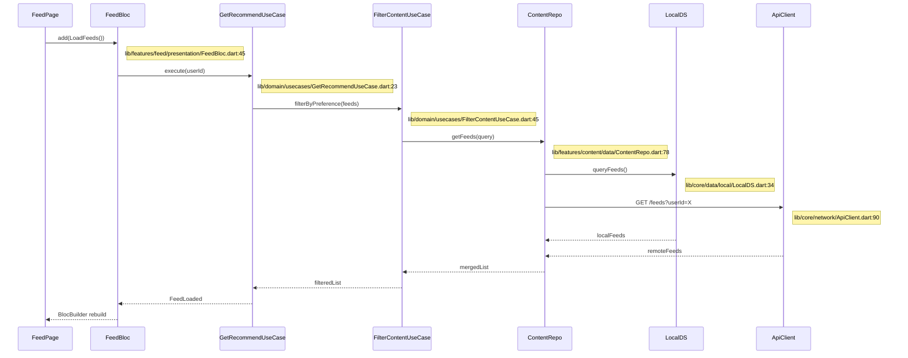

# Flutter 项目架构模板

本文档为 Flutter 移动应用项目提供详细的架构文档模板。

## Flutter 特定章节

### F1. 技术栈详情

| 类别 | 技术 | 版本 | 说明 |
|------|------|------|------|
| 框架 | Flutter | 3.16+ | 跨平台 UI 框架 |
| 语言 | Dart | 3.x | 开发语言 |
| 状态管理 | flutter_bloc / Riverpod | - | 状态管理 |
| 依赖注入 | get_it / Injectable | - | DI 容器 |
| 网络 | dio | 5.x | HTTP 客户端 |
| 本地存储 | sqflite / shared_preferences | - | 本地数据 |
| 导航 | go_router | 13.x | 声明式路由 |
| 序列化 | json_serializable | - | JSON 序列化 |
| 测试 | flutter_test / mockito | - | 测试框架 |

### F2. 架构模式

#### Clean Architecture + BLoC
```
┌─────────────────────────────────────────┐
│            Presentation Layer           │
│  ┌─────────────────────────────────┐    │
│  │  Screens / Pages               │    │
│  │  Widgets                       │    │
│  │  BLoCs                         │    │
│  └─────────────────────────────────┘    │
└─────────────────────────────────────────┘
                    │
┌─────────────────────────────────────────┐
│              Domain Layer               │
│  ┌─────────────────────────────────┐    │
│  │  Entities                       │    │
│  │  Repositories (abstract)         │    │
│  │  Use Cases                      │    │
│  └─────────────────────────────────┘    │
└─────────────────────────────────────────┘
                    │
┌─────────────────────────────────────────┐
│               Data Layer                │
│  ┌─────────────────────────────────┐    │
│  │  Models                         │    │
│  │  Repository Implementations     │    │
│  │  Data Sources (Local/Remote)    │    │
│  └─────────────────────────────────┘    │
└─────────────────────────────────────────┘
```

### F3. 目录结构

```
lib/
├── core/                 # 核心模块
│   ├── constants/        # 常量
│   ├── errors/           # 错误处理
│   ├── network/          # 网络配置
│   ├── theme/            # 主题
│   └── utils/           # 工具函数
├── features/             # 功能模块
│   └── users/
│       ├── data/
│       │   ├── datasources/
│       │   ├── models/
│       │   └── repositories/
│       ├── domain/
│       │   ├── entities/
│       │   ├── repositories/
│       │   └── usecases/
│       └── presentation/
│           ├── bloc/
│           ├── pages/
│           └── widgets/
├── injection/           # 依赖注入
└── main.dart            # 入口文件
```

### F4. 页面导航结构



### F5. BLoC 状态管理

#### Event
```dart
abstract class UserEvent {}
class LoadUsers extends UserEvent {}
class AddUser extends UserEvent {
  final String name;
  AddUser(this.name);
}
```

#### State
```dart
class UserState {
  final List<User> users;
  final bool isLoading;
  final String? error;
}
```

#### BLoC
```dart
class UserBloc extends Bloc<UserEvent, UserState> {
  UserBloc(this._getUsers) : super(UserInitial()) {
    on<LoadUsers>(_onLoadUsers);
  }

  Future<void> _onLoadUsers(LoadUsers event, Emitter<UserState> emit) async {
    emit(UserLoading());
    try {
      final users = await _getUsers();
      emit(UserLoaded(users));
    } catch (e) {
      emit(UserError(e.toString()));
    }
  }
}
```

### F6. 网络层设计

```dart
// dio client
class DioClient {
  final Dio _dio = Dio(BaseOptions(
    baseUrl: 'https://api.example.com',
    connectTimeout: const Duration(seconds: 30),
  ));

  Future<Response> get(String path) async {
    return await _dio.get(path);
  }
}
```

### F7. 本地存储设计

#### SharedPreferences
```dart
final prefs = await SharedPreferences.getInstance();
await prefs.setString('token', 'xxx');
final token = prefs.getString('token');
```

#### SQLite
```dart
final database = await openDatabase('myapp.db');
await database.execute('''
  CREATE TABLE users (
    id INTEGER PRIMARY KEY,
    name TEXT
  )
''');
```

### F8. 平台特定代码

```dart
// Method Channel
const channel = MethodChannel('com.example.app/battery');
final batteryLevel = await channel.invokeMethod<int>('getBatteryLevel');

// Platform-specific implementation
// iOS: Swift in ios/Runner/
// Android: Kotlin in android/app/src/main/kotlin/
```

### F9. 主要业务流程图 ★

> ⚠️ **每个节点必须标注方法名和代码位置（文件:行号）**。以下为 Flutter 项目典型业务流程示例。

#### 12.1 项目整体业务流程

```mermaid
flowchart TB
    subgraph App[应用启动]
        LAUNCH["启动App<br>main() / runApp()<br>lib/main.dart:12"]
        INIT["初始化模块<br>configureDependencies()<br>lib/injection/injection.dart:23"]
        LOAD["加载用户数据<br>UserRepo.getCurrentUser()<br>lib/features/user/data/UserRepo.dart:56"]
        LAUNCH --> INIT
        INIT --> LOAD
    end
    subgraph HomeFlow[首页流程]
        HOME["展示首页<br>HomePage.build()<br>lib/features/home/presentation/HomePage.dart:34"]
        FEED["内容流<br>FeedBloc.loadFeeds()<br>lib/features/feed/presentation/FeedBloc.dart:45"]
        SEARCH["搜索<br>SearchBloc.search()<br>lib/features/search/presentation/SearchBloc.dart:56"]
        HOME --> FEED
        HOME --> SEARCH
    end
    subgraph FeatureFlow[功能流程]
        DETAIL["内容详情<br>DetailPage.build()<br>lib/features/detail/presentation/DetailPage.dart:67"]
        BOOKMARK["收藏<br>BookmarkBloc.toggle()<br>lib/features/bookmark/presentation/BookmarkBloc.dart:78"]
        SHARE["分享<br>ShareUtil.share()<br>lib/core/utils/ShareUtil.dart:34"]
        DETAIL --> BOOKMARK
        DETAIL --> SHARE
    end
    subgraph DataFlow[数据流程]
        REPO["Repository<br>ContentRepo.saveBookmark()<br>lib/features/content/data/ContentRepo.dart:89"]
        LOCAL[("本地存储<br>LocalDS.insert()<br>lib/core/data/local/LocalDS.dart:45)"]
        REMOTE[("远程API<br>ApiClient.post()<br>lib/core/network/ApiClient.dart:112)"]
        REPO --> LOCAL
        REPO --> REMOTE
    end
    subgraph Background[后台流程]
        SYNC["数据同步<br>SyncService.sync()<br>lib/core/services/SyncService.dart:56"]
        NOTIFY["本地通知<br>NotificationService.show()<br>lib/core/services/NotificationService.dart:34"]
        SYNC --> NOTIFY
    end


LOAD --> HOME


FEED --> DETAIL


BOOKMARK --> REPO


REPO --> SYNC
```

##### 12.1.1 业务流程步骤详解 ★

| 步骤编号 | 步骤名称 | 核心方法/API | 输入参数 | 返回结果 | 代码位置 | 说明 |
|----------|----------|-------------|----------|----------|----------|------|
| 1 | 启动App | `main()` / `runApp(MyApp())` | `List<String> args` | `void` | `lib/main.dart:12` | 初始化 Flutter 引擎、绑定 |
| 2 | 初始化模块 | `configureDependencies()` | - | `void` | `lib/injection/injection.dart:23` | get_it 注册所有依赖 |
| 3 | 加载用户数据 | `UserRepo.getCurrentUser()` | - | `Future<User?>` | `lib/features/user/data/UserRepo.dart:56` | 从本地/缓存获取当前用户 |
| 4 | 展示首页 | `HomePage.build(BuildContext)` | `context` | `Widget` | `lib/features/home/presentation/HomePage.dart:34` | 组合首页 UI |
| 5 | 内容流 | `FeedBloc.loadFeeds()` | - | `void` → `FeedState` | `lib/features/feed/presentation/FeedBloc.dart:45` | 加载推荐内容流 |
| 6 | 搜索 | `SearchBloc.search(String)` | `keyword`: 搜索词 | `void` → `SearchState` | `lib/features/search/presentation/SearchBloc.dart:56` | 触发搜索 |
| 7 | 内容详情 | `DetailPage.build(BuildContext)` | `context` + `itemId` | `Widget` | `lib/features/detail/presentation/DetailPage.dart:67` | 展示文章/视频详情 |
| 8 | 收藏 | `BookmarkBloc.toggle(Content)` | `content`: 内容实体 | `void` | `lib/features/bookmark/presentation/BookmarkBloc.dart:78` | 切换收藏状态 |
| 9 | 分享 | `ShareUtil.share(Content)` | `content`: 内容实体 | `Future<void>` | `lib/core/utils/ShareUtil.dart:34` | 调用系统分享 |
| 10 | 数据同步 | `SyncService.sync()` | - | `Future<SyncResult>` | `lib/core/services/SyncService.dart:56` | 后台定时数据同步 |
| 11 | 本地通知 | `NotificationService.show(Notification)` | `notification` | `Future<void>` | `lib/core/services/NotificationService.dart:34` | 本地通知推送 |

##### 12.1.2 关键步骤代码示例

###### 步骤 5：内容流加载

```dart
// 📁 lib/features/feed/presentation/FeedBloc.dart:45
class FeedBloc extends Bloc<FeedEvent, FeedState> {
  final GetRecommendUseCase _getRecommend;

  FeedBloc(this._getRecommend) : super(FeedInitial()) {
    on<LoadFeeds>(_onLoadFeeds);
  }

  Future<void> _onLoadFeeds(LoadFeeds event, Emitter<FeedState> emit) async {
    emit(FeedLoading());                                             // L52
    try {
      final feeds = await _getRecommend.execute(currentUserId);     // L54 → GetRecommendUseCase
      emit(FeedLoaded(feeds));                                       // L55
    } catch (e) {
      emit(FeedError(e.toString()));                                 // L57
    }
  }
}
```

###### 步骤 8：收藏功能 — Repository 层

```dart
// 📁 lib/features/content/data/ContentRepo.dart:89
class ContentRepoImpl implements ContentRepo {
  final LocalDataSource _local;
  final ApiClient _remote;

  Future<void> saveBookmark(Content content) async {
    await _local.insert(content.toEntity());                         // L92: SQLite/SharedPreferences 写入
    await _remote.post('/bookmark', data: content.toJson());         // L93: Dio POST 远程同步
  }
}
```

#### 12.2 核心功能模块流程（时序图）★

##### 推荐流程（以 Feed 功能为例）



**步骤详解**：

| 步骤 | 调用者 | 被调用者 | 方法签名 | 参数 | 返回 | 代码位置 | 说明 |
|------|--------|----------|----------|------|------|----------|------|
| 1 | FeedPage | FeedBloc | `add(LoadFeeds())` | `event`: LoadFeeds事件 | `void` | `lib/features/feed/presentation/FeedBloc.dart:45` | 触发事件 |
| 2 | FeedBloc | GetRecommendUseCase | `execute(String userId)` | `userId`: 用户ID | `Future<List<Feed>>` | `lib/domain/usecases/GetRecommendUseCase.dart:23` | 编排推荐流程 |
| 3 | GetRecommendUseCase | FilterContentUseCase | `filterByPreference(List feeds)` | `feeds`: 原始列表 | `List<FilteredFeed>` | `lib/domain/usecases/FilterContentUseCase.dart:45` | 按偏好过滤 |
| 4 | FilterContentUseCase | ContentRepo | `getFeeds(FeedQuery)` | `query`: 查询参数 | `Future<List<Feed>>` | `lib/features/content/data/ContentRepo.dart:78` | 获取内容数据 |
| 5 | ContentRepo | LocalDS | `queryFeeds()` | - | `Future<List<Feed>>` | `lib/core/data/local/LocalDS.dart:34` | 本地 SQFlite 查询 |
| 6 | ContentRepo | ApiClient | `GET /feeds?userId=X` | `userId`: 查询参数 | `Future<List<FeedDTO>>` | `lib/core/network/ApiClient.dart:90` | Dio GET 请求 |
| 7 | ContentRepo | (合并) | `merge local + remote` | - | `List<Feed>` | `lib/features/content/data/ContentRepo.dart:112` | 本地优先去重合并 |
| 8 | FilterContentUseCase | (过滤) | 偏好过滤 | - | `List<FilteredFeed>` | `lib/domain/usecases/FilterContentUseCase.dart:67` | 去重+偏好排序 |
| 9 | GetRecommendUseCase | (映射) | Entity 映射 | - | `List<Feed>` | `lib/domain/usecases/GetRecommendUseCase.dart:67` | DTO→Entity |

**关键代码示例**：

```dart
// 📁 lib/domain/usecases/GetRecommendUseCase.dart:23 - 推荐编排
class GetRecommendUseCase {
  final ContentRepo _repo;
  final FilterContentUseCase _filter;

  Future<List<Feed>> execute(String userId) async {
    final remote = await _repo.getRemoteFeeds(userId);              // L26: 远程获取
    final local = await _repo.getLocalFeeds();                      // L27: 本地缓存
    final merged = {...local, ...remote}.toList()
      .fold<List<Feed>>([], (list, item) =>
        list.any((e) => e.id == item.id) ? list : list..add(item));// L29: 去重合并
    final filtered = await _filter.filterByPreference(merged);      // L30: 偏好过滤
    return filtered..sort((a, b) => b.score.compareTo(a.score));    // L31: 热度排序
  }
}
```

##### 搜索流程



**步骤详解**：

| 步骤 | 调用者 | 被调用者 | 方法签名 | 参数 | 返回 | 代码位置 | 说明 |
|------|--------|----------|----------|------|------|----------|------|
| 1 | SearchPage | SearchBloc | `add(Search(String))` | `keyword`: 搜索词 | `void` | `lib/features/search/presentation/SearchBloc.dart:45` | 触发搜索事件 |
| 2 | SearchBloc | SearchUseCase | `execute(String keyword)` | `keyword`: 搜索词 | `Future<List<SearchResult>>` | `lib/domain/usecases/SearchUseCase.dart:23` | 搜索编排 |
| 3 | SearchUseCase | SearchRepo | `searchContent(String query)` | `query`: 查询字符串 | `Future<List<SearchResult>>` | `lib/features/search/data/SearchRepo.dart:56` | 数据检索 |
| 4 | SearchRepo | LocalDS | `queryLocal(String keyword)` | `keyword`: 关键词 | `Future<List<SearchResult>>` | `lib/core/data/local/LocalDS.dart:34` | SQLite FTS 搜索 |
| 5 | SearchRepo | ApiClient | `GET /search?q={keyword}` | `q`: 搜索关键词 | `Future<SearchResponse>` | `lib/core/network/ApiClient.dart:123` | Dio GET 请求 |
| 6 | SearchRepo | (合并) | `deduplicate & merge` | - | `List<SearchResult>` | `lib/features/search/data/SearchRepo.dart:89` | 本地+远程去重 |

**关键代码示例**：

```dart
// 📁 lib/features/search/data/SearchRepo.dart:89 - 搜索合并去重
class SearchRepoImpl implements SearchRepo {
  Future<List<SearchResult>> searchContent(String query) async {
    final local = await _local.queryLocal(query);                   // L93: SQLite FTS
    final remote = await _remote.get('/search', queryParameters: {  // L95: Dio GET
      'q': query,
    }).then((r) => r.data).catchError((_) => <SearchResult>[]);    // L98: 远程失败兜底
    final all = [...local, ...remote];
    return all.fold<List<SearchResult>>([], (list, item) =>
      list.any((e) => e.id == item.id) ? list : list..add(item));  // L100: 去重
  }
}
```

#### 12.3 核心功能流程图（分层）★

##### 推荐功能分层流程



**配套时序图**：



**步骤与API详解**：

| 步骤 | 组件 | 核心方法 | 参数类型 | 返回类型 | 代码位置 | 关键逻辑 |
|------|------|----------|----------|----------|----------|----------|
| 1 | FeedPage | `BlocProvider.of<FeedBloc>(context).add(LoadFeeds())` | `LoadFeeds` event | `void` | `lib/features/feed/presentation/FeedPage.dart:34` | BlocBuilder 监听状态重建 UI |
| 2 | FeedBloc | `_onLoadFeeds(LoadFeeds, Emitter)` | `event`, `emit` | `Future<void>` | `lib/features/feed/presentation/FeedBloc.dart:45` | bloc 中处理事件 |
| 3 | GetRecommendUseCase | `execute(String userId)` | `userId`: 用户ID | `Future<List<Feed>>` | `lib/domain/usecases/GetRecommendUseCase.dart:23` | 推荐流程编排 |
| 4 | FilterContentUseCase | `filterByPreference(List)` | `List<Feed>` | `Future<List<Feed>>` | `lib/domain/usecases/FilterContentUseCase.dart:45` | 按用户偏好过滤 |
| 5 | ContentRepoImpl | `getFeeds(FeedQuery)` | `FeedQuery` | `Future<List<Feed>>` | `lib/features/content/data/ContentRepo.dart:78` | 数据聚合入口 |
| 6 | LocalDS | `queryFeeds()` | - | `Future<List<Feed>>` | `lib/core/data/local/LocalDS.dart:34` | SQFlite 本地查询 |
| 7 | ApiClient | `GET /feeds?userId=X` | `userId`: 查询参数 | `Future<Response>` | `lib/core/network/ApiClient.dart:90` | Dio HTTP 请求 |

#### 12.4 业务流程说明（含代码位置、API详情）★

| 流程名称 | 涉及模块 | 入口方法 | 核心API链路 | 参数/返回 | 代码位置 | 功能描述 |
|----------|----------|----------|-------------|-----------|----------|----------|
| 应用启动 | app | `main()` | `runApp()` → `configureDependencies()` → `UserRepo.getCurrentUser()` | `args` → `void` | `lib/main.dart:12` | 初始化 get_it DI、全局配置 |
| 首页加载 | feature:feed | `FeedBloc.add(LoadFeeds)` | `GetRecommendUseCase.execute()` → `ContentRepo.getFeeds()` → `GET /feeds` | `userId` → `FeedState` | `lib/features/feed/presentation/FeedBloc.dart:45` | 获取推荐内容列表 |
| 内容详情 | feature:detail | `DetailPage.build()` | `DetailBloc.loadDetail()` → `ContentRepo.getById()` → SQLite+API | `itemId` → `DetailState` | `lib/features/detail/presentation/DetailPage.dart:67` | 展示文章/视频详情 |
| 搜索功能 | feature:search | `SearchBloc.add(Search)` | `SearchUseCase.execute()` → `SearchRepo.searchContent()` → SQLite FTS + `GET /search` | `keyword` → `SearchState` | `lib/features/search/presentation/SearchBloc.dart:45` | 本地+远程联合搜索 |
| 收藏功能 | feature:bookmark | `BookmarkBloc.add(Toggle)` | `ContentRepo.saveBookmark()` → `LocalDS.insert()` + `POST /bookmark` | `Content` → `void` | `lib/features/bookmark/presentation/BookmarkBloc.dart:78` | 本地持久化+远程同步 |
| 数据同步 | core:sync | `SyncService.sync()` | `ContentRepo.getDirty()` → `ApiClient.post()` → `LocalDS.markSynced()` | - → `SyncResult` | `lib/core/services/SyncService.dart:56` | Timer 定时后台同步 |

## 标准章节参考

详见 [template.md](./template.md) 中的标准章节结构。
