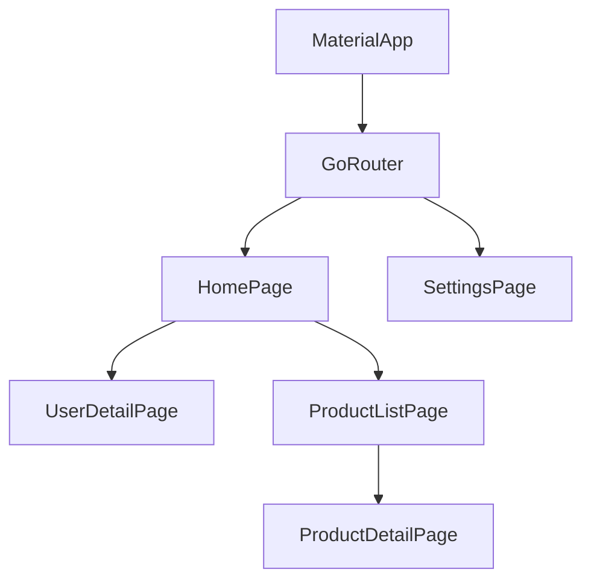

# Flutter 项目架构模板

本文档为 Flutter 移动应用项目提供详细的架构文档模板。

## Flutter 特定章节

### F1. 技术栈详情

| 类别 | 技术 | 版本 | 说明 |
|------|------|------|------|
| 框架 | Flutter | 3.16+ | 跨平台 UI 框架 |
| 语言 | Dart | 3.x | 开发语言 |
| 状态管理 | flutter_bloc / Riverpod | - | 状态管理 |
| 依赖注入 | get_it / Injectable | - | DI 容器 |
| 网络 | dio | 5.x | HTTP 客户端 |
| 本地存储 | sqflite / shared_preferences | - | 本地数据 |
| 导航 | go_router | 13.x | 声明式路由 |
| 序列化 | json_serializable | - | JSON 序列化 |
| 测试 | flutter_test / mockito | - | 测试框架 |

### F2. 架构模式

#### Clean Architecture + BLoC
```
┌─────────────────────────────────────────┐
│            Presentation Layer           │
│  ┌─────────────────────────────────┐    │
│  │  Screens / Pages               │    │
│  │  Widgets                       │    │
│  │  BLoCs                         │    │
│  └─────────────────────────────────┘    │
└─────────────────────────────────────────┘
                    │
┌─────────────────────────────────────────┐
│              Domain Layer               │
│  ┌─────────────────────────────────┐    │
│  │  Entities                       │    │
│  │  Repositories (abstract)         │    │
│  │  Use Cases                      │    │
│  └─────────────────────────────────┘    │
└─────────────────────────────────────────┘
                    │
┌─────────────────────────────────────────┐
│               Data Layer                │
│  ┌─────────────────────────────────┐    │
│  │  Models                         │    │
│  │  Repository Implementations     │    │
│  │  Data Sources (Local/Remote)    │    │
│  └─────────────────────────────────┘    │
└─────────────────────────────────────────┘
```

### F3. 目录结构

```
lib/
├── core/                 # 核心模块
│   ├── constants/        # 常量
│   ├── errors/           # 错误处理
│   ├── network/          # 网络配置
│   ├── theme/            # 主题
│   └── utils/           # 工具函数
├── features/             # 功能模块
│   └── users/
│       ├── data/
│       │   ├── datasources/
│       │   ├── models/
│       │   └── repositories/
│       ├── domain/
│       │   ├── entities/
│       │   ├── repositories/
│       │   └── usecases/
│       └── presentation/
│           ├── bloc/
│           ├── pages/
│           └── widgets/
├── injection/           # 依赖注入
└── main.dart            # 入口文件
```

### F4. 页面导航结构



### F5. BLoC 状态管理

#### Event
```dart
abstract class UserEvent {}
class LoadUsers extends UserEvent {}
class AddUser extends UserEvent {
  final String name;
  AddUser(this.name);
}
```

#### State
```dart
class UserState {
  final List<User> users;
  final bool isLoading;
  final String? error;
}
```

#### BLoC
```dart
class UserBloc extends Bloc<UserEvent, UserState> {
  UserBloc(this._getUsers) : super(UserInitial()) {
    on<LoadUsers>(_onLoadUsers);
  }

  Future<void> _onLoadUsers(LoadUsers event, Emitter<UserState> emit) async {
    emit(UserLoading());
    try {
      final users = await _getUsers();
      emit(UserLoaded(users));
    } catch (e) {
      emit(UserError(e.toString()));
    }
  }
}
```

### F6. 网络层设计

```dart
// dio client
class DioClient {
  final Dio _dio = Dio(BaseOptions(
    baseUrl: 'https://api.example.com',
    connectTimeout: const Duration(seconds: 30),
  ));

  Future<Response> get(String path) async {
    return await _dio.get(path);
  }
}
```

### F7. 本地存储设计

#### SharedPreferences
```dart
final prefs = await SharedPreferences.getInstance();
await prefs.setString('token', 'xxx');
final token = prefs.getString('token');
```

#### SQLite
```dart
final database = await openDatabase('myapp.db');
await database.execute('''
  CREATE TABLE users (
    id INTEGER PRIMARY KEY,
    name TEXT
  )
''');
```

### F8. 平台特定代码

```dart
// Method Channel
const channel = MethodChannel('com.example.app/battery');
final batteryLevel = await channel.invokeMethod<int>('getBatteryLevel');

// Platform-specific implementation
// iOS: Swift in ios/Runner/
// Android: Kotlin in android/app/src/main/kotlin/
```

## 标准章节参考

详见 [template.md](./template.md) 中的标准章节结构。
