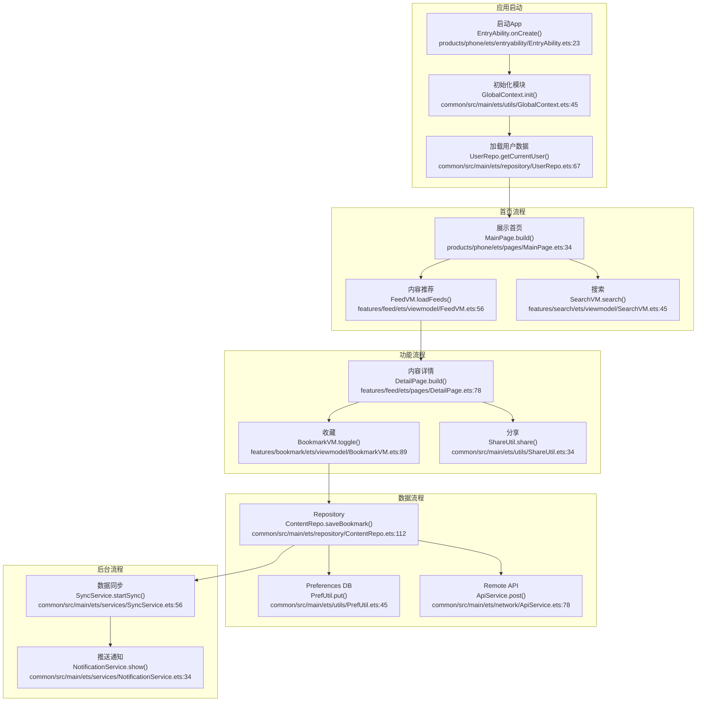
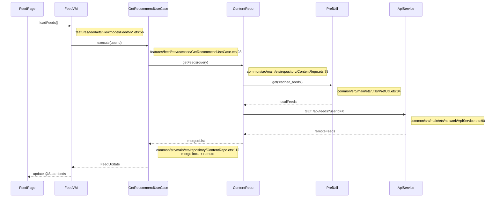
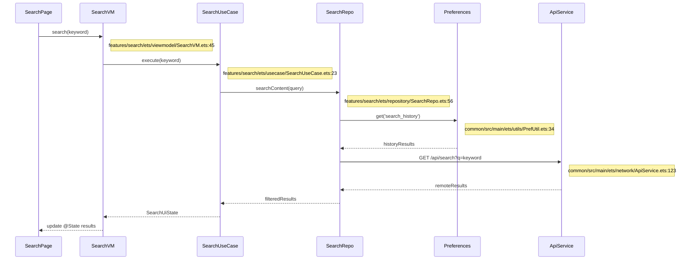
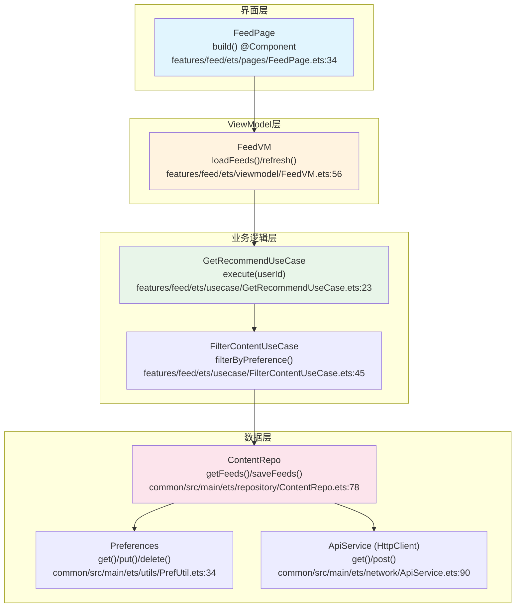
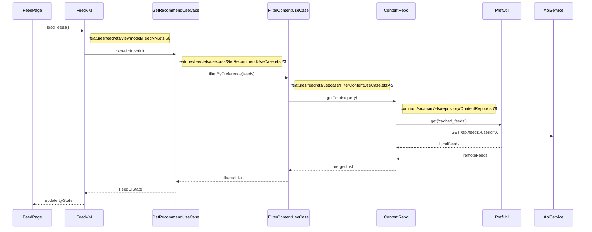

# HarmonyOS Next 项目架构模板

本文档为 HarmonyOS Next 项目提供详细的架构文档模板。

## HarmonyOS Next 特定章节

### H1. 技术栈详情

| 类别 | 技术 | 版本 | 说明 |
|------|------|------|------|
| 编程语言 | ArkTS | 4.x | 鸿蒙原生开发语言 |
| UI 框架 | ArkUI | 4.x | 声明式UI框架 |
| 构建工具 | Hvigor | 4.x | 鸿蒙构建工具 |
| 包管理 | OHPM | 1.x | OpenHarmony Package Manager |
| 状态管理 | AppStorage / LocalStorage | - | 响应式状态管理 |
| 网络 | HttpClient / Net | - | 网络请求 |
| 本地存储 | Preferences / SQLite | - | 本地数据持久化 |
| 分布式能力 | Distributed SoftBus | - | 分布式软总线 |
| 测试 | HarmonyOS Test Framework | - | 测试框架 |

### H2. 架构模式

#### 三层架构（官方推荐）
```
┌─────────────────────────────────────────┐
│         产品定制层 (Product)            │
│  ┌─────────────────────────────────┐    │
│  │  Entry类型HAP                   │    │
│  │  设备形态适配、响应式布局        │    │
│  │  窗口模式：全屏/分屏/悬浮/自由窗  │    │
│  └─────────────────────────────────┘    │
└─────────────────────────────────────────┘
                    │
┌─────────────────────────────────────────┐
│          特性层 (Feature)               │
│  ┌─────────────────────────────────┐    │
│  │  Feature类型HAP                 │    │
│  │  业务逻辑、UseCase              │    │
│  │  UI组件组合（无布局）            │    │
│  └─────────────────────────────────┘    │
└─────────────────────────────────────────┘
                    │
┌─────────────────────────────────────────┐
│          共用层 (Common)                │
│  ┌─────────────────────────────────┐    │
│  │  Library/HAR/HSP                │    │
│  │  网络、数据、工具类、通用组件    │    │
│  │  零形态感知（无设备相关代码）     │    │
│  └─────────────────────────────────┘    │
└─────────────────────────────────────────┘
```

### H3. 包类型选择指南

| 包类型 | 适用场景 | 特点 | 注意事项 |
|--------|----------|------|----------|
| **HAP** | 核心业务模块、应用入口 | 支持动态加载，可独立安装 | Entry类型必须有一个 |
| **HAR** | 静态共享资源、工具类、UI组件 | 编译时集成，适合发布到OHPM仓库 | 多包引用会增大体积，建议开启混淆 |
| **HSP** | 动态共享包、按需加载功能 | 运行时复用，减小包体积 | 仅支持应用内共享，HAR依赖HSP只能内部使用 |

### H4. 工程目录结构

```
MyApp (工程根目录)
├── AppScope/                     # 应用级配置和资源（自动生成，不可修改）
│   ├── app.json5                # 应用级配置（包名、版本、图标等）
│   └── resources/               # 应用级资源（全局资源）
├── common/                      # 共用层（Library/HAR/HSP）
│   ├── src/main/ets/
│   │   ├── network/             # 网络请求封装
│   │   ├── repository/          # 数据仓库
│   │   ├── model/               # 数据模型
│   │   ├── utils/               # 工具类
│   │   └── components/          # 通用组件（不含布局）
│   └── ohos.build-profile.json5
├── features/                    # 特性层（Feature HAP）
│   ├── login/                   # 登录模块
│   ├── search/                  # 搜索模块
│   └── payment/                 # 支付模块
├── products/                    # 产品定制层（Entry HAP）
│   ├── phone/                   # 手机形态
│   ├── tablet/                  # 平板形态
│   ├── pc/                      # PC形态
│   └── watch/                   # 穿戴设备形态
├── hvigorfile.ts                # 自定义构建脚本
├── build-profile.json5          # 签名和产品配置
└── oh-package.json5             # 依赖库信息
```

#### UI/UX 组件使用情况

> 各模块使用的 ArkUI 关键组件清单。

| 层级 | 模块 | 使用的 UI 组件 | 组件库 |
|------|------|---------------|--------|
| 入口 | products/phone | Navigation, TabContent, Tabs | ArkUI |
| 共用 | common/components | Button, Text, Image, List, Grid, Dialog | ArkUI 基础组件 |
| 特性 | features/login | TextInput, Button, LoadingProgress, Toast | ArkUI |
| 特性 | features/search | Search, ListItem, Refresh, PullToRefresh | ArkUI |
| 特性 | features/payment | Stepper, Radio, Checkbox, QRCode | ArkUI |

> **UX 设计要点**：多设备响应式布局 (phone/tablet/pc/watch 断点适配) / 原子化服务 (元服务卡片) / 一多能力 (一次开发多端部署) / 自由窗口 (PC/平板悬浮窗) / 深色模式适配 / 无障碍朗读 (accessibilityGroup)

### H5. 配置文件分析

#### app.json5（应用级配置）
```json
{
  "app": {
    "bundleName": "com.example.myapp",
    "vendor": "example",
    "version": {
      "code": 10000,
      "name": "1.0.0"
    },
    "icon": "$media:app_icon",
    "label": "$string:app_name"
  }
}
```

#### module.json5（模块配置）
```json
{
  "module": {
    "name": "entry",
    "type": "entry",
    "deviceTypes": ["phone", "tablet"],
    "abilities": [
      {
        "name": "EntryAbility",
        "srcEntrance": "./ets/entryability/EntryAbility.ets",
        "description": "$string:entry_ability_desc",
        "icon": "$media:icon",
        "label": "$string:entry_ability_label",
        "startWindowIcon": "$media:icon",
        "startWindowBackground": "$color:start_window_background"
      }
    ]
  }
}
```

### H6. 分布式能力

#### 分布式软总线
```typescript
// 设备发现
import distributedDeviceManager from '@ohos.distributedDeviceManager';

const dm = distributedDeviceManager.createDistributedDeviceManager();
const devices = await dm.getAvailableDeviceList();
```

#### 分布式数据管理
```typescript
// 跨设备数据同步
import distributedDataObject from '@ohos.data.distributedDataObject';

const kvManager = distributedDataObject.createKVManager();
const kvStore = await kvManager.getKVStore('my_store');
await kvStore.put('key', 'value');
```

### H7. 响应式布局

#### 断点布局
```typescript
@Entry
@Component
struct MyPage {
  build() {
    Column() {
      if (deviceInfo.screenWidth > 800) {
        // 大屏布局
        Row() {
          SideBar()
          MainContent()
        }
      } else {
        // 小屏布局
        Column() {
          Header()
          MainContent()
        }
      }
    }
  }
}
```

#### 自适应布局
```typescript
@Entry
@Component
struct AdaptiveLayout {
  build() {
    Grid() {
      ForEach(this.data, (item) => {
        GridItem() {
          Card({ data: item })
        }
      })
    }
    .columnsTemplate(deviceInfo.screenWidth > 600 ? '1fr 1fr 1fr' : '1fr 1fr')
    .columnsGap(16)
    .rowsGap(16)
  }
}
```

### H8. 状态管理

#### AppStorage（全局状态）
```typescript
// 定义全局状态
AppStorage.setOrCreate('userName', '');

// 组件中使用
@Entry
@Component
struct UserProfile {
  @StorageProp('userName') userName: string = '';
  
  build() {
    Text(`Hello, ${this.userName}`)
  }
}
```

#### LocalStorage（页面状态）
```typescript
const localStorage = new LocalStorage();

@Entry(localStorage)
@Component
struct MyPage {
  @LocalStorageProp('count') count: number = 0;
  
  build() {
    Button(`Count: ${this.count}`)
      .onClick(() => this.count++)
  }
}
```

### H9. 网络层设计

```typescript
// HttpClient封装
export class ApiService {
  private baseUrl: string = 'https://api.example.com';
  
  async get<T>(path: string, params?: Record<string, string>): Promise<T> {
    const httpClient = new HttpClient();
    const request = new HttpRequestInfo();
    request.url = `${this.baseUrl}${path}`;
    request.method = HttpMethod.GET;
    
    if (params) {
      request.parameters = params;
    }
    
    const response = await httpClient.request(request);
    return await response.json();
  }
  
  async post<T>(path: string, body: Record<string, unknown>): Promise<T> {
    const httpClient = new HttpClient();
    const request = new HttpRequestInfo();
    request.url = `${this.baseUrl}${path}`;
    request.method = HttpMethod.POST;
    request.body = JSON.stringify(body);
    
    const response = await httpClient.request(request);
    return await response.json();
  }
}
```

### H10. 本地存储

#### Preferences
```typescript
import preferences from '@ohos.data.preferences';

async function saveToken(token: string): Promise<void> {
  const pref = await preferences.getPreferences(getContext(), 'user_prefs');
  await pref.put('token', token);
  await pref.flush();
}

async function getToken(): Promise<string | undefined> {
  const pref = await preferences.getPreferences(getContext(), 'user_prefs');
  return pref.get('token', '') as string;
}
```

### H11. 主要业务流程图 ★

> ⚠️ **每个节点必须标注方法名和代码位置（文件:行号）**。以下为 HarmonyOS Next 项目典型业务流程示例。

#### 12.1 项目整体业务流程



##### 12.1.1 业务流程步骤详解 ★

| 步骤编号 | 步骤名称 | 核心方法/API | 输入参数 | 返回结果 | 代码位置 | 说明 |
|----------|----------|-------------|----------|----------|----------|------|
| 1 | 启动App | `EntryAbility.onCreate(want, launchParam)` | `want`: Want, `launchParam`: AbilityConstant.LaunchParam | `void` | `products/phone/ets/entryability/EntryAbility.ets:23` | 初始化 Ability、加载首页 |
| 2 | 初始化模块 | `GlobalContext.init(Context)` | `context`: 应用上下文 | `void` | `common/src/main/ets/utils/GlobalContext.ets:45` | 初始化全局上下文、网络配置 |
| 3 | 加载用户数据 | `UserRepo.getCurrentUser()` | - | `Promise<User \| null>` | `common/src/main/ets/repository/UserRepo.ets:67` | 从 Preferences 获取登录态 |
| 4 | 展示首页 | `MainPage.build()` | - | `void` | `products/phone/ets/pages/MainPage.ets:34` | ArkUI 声明式渲染主页面 |
| 5 | 内容推荐 | `FeedVM.loadFeeds()` | - | `void → @State feeds` | `features/feed/ets/viewmodel/FeedVM.ets:56` | 加载推荐内容 |
| 6 | 搜索 | `SearchVM.search(keyword)` | `keyword`: string | `void → @State results` | `features/search/ets/viewmodel/SearchVM.ets:45` | 触发搜索 |
| 7 | 内容详情 | `DetailPage.build()` | - | `void` | `features/feed/ets/pages/DetailPage.ets:78` | 展示内容详情页 |
| 8 | 收藏 | `BookmarkVM.toggle(Content)` | `content`: Content | `Promise<void>` | `features/bookmark/ets/viewmodel/BookmarkVM.ets:89` | 切换收藏状态 |
| 9 | 分享 | `ShareUtil.share(Content)` | `content`: Content | `Promise<void>` | `common/src/main/ets/utils/ShareUtil.ets:34` | 调用系统分享 |
| 10 | 数据同步 | `SyncService.startSync()` | - | `void` | `common/src/main/ets/services/SyncService.ets:56` | 定时后台同步 |
| 11 | 推送通知 | `NotificationService.show(Notification)` | `notification`: NotificationRequest | `Promise<void>` | `common/src/main/ets/services/NotificationService.ets:34` | 系统通知推送 |

##### 12.1.2 关键步骤代码示例

###### 步骤 1：应用启动

```typescript
// 📁 products/phone/ets/entryability/EntryAbility.ets:23
export default class EntryAbility extends UIAbility {
  onCreate(want: Want, launchParam: AbilityConstant.LaunchParam): void {
    this.context.getApplicationContext();                            // L26: 获取应用上下文
    GlobalContext.init(this.context);                                // L28: 初始化全局上下文
    this.loadUserData();                                             // L30: 加载用户数据
  }

  onWindowStageCreate(windowStage: window.WindowStage): void {
    windowStage.loadContent('pages/MainPage', (err) => {            // L34: 加载首页
      if (err.code) console.error('Failed to load content');
    });
  }
}
```

###### 步骤 8：收藏功能 — Repository 层

```typescript
// 📁 common/src/main/ets/repository/ContentRepo.ets:112
export class ContentRepo {
  async saveBookmark(content: Content): Promise<void> {
    await PrefUtil.put(`bookmark_${content.id}`, JSON.stringify(content)); // L115: Preferences 写入
    try {
      await ApiService.post('/api/bookmark', { contentId: content.id });   // L117: HTTP 远程同步
    } catch (err) {
      // 远程失败不影响本地操作
      Logger.warn('Bookmark sync failed', err);                            // L119
    }
  }
}
```

#### 12.2 核心功能模块流程（时序图）★

##### 推荐流程（以 Feed 功能为例）



**步骤详解**：

| 步骤 | 调用者 | 被调用者 | 方法签名 | 参数 | 返回 | 代码位置 | 说明 |
|------|--------|----------|----------|------|------|----------|------|
| 1 | FeedPage | FeedVM | `loadFeeds()` | - | `Promise<void>` | `features/feed/ets/viewmodel/FeedVM.ets:56` | 页面显示时触发 |
| 2 | FeedVM | GetRecommendUseCase | `execute(userId: string)` | `userId`: 用户ID | `Promise<FeedUiState>` | `features/feed/ets/usecase/GetRecommendUseCase.ets:23` | 编排推荐流程 |
| 3 | GetRecommendUseCase | ContentRepo | `getFeeds(query: FeedQuery)` | `query`: 查询参数 | `Promise<Content[]>` | `common/src/main/ets/repository/ContentRepo.ets:78` | 获取内容数据 |
| 4 | ContentRepo | PrefUtil | `get('cached_feeds')` | `key`: 缓存键 | `Promise<Content[]>` | `common/src/main/ets/utils/PrefUtil.ets:34` | Preferences 缓存查询 |
| 5 | ContentRepo | ApiService | `GET /api/feeds?userId=X` | `userId`: 查询参数 | `Promise<FeedResponse>` | `common/src/main/ets/network/ApiService.ets:90` | HTTP 远程请求 |
| 6 | ContentRepo | (合并) | `merge local + remote` | - | `Content[]` | `common/src/main/ets/repository/ContentRepo.ets:112` | 本地优先去重 |

**关键代码示例**：

```typescript
// 📁 common/src/main/ets/repository/ContentRepo.ets:112 - 数据合并策略
export class ContentRepo {
  async getFeeds(query: FeedQuery): Promise<Content[]> {
    const cached = await PrefUtil.get<Content[]>('cached_feeds', []);  // L115: 读缓存
    try {
      const remote = await ApiService.get<FeedResponse>('/api/feeds', { userId: query.userId });
      const merged = this.mergeFeeds(cached, remote.data);              // L119: 合并去重
      await PrefUtil.put('cached_feeds', merged);                       // L120: 回写缓存
      return merged;
    } catch (err) {
      Logger.warn('Remote fails, fallback to cache', err);              // L123: 降级缓存
      return cached;
    }
  }
}
```

##### 搜索流程



**步骤详解**：

| 步骤 | 调用者 | 被调用者 | 方法签名 | 参数 | 返回 | 代码位置 | 说明 |
|------|--------|----------|----------|------|------|----------|------|
| 1 | SearchPage | SearchVM | `search(keyword: string)` | `keyword`: 搜索词 | `Promise<void>` | `features/search/ets/viewmodel/SearchVM.ets:45` | 用户输入触发 |
| 2 | SearchVM | SearchUseCase | `execute(keyword: string)` | `keyword`: 搜索词 | `Promise<SearchUiState>` | `features/search/ets/usecase/SearchUseCase.ets:23` | 搜索编排 |
| 3 | SearchUseCase | SearchRepo | `searchContent(query: string)` | `query`: 查询串 | `Promise<SearchResult[]>` | `features/search/ets/repository/SearchRepo.ets:56` | 数据检索 |
| 4 | SearchRepo | ApiService | `GET /api/search?q={keyword}` | `q`: 搜索词 | `Promise<SearchResponse>` | `common/src/main/ets/network/ApiService.ets:123` | HTTP GET 请求 |

#### 12.3 核心功能流程图（分层）★

##### 推荐功能分层流程



**配套时序图**：



**步骤与API详解**：

| 步骤 | 组件 | 核心方法 | 参数类型 | 返回类型 | 代码位置 | 关键逻辑 |
|------|------|----------|----------|----------|----------|----------|
| 1 | FeedPage | `build()` | - | `void` | `features/feed/ets/pages/FeedPage.ets:34` | ArkUI @Component 声明式渲染 |
| 2 | FeedVM | `loadFeeds()` | - | `Promise<void> → @State feeds` | `features/feed/ets/viewmodel/FeedVM.ets:56` | 触发数据加载 |
| 3 | GetRecommendUseCase | `execute(userId: string)` | `userId`: 用户ID | `Promise<FeedUiState>` | `features/feed/ets/usecase/GetRecommendUseCase.ets:23` | 推荐流程编排 |
| 4 | FilterContentUseCase | `filterByPreference(Content[])` | `Content[]` | `Content[]` | `features/feed/ets/usecase/FilterContentUseCase.ets:45` | 偏好过滤+去重 |
| 5 | ContentRepo | `getFeeds(FeedQuery)` | `FeedQuery` | `Promise<Content[]>` | `common/src/main/ets/repository/ContentRepo.ets:78` | 数据聚合入口 |
| 6 | PrefUtil | `get('cached_feeds')` | `key`: string | `Promise<T>` | `common/src/main/ets/utils/PrefUtil.ets:34` | Preferences 本地查询 |
| 7 | ApiService | `GET /api/feeds?userId=X` | `userId`: 查询参数 | `Promise<FeedResponse>` | `common/src/main/ets/network/ApiService.ets:90` | HttpClient HTTP 请求 |

#### 12.4 业务流程说明（含代码位置、API详情）★

| 流程名称 | 涉及模块 | 入口方法 | 核心API链路 | 参数/返回 | 代码位置 | 功能描述 |
|----------|----------|----------|-------------|-----------|----------|----------|
| 应用启动 | entry | `EntryAbility.onCreate()` | `GlobalContext.init()` → `UserRepo.getCurrentUser()` | `Want` → `void` | `products/phone/ets/entryability/EntryAbility.ets:23` | 初始化全局上下文、路由 |
| 首页加载 | feature:feed | `FeedVM.loadFeeds()` | `GetRecommendUseCase.execute()` → `ContentRepo.getFeeds()` → `GET /api/feeds` | `userId` → `FeedUiState` | `features/feed/ets/viewmodel/FeedVM.ets:56` | 获取推荐内容列表 |
| 内容详情 | feature:feed | `DetailPage.build()` | `DetailVM.loadDetail()` → `ContentRepo.getById()` → Pref + API | `contentId` → `DetailUiState` | `features/feed/ets/pages/DetailPage.ets:78` | 展示文章/视频详情 |
| 搜索功能 | feature:search | `SearchVM.search()` | `SearchUseCase.execute()` → `SearchRepo.searchContent()` → `GET /api/search` | `keyword` → `SearchUiState` | `features/search/ets/viewmodel/SearchVM.ets:45` | 远程搜索 |
| 收藏功能 | feature:bookmark | `BookmarkVM.toggle()` | `ContentRepo.saveBookmark()` → `PrefUtil.put()` + `POST /api/bookmark` | `Content` → `Promise<void>` | `features/bookmark/ets/viewmodel/BookmarkVM.ets:89` | 本地持久化+远程同步 |
| 数据同步 | common:sync | `SyncService.startSync()` | `ContentRepo.getDirty()` → `ApiService.post()` → `PrefUtil.put()` | - → `void` | `common/src/main/ets/services/SyncService.ets:56` | 定时后台同步 |

## 标准章节参考

详见 [template.md](./template.md) 中的标准章节结构。

## 最佳实践建议

### 依赖管理
- 遵循单向依赖原则：共用层 → 特性层 → 产品定制层
- HAR/HSP不支持循环依赖，配置时需注意
- 通过oh-package.json5区分必需模块与可选模块

### 资源管理
- AppScope资源与Module资源同名时，编译后只保留AppScope的
- 建议按功能模块组织资源文件

### 性能优化
- 优先使用HSP减少包体积
- HAR包建议开启混淆保护代码
- 合理使用懒加载和按需加载

### 分布式适配
- 跨设备场景需提前封装分布式接口
- 注意分布式数据同步的一致性问题
