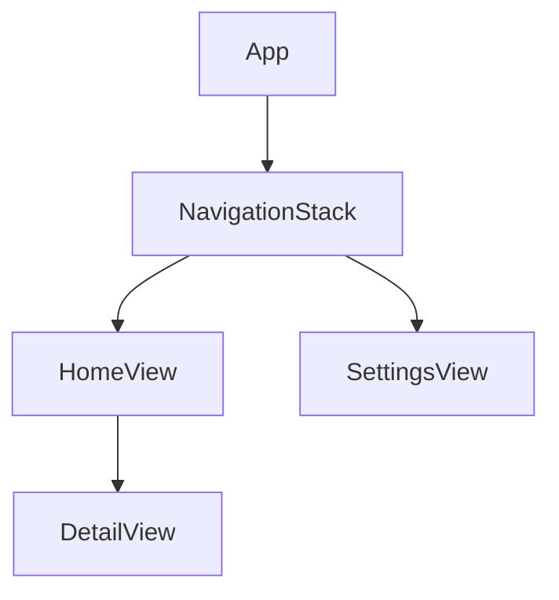
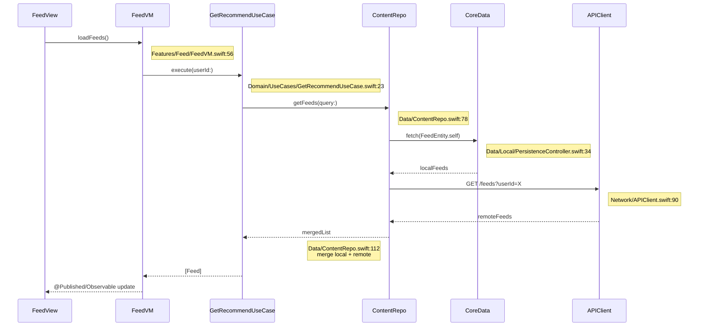
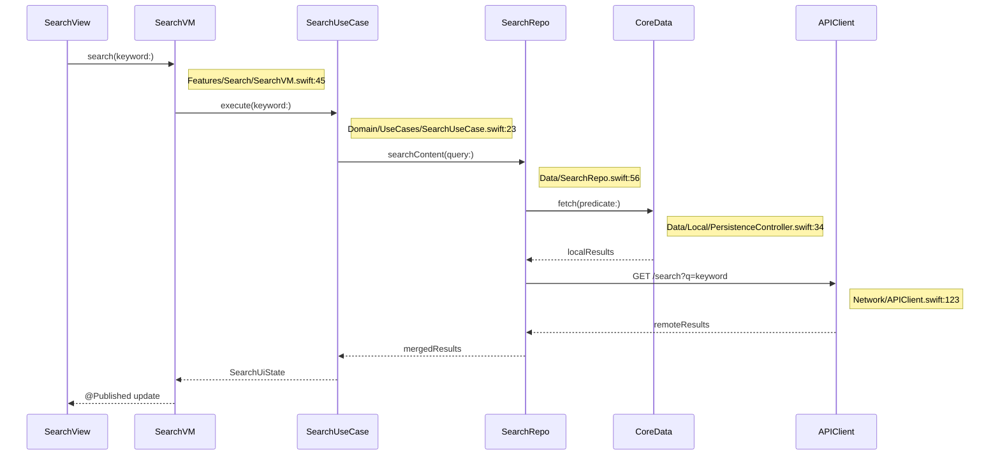
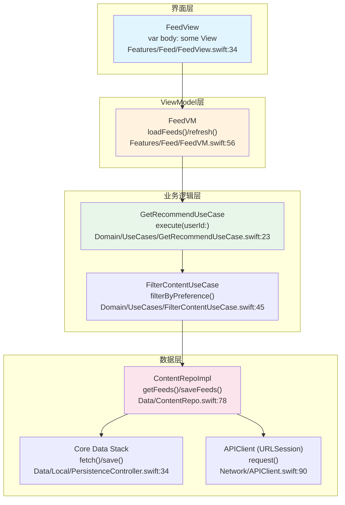

# iOS 项目架构模板

本文档为 iOS 项目提供详细的架构文档模板。

## iOS 特定章节

### I1. 技术栈详情

| 类别 | 技术 | 版本 | 说明 |
|------|------|------|------|
| 编程语言 | Swift | 5.9+ | 主要开发语言 |
| UI 框架 | SwiftUI / UIKit | - | 声明式 UI / 传统 UI |
| 架构模式 | MVVM / TCA | - | 状态管理 |
| 本地存储 | Core Data / Realm | - | 数据持久化 |
| 依赖管理 | SPM / CocoaPods | - | 包管理 |
| 网络 | URLSession / Alamofire | - | 网络请求 |
| 导航 | NavigationStack | iOS 16+ | 导航 |
| 异步 | async/await | Swift 5.5+ | 异步编程 |

### I2. 架构模式

#### MVVM 架构
```
┌─────────────────────────────────────────┐
│                  View                   │
│  ┌─────────────┐  ┌─────────────────┐  │
│  │  SwiftUI    │  │   @StateObject  │  │
│  │    View     │  │   @ObservedObject│  │
│  └─────────────┘  └─────────────────┘  │
└─────────────────────────────────────────┘
                    │
┌─────────────────────────────────────────┐
│              ViewModel                  │
│  ┌─────────────────────────────────┐    │
│  │  @Published / @Observable      │    │
│  │  func methods()                │    │
│  └─────────────────────────────────┘    │
└─────────────────────────────────────────┘
                    │
┌─────────────────────────────────────────┐
│               Model                     │
│  ┌─────────────────────────────────┐    │
│  │  Struct / Class / Enum         │    │
│  └─────────────────────────────────┘    │
└─────────────────────────────────────────┘
```

### I3. 模块分类

| 类别 | 模块 | 职责 |
|------|------|------|
| App | MyApp | 应用入口 |
| Features | Features/* | 功能模块 |
| Core | Core/* | 共享代码 |
| Services | Services/* | 网络、存储服务 |

### I4. 依赖管理

#### Swift Package Manager
```swift
dependencies: [
    .package(url: "https://github.com/Alamofire/Alamofire.git", from: "5.8.0")
]
```

#### CocoaPods
```ruby
pod 'Alamofire', '~> 5.8'
```

### I5. 本地存储

#### Core Data 栈
```swift
let container = NSPersistentContainer(name: "MyModel")
container.loadPersistentStores { description, error in
    // Handle error
}
```

### I6. 状态管理

#### @Observable (iOS 17+)
```swift
@Observable
class UserViewModel {
    var users: [User] = []
    func loadUsers() async { ... }
}
```

### I7. 导航结构



### I8. 主要业务流程图 ★

> ⚠️ **每个节点必须标注方法名和代码位置（文件:行号）**。以下为 iOS 项目典型业务流程示例。

#### 12.1 项目整体业务流程

```mermaid
flowchart TB
    subgraph App[应用启动]
        LAUNCH["启动App<br>AppDelegate.application()<br>MyApp/AppDelegate.swift:23"]
        INIT["初始化模块<br>AppContainer.configure()<br>Core/DI/AppContainer.swift:45"]
        LOAD["加载用户数据<br>UserRepo.getCurrentUser()<br>Data/UserRepo.swift:67"]
        LAUNCH --> INIT
        INIT --> LOAD
    end
    subgraph HomeFlow[首页流程]
        HOME["展示首页<br>HomeView.body<br>Features/Home/HomeView.swift:34"]
        FEED["内容推荐<br>FeedVM.loadFeeds()<br>Features/Feed/FeedVM.swift:56"]
        SEARCH["搜索<br>SearchVM.search()<br>Features/Search/SearchVM.swift:45"]
        HOME --> FEED
        HOME --> SEARCH
    end
    subgraph FeatureFlow[功能流程]
        DETAIL["内容详情<br>DetailView.body<br>Features/Detail/DetailView.swift:78"]
        BOOKMARK["收藏<br>BookmarkVM.toggle()<br>Features/Bookmark/BookmarkVM.swift:89"]
        SHARE["分享<br>ShareService.share()<br>Core/Services/ShareService.swift:34"]
        DETAIL --> BOOKMARK
        DETAIL --> SHARE
    end
    subgraph DataFlow[数据流程]
        REPO["Repository<br>ContentRepo.saveBookmark()<br>Data/ContentRepo.swift:112"]
        LOCAL[("Core Data<br>PersistenceController.save()<br>Data/Local/PersistenceController.swift:45)"]
        REMOTE[("Remote API<br>APIClient.request()<br>Network/APIClient.swift:78)"]
        REPO --> LOCAL
        REPO --> REMOTE
    end
    subgraph Background[后台流程]
        SYNC["数据同步<br>SyncService.sync()<br>Core/Services/SyncService.swift:56"]
        NOTIFY["推送通知<br>NotificationService.register()<br>Core/Services/NotificationService.swift:34"]
        SYNC --> NOTIFY
    end


LOAD --> HOME


FEED --> DETAIL


BOOKMARK --> REPO


REPO --> SYNC
```

##### 12.1.1 业务流程步骤详解 ★

| 步骤编号 | 步骤名称 | 核心方法/API | 输入参数 | 返回结果 | 代码位置 | 说明 |
|----------|----------|-------------|----------|----------|----------|------|
| 1 | 启动App | `AppDelegate.application(_:didFinishLaunchingWithOptions:)` | `application`, `launchOptions` | `Bool` | `MyApp/AppDelegate.swift:23` | 初始化窗口、DI容器 |
| 2 | 初始化模块 | `AppContainer.configure()` | - | `Void` | `Core/DI/AppContainer.swift:45` | 注册所有依赖到容器 |
| 3 | 加载用户数据 | `UserRepo.getCurrentUser()` | - | `async throws → User?` | `Data/UserRepo.swift:67` | 从 Core Data / Keychain 获取 |
| 4 | 展示首页 | `HomeView.body` | - | `some View` | `Features/Home/HomeView.swift:34` | SwiftUI 声明式组合首页 |
| 5 | 内容推荐 | `FeedVM.loadFeeds()` | - | `Void → @Published feeds` | `Features/Feed/FeedVM.swift:56` | 异步加载推荐内容 |
| 6 | 搜索 | `SearchVM.search(keyword:)` | `keyword`: String | `Void → @Published results` | `Features/Search/SearchVM.swift:45` | 触发搜索 |
| 7 | 内容详情 | `DetailView.body` | - | `some View` | `Features/Detail/DetailView.swift:78` | 展示内容详情页 |
| 8 | 收藏 | `BookmarkVM.toggle(content:)` | `content`: Content | `Void` | `Features/Bookmark/BookmarkVM.swift:89` | 切换收藏状态 |
| 9 | 分享 | `ShareService.share(content:)` | `content`: Content | `Void` | `Core/Services/ShareService.swift:34` | 调用 UIActivityViewController |
| 10 | 数据同步 | `SyncService.sync()` | - | `async throws → SyncReport` | `Core/Services/SyncService.swift:56` | BGTaskScheduler 定时同步 |
| 11 | 推送通知 | `NotificationService.register()` | - | `Void` | `Core/Services/NotificationService.swift:34` | 注册 APNs 远程推送 |

##### 12.1.2 关键步骤代码示例

###### 步骤 5：内容流加载

```swift
// 📁 Features/Feed/FeedVM.swift:56
@Observable
final class FeedVM {
    var feeds: [Feed] = []
    var isLoading = false
    private let getRecommend: GetRecommendUseCase

    func loadFeeds() async {
        isLoading = true                                              // L62
        do {
            feeds = try await getRecommend.execute(userId: currentUserId)  // L64
        } catch {
            // handle error through @Observable state                 // L66
        }
        isLoading = false                                             // L68
    }
}
```

###### 步骤 8：收藏功能 — Repository 层

```swift
// 📁 Data/ContentRepo.swift:112
final class ContentRepoImpl: ContentRepo {
    private let local: PersistenceController
    private let remote: APIClient

    func saveBookmark(_ content: Content) async throws {
        try await local.save(content.toEntity())                      // L116: Core Data 写入
        try await remote.post("/bookmark", body: content.toDTO())     // L117: URLSession 远程同步
    }
}
```

#### 12.2 核心功能模块流程（时序图）★

##### 推荐流程（以 Feed 功能为例）



**步骤详解**：

| 步骤 | 调用者 | 被调用者 | 方法签名 | 参数 | 返回 | 代码位置 | 说明 |
|------|--------|----------|----------|------|------|----------|------|
| 1 | FeedView | FeedVM | `loadFeeds()` | - | `Void` | `Features/Feed/FeedVM.swift:56` | 页面出现时触发(.task) |
| 2 | FeedVM | GetRecommendUseCase | `execute(userId: String)` | `userId`: 用户ID | `async throws → [Feed]` | `Domain/UseCases/GetRecommendUseCase.swift:23` | 编排推荐流程 |
| 3 | GetRecommendUseCase | ContentRepo | `getFeeds(query: FeedQuery)` | `query`: 查询参数 | `async throws → [Feed]` | `Data/ContentRepo.swift:78` | 获取内容数据 |
| 4 | ContentRepo | CoreData | `fetch(FeedEntity.self)` | - | `async throws → [FeedEntity]` | `Data/Local/PersistenceController.swift:34` | NSFetchRequest 查询 |
| 5 | ContentRepo | APIClient | `GET /feeds?userId=X` | `userId`: 查询参数 | `async throws → FeedResponse` | `Network/APIClient.swift:90` | URLSession data task |
| 6 | ContentRepo | (合并) | `merge local + remote` | - | `[Feed]` | `Data/ContentRepo.swift:112` | 本地优先去重合并 |

**关键代码示例**：

```swift
// 📁 Data/ContentRepo.swift:112 - 数据合并策略
final class ContentRepoImpl: ContentRepo {
    func getFeeds(query: FeedQuery) async throws -> [Feed] {
        let cached = try await local.fetch(FeedEntity.fetchRequest())   // L115: Core Data fetch
        let remote = try await remote.get("/feeds", params: ["userId": query.userId])
        let merged = mergeFeeds(cached.map(\.toDomain), remote.toDomain()) // L118: 合并
        try await local.save(merged.map(\.toEntity))                    // L119: 回写缓存
        return merged
    }
}
```

##### 搜索流程



**步骤详解**：

| 步骤 | 调用者 | 被调用者 | 方法签名 | 参数 | 返回 | 代码位置 | 说明 |
|------|--------|----------|----------|------|------|----------|------|
| 1 | SearchView | SearchVM | `search(keyword: String)` | `keyword`: 搜索词 | `Void` | `Features/Search/SearchVM.swift:45` | TextField onSubmit 触发 |
| 2 | SearchVM | SearchUseCase | `execute(keyword: String)` | `keyword`: 搜索词 | `async throws → [SearchResult]` | `Domain/UseCases/SearchUseCase.swift:23` | 搜索编排 |
| 3 | SearchUseCase | SearchRepo | `searchContent(query: String)` | `query`: 查询字符串 | `async throws → [SearchResult]` | `Data/SearchRepo.swift:56` | 数据检索 |
| 4 | SearchRepo | CoreData | `fetch(predicate:)` | `keyword`: NSPredicate | `async throws → [SearchResult]` | `Data/Local/PersistenceController.swift:34` | 本地 FTS 查询 |
| 5 | SearchRepo | APIClient | `GET /search?q={keyword}` | `q`: 搜索关键词 | `async throws → SearchResponse` | `Network/APIClient.swift:123` | HTTP GET 请求 |

**关键代码示例**：

```swift
// 📁 Data/SearchRepo.swift:89 - 搜索合并去重
final class SearchRepoImpl: SearchRepo {
    func searchContent(query: String) async throws -> [SearchResult] {
        let local = try await local.fetch(SearchResultEntity.fetchRequest(),
            predicate: NSPredicate(format: "title CONTAINS[cd] %@", query))  // L93: Core Data
        let remote = (try? await remote.get("/search", params: ["q": query])) ?? []  // L96
        return Set(local.map(\.toDomain) + remote.toDomain()).sorted(by: \.id)  // L98: Set去重
    }
}
```

#### 12.3 核心功能流程图（分层）★

##### 推荐功能分层流程



**步骤与API详解**：

| 步骤 | 组件 | 核心方法 | 参数类型 | 返回类型 | 代码位置 | 关键逻辑 |
|------|------|----------|----------|----------|----------|----------|
| 1 | FeedView | `var body: some View` | - | `some View` | `Features/Feed/FeedView.swift:34` | SwiftUI 声明式渲染 |
| 2 | FeedVM | `loadFeeds()` | - | `Void → @Published feeds` | `Features/Feed/FeedVM.swift:56` | .task 修饰符触发加载 |
| 3 | GetRecommendUseCase | `execute(userId: String)` | `userId`: 用户ID | `async throws → [Feed]` | `Domain/UseCases/GetRecommendUseCase.swift:23` | 推荐流程编排 |
| 4 | FilterContentUseCase | `filterByPreference([Feed])` | `[Feed]` | `[Feed]` | `Domain/UseCases/FilterContentUseCase.swift:45` | 偏好过滤+去重 |
| 5 | ContentRepoImpl | `getFeeds(FeedQuery)` | `FeedQuery` | `async throws → [Feed]` | `Data/ContentRepo.swift:78` | 数据聚合入口 |
| 6 | PersistenceController | `fetch(NSFetchRequest)` | `fetchRequest` | `async throws → [Entity]` | `Data/Local/PersistenceController.swift:34` | Core Data 查询 |
| 7 | APIClient | `GET /feeds?userId=X` | `userId`: 查询参数 | `async throws → FeedResponse` | `Network/APIClient.swift:90` | URLSession 请求 |

#### 12.4 业务流程说明（含代码位置、API详情）★

| 流程名称 | 涉及模块 | 入口方法 | 核心API链路 | 参数/返回 | 代码位置 | 功能描述 |
|----------|----------|----------|-------------|-----------|----------|----------|
| 应用启动 | App | `AppDelegate.application()` | `AppContainer.configure()` → `UserRepo.getCurrentUser()` | `launchOptions` → `Bool` | `MyApp/AppDelegate.swift:23` | DI容器初始化、窗口加载 |
| 首页加载 | Feed | `FeedVM.loadFeeds()` | `GetRecommendUseCase.execute()` → `ContentRepo.getFeeds()` → `GET /feeds` | `userId` → `@Published [Feed]` | `Features/Feed/FeedVM.swift:56` | 获取推荐内容列表 |
| 内容详情 | Detail | `DetailView.body` | `DetailVM.loadDetail()` → `ContentRepo.getById()` → CoreData+API | `contentId` → `DetailUiState` | `Features/Detail/DetailView.swift:78` | 展示文章/视频详情 |
| 搜索功能 | Search | `SearchVM.search(keyword:)` | `SearchUseCase.execute()` → `SearchRepo.searchContent()` → CoreData+GET /search | `keyword` → `SearchUiState` | `Features/Search/SearchVM.swift:45` | 本地+远程联合搜索 |
| 收藏功能 | Bookmark | `BookmarkVM.toggle(content:)` | `ContentRepo.saveBookmark()` → CoreData.save() + POST /bookmark | `Content` → `Void` | `Features/Bookmark/BookmarkVM.swift:89` | CoreData+远程同步 |
| 数据同步 | Core:Sync | `SyncService.sync()` | `ContentRepo.getDirty()` → APIClient.post() → CoreData.save() | - → `SyncReport` | `Core/Services/SyncService.swift:56` | BGTaskScheduler 后台同步 |

## 标准章节参考

详见 [template.md](./template.md) 中的标准章节结构。
