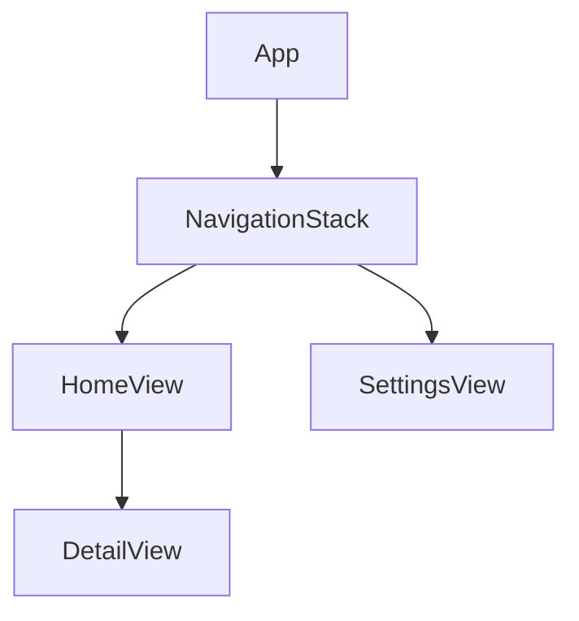

# iOS 项目架构模板

本文档为 iOS 项目提供详细的架构文档模板。

## iOS 特定章节

### I1. 技术栈详情

| 类别 | 技术 | 版本 | 说明 |
|------|------|------|------|
| 编程语言 | Swift | 5.9+ | 主要开发语言 |
| UI 框架 | SwiftUI / UIKit | - | 声明式 UI / 传统 UI |
| 架构模式 | MVVM / TCA | - | 状态管理 |
| 本地存储 | Core Data / Realm | - | 数据持久化 |
| 依赖管理 | SPM / CocoaPods | - | 包管理 |
| 网络 | URLSession / Alamofire | - | 网络请求 |
| 导航 | NavigationStack | iOS 16+ | 导航 |
| 异步 | async/await | Swift 5.5+ | 异步编程 |

### I2. 架构模式

#### MVVM 架构
```
┌─────────────────────────────────────────┐
│                  View                   │
│  ┌─────────────┐  ┌─────────────────┐  │
│  │  SwiftUI    │  │   @StateObject  │  │
│  │    View     │  │   @ObservedObject│  │
│  └─────────────┘  └─────────────────┘  │
└─────────────────────────────────────────┘
                    │
┌─────────────────────────────────────────┐
│              ViewModel                  │
│  ┌─────────────────────────────────┐    │
│  │  @Published / @Observable      │    │
│  │  func methods()                │    │
│  └─────────────────────────────────┘    │
└─────────────────────────────────────────┘
                    │
┌─────────────────────────────────────────┐
│               Model                     │
│  ┌─────────────────────────────────┐    │
│  │  Struct / Class / Enum         │    │
│  └─────────────────────────────────┘    │
└─────────────────────────────────────────┘
```

### I3. 模块分类

| 类别 | 模块 | 职责 |
|------|------|------|
| App | MyApp | 应用入口 |
| Features | Features/* | 功能模块 |
| Core | Core/* | 共享代码 |
| Services | Services/* | 网络、存储服务 |

### I4. 依赖管理

#### Swift Package Manager
```swift
dependencies: [
    .package(url: "https://github.com/Alamofire/Alamofire.git", from: "5.8.0")
]
```

#### CocoaPods
```ruby
pod 'Alamofire', '~> 5.8'
```

### I5. 本地存储

#### Core Data 栈
```swift
let container = NSPersistentContainer(name: "MyModel")
container.loadPersistentStores { description, error in
    // Handle error
}
```

### I6. 状态管理

#### @Observable (iOS 17+)
```swift
@Observable
class UserViewModel {
    var users: [User] = []
    func loadUsers() async { ... }
}
```

### I7. 导航结构



## 标准章节参考

详见 [template.md](./template.md) 中的标准章节结构。
