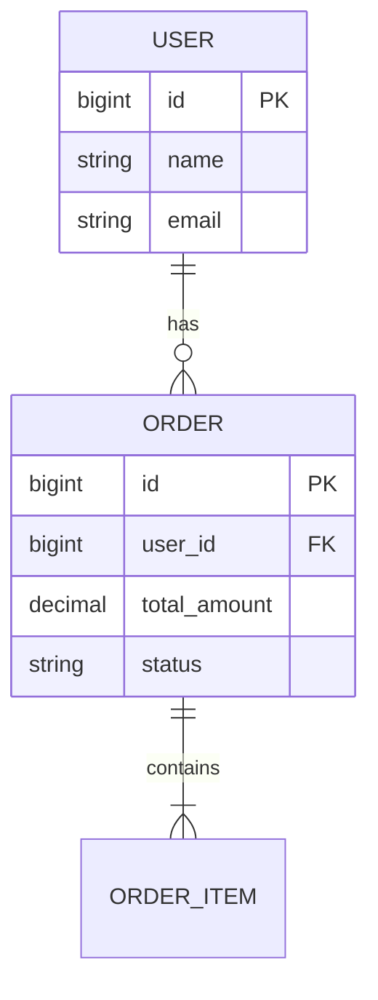
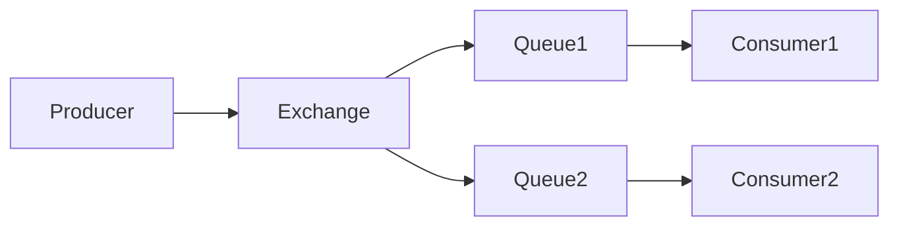

# Java 后端项目架构模板

本文档为 Java 后端项目提供详细的架构文档模板。

## Java 后端特定章节

### J1. 技术栈详情

| 类别 | 技术 | 版本 | 说明 |
|------|------|------|------|
| 编程语言 | Java | 17+ | 主要开发语言 |
| 框架 | Spring Boot | 3.2.x | Web 框架 |
| 构建工具 | Maven / Gradle | 3.9+ / 8.x | 项目构建 |
| 数据库 | MySQL / PostgreSQL | 8.x | 关系数据库 |
| ORM | Spring Data JPA / MyBatis | - | 数据访问 |
| 缓存 | Redis | 7.x | 缓存层 |
| 消息队列 | Kafka / RabbitMQ | - | 消息中间件 |
| API 文档 | SpringDoc OpenAPI | 2.x | API 文档 |
| 日志 | SLF4J + Logback | - | 日志框架 |
| 测试 | JUnit 5 + Mockito | - | 单元测试 |

### J2. 架构模式

#### 分层架构
```
┌─────────────────────────────────────────┐
│            Controller Layer             │
│  ┌─────────────────────────────────┐    │
│  │  @RestController / @Controller │    │
│  │  Handle HTTP Requests           │    │
│  └─────────────────────────────────┘    │
└─────────────────────────────────────────┘
                    │
┌─────────────────────────────────────────┐
│             Service Layer               │
│  ┌─────────────────────────────────┐    │
│  │  @Service                       │    │
│  │  Business Logic                │    │
│  └─────────────────────────────────┘    │
└─────────────────────────────────────────┘
                    │
┌─────────────────────────────────────────┐
│            Repository Layer             │
│  ┌─────────────────────────────────┐    │
│  │  @Repository / Mapper           │    │
│  │  Data Access                   │    │
│  └─────────────────────────────────┘    │
└─────────────────────────────────────────┘
```

### J3. 模块划分

| 模块 | 职责 | 技术 |
|------|------|------|
| xxx-api | 接口定义 | Controller, DTO |
| xxx-service | 业务逻辑 | Service |
| xxx-dal | 数据访问 | Repository, Mapper |
| xxx-common | 公共组件 | 工具类, 常量 |

### J4. API 端点分析

#### RESTful API 规范
```yaml
openapi: 3.0.3
info:
  title: API 文档
  version: 1.0.0
paths:
  /users:
    get:
      summary: 获取用户列表
    post:
      summary: 创建用户
  /users/{id}:
    get:
      summary: 获取用户详情
```

### J5. 数据库设计

#### ER 图


### J6. 缓存策略

| 缓存级别 | 技术 | 场景 | TTL |
|----------|------|------|-----|
| 本地缓存 | Caffeine | 热点数据 | 5min |
| 分布式缓存 | Redis | 共享数据 | 30min |

### J7. 消息队列设计

#### 消息流程


### J8. 性能与容量规划

| 指标 | 当前容量 | 规划容量 |
|------|----------|----------|
| QPS | 1000 | 5000 |
| 响应时间 P99 | 50ms | 100ms |
| 可用性 | 99.9% | 99.99% |

## 标准章节参考

详见 [template.md](./template.md) 中的标准章节结构。
