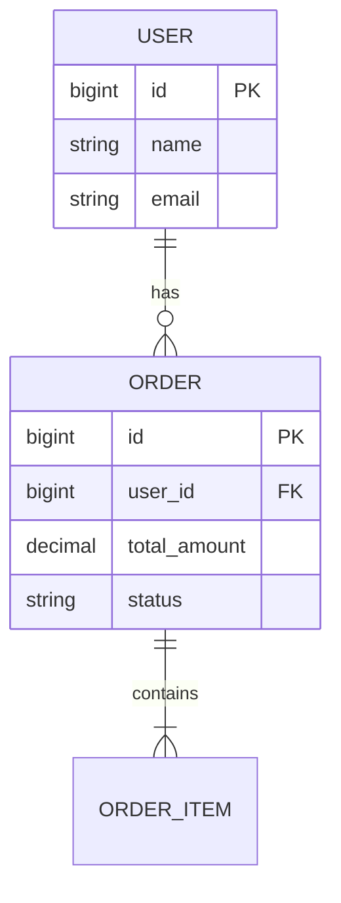
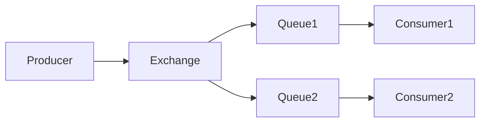
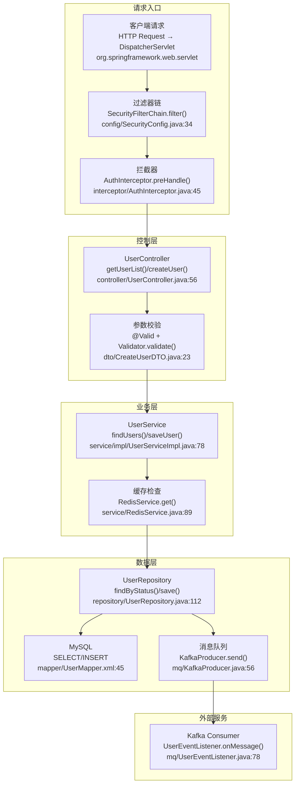
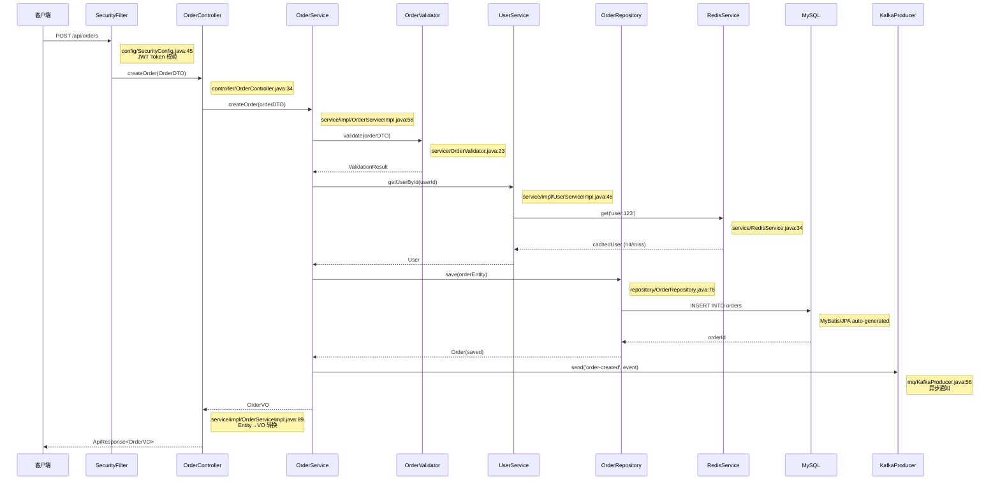
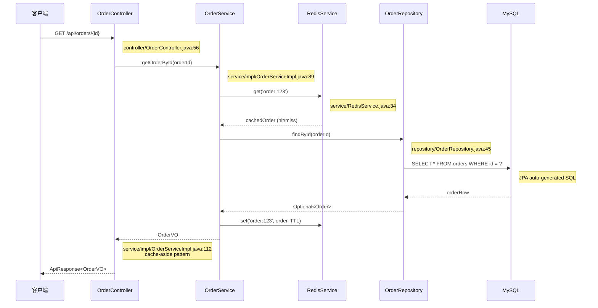
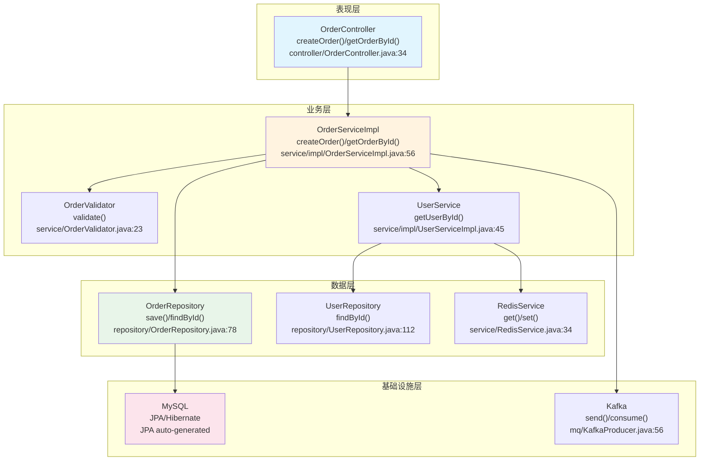

# Java 后端项目架构模板

本文档为 Java 后端项目提供详细的架构文档模板。

## Java 后端特定章节

### J1. 技术栈详情

| 类别 | 技术 | 版本 | 说明 |
|------|------|------|------|
| 编程语言 | Java | 17+ | 主要开发语言 |
| 框架 | Spring Boot | 3.2.x | Web 框架 |
| 构建工具 | Maven / Gradle | 3.9+ / 8.x | 项目构建 |
| 数据库 | MySQL / PostgreSQL | 8.x | 关系数据库 |
| ORM | Spring Data JPA / MyBatis | - | 数据访问 |
| 缓存 | Redis | 7.x | 缓存层 |
| 消息队列 | Kafka / RabbitMQ | - | 消息中间件 |
| API 文档 | SpringDoc OpenAPI | 2.x | API 文档 |
| 日志 | SLF4J + Logback | - | 日志框架 |
| 测试 | JUnit 5 + Mockito | - | 单元测试 |

### J2. 架构模式

#### 分层架构
```
┌─────────────────────────────────────────┐
│            Controller Layer             │
│  ┌─────────────────────────────────┐    │
│  │  @RestController / @Controller │    │
│  │  Handle HTTP Requests           │    │
│  └─────────────────────────────────┘    │
└─────────────────────────────────────────┘
                    │
┌─────────────────────────────────────────┐
│             Service Layer               │
│  ┌─────────────────────────────────┐    │
│  │  @Service                       │    │
│  │  Business Logic                │    │
│  └─────────────────────────────────┘    │
└─────────────────────────────────────────┘
                    │
┌─────────────────────────────────────────┐
│            Repository Layer             │
│  ┌─────────────────────────────────┐    │
│  │  @Repository / Mapper           │    │
│  │  Data Access                   │    │
│  └─────────────────────────────────┘    │
└─────────────────────────────────────────┘
```

### J3. 模块划分

| 模块 | 职责 | 技术 |
|------|------|------|
| xxx-api | 接口定义 | Controller, DTO |
| xxx-service | 业务逻辑 | Service |
| xxx-dal | 数据访问 | Repository, Mapper |
| xxx-common | 公共组件 | 工具类, 常量 |

### J4. API 端点分析

#### RESTful API 规范
```yaml
openapi: 3.0.3
info:
  title: API 文档
  version: 1.0.0
paths:
  /users:
    get:
      summary: 获取用户列表
    post:
      summary: 创建用户
  /users/{id}:
    get:
      summary: 获取用户详情
```

### J5. 数据库设计

#### ER 图


### J6. 缓存策略

| 缓存级别 | 技术 | 场景 | TTL |
|----------|------|------|-----|
| 本地缓存 | Caffeine | 热点数据 | 5min |
| 分布式缓存 | Redis | 共享数据 | 30min |

### J7. 消息队列设计

#### 消息流程


### J8. 性能与容量规划

| 指标 | 当前容量 | 规划容量 |
|------|----------|----------|
| QPS | 1000 | 5000 |
| 响应时间 P99 | 50ms | 100ms |
| 可用性 | 99.9% | 99.99% |

### J9. 主要业务流程图 ★

> ⚠️ **每个节点必须标注方法名和代码位置（文件:行号）**。以下为 Spring Boot 项目典型业务流程示例。

#### 12.1 项目整体业务流程



##### 12.1.1 业务流程步骤详解 ★

| 步骤编号 | 步骤名称 | 核心方法/API | 输入参数 | 返回结果 | 代码位置 | 说明 |
|----------|----------|-------------|----------|----------|----------|------|
| 1 | 请求入口 | `DispatcherServlet.doDispatch()` | `HttpServletRequest` | `ModelAndView` | Spring Framework 内置 | Spring MVC 核心分发器 |
| 2 | 安全过滤 | `SecurityFilterChain.filter(request, response, chain)` | `request`, `response`, `chain` | `void` | `config/SecurityConfig.java:34` | 认证鉴权拦截 |
| 3 | 认证拦截 | `AuthInterceptor.preHandle(request, response, handler)` | `request`, `response`, `handler` | `boolean` | `interceptor/AuthInterceptor.java:45` | Token 校验 |
| 4 | 控制器 | `UserController.getUserList(PageRequest)` | `pageable`: 分页参数 | `Page<UserVO>` | `controller/UserController.java:56` | 处理 HTTP 请求 |
| 5 | 参数校验 | `@Valid CreateUserDTO` | `dto`: 请求体 | `BindingResult` | `dto/CreateUserDTO.java:23` | Bean Validation |
| 6 | 业务逻辑 | `UserServiceImpl.findUsers(PageRequest)` | `pageable`: 分页参数 | `Page<User>` | `service/impl/UserServiceImpl.java:78` | 核心业务处理 |
| 7 | 缓存检查 | `RedisService.get(key)` | `key`: 缓存键 | `Object` | `service/RedisService.java:89` | Redis 缓存命中查检 |
| 8 | 数据仓储 | `UserRepository.findByStatus(status, pageable)` | `status`, `pageable` | `Page<User>` | `repository/UserRepository.java:112` | Spring Data JPA 查询 |
| 9 | 数据库 | `SELECT * FROM user WHERE status = ? LIMIT ? OFFSET ?` | `status`, `limit`, `offset` | `ResultSet` | `mapper/UserMapper.xml:45` | MyBatis/直接 SQL |
| 10 | 消息队列 | `KafkaProducer.send(topic, message)` | `topic`, `message` | `void` | `mq/KafkaProducer.java:56` | 异步事件发布 |
| 11 | 事件消费 | `UserEventListener.onMessage(ConsumerRecord)` | `record`: 消息记录 | `void` | `mq/UserEventListener.java:78` | 异步事件处理 |

##### 12.1.2 关键步骤代码示例

###### 步骤 4：Controller 层

```java
// 📁 controller/UserController.java:56
@RestController
@RequestMapping("/api/users")
@RequiredArgsConstructor
public class UserController {
    private final UserService userService;

    @GetMapping
    public ApiResponse<Page<UserVO>> getUserList(@PageableDefault(size = 20) Pageable pageable) {
        Page<User> users = userService.findUsers(pageable);         // L62: → UserService.findUsers()
        return ApiResponse.success(users.map(UserVO::from));        // L63: Entity → VO
    }

    @PostMapping
    public ApiResponse<UserVO> createUser(@Valid @RequestBody CreateUserDTO dto) {
        User user = userService.saveUser(dto.toEntity());           // L68: → UserService.saveUser()
        return ApiResponse.success(UserVO.from(user));              // L69
    }
}
```

###### 步骤 6：Service 层业务逻辑

```java
// 📁 service/impl/UserServiceImpl.java:78
@Service
@RequiredArgsConstructor
public class UserServiceImpl implements UserService {
    private final UserRepository userRepository;
    private final RedisService redisService;

    @Override
    public Page<User> findUsers(Pageable pageable) {
        String cacheKey = "users:page:" + pageable.getPageNumber(); // L81
        Page<User> cached = (Page<User>) redisService.get(cacheKey);// L82: 查 Redis
        if (cached != null) return cached;                             // L83: 缓存命中

        Page<User> users = userRepository.findByStatus(             // L86: 缓存未命中
            UserStatus.ACTIVE, pageable);                              // → JPA Repository
        redisService.set(cacheKey, users, Duration.ofMinutes(5));   // L88: 回写缓存
        return users;
    }
}
```

#### 12.2 核心功能模块流程（时序图）★

##### 创建订单流程



**步骤详解**：

| 步骤 | 调用者 | 被调用者 | 方法签名 | 参数 | 返回 | 代码位置 | 说明 |
|------|--------|----------|----------|------|------|----------|------|
| 1 | 客户端 | SecurityFilter | `doFilter(req, resp, chain)` | `req`, `resp`, `chain` | `void` | `config/SecurityConfig.java:45` | JWT 校验 |
| 2 | Filter | OrderController | `createOrder(@Valid OrderDTO)` | `orderDTO`: 订单请求体 | `ApiResponse<OrderVO>` | `controller/OrderController.java:34` | REST 端点 |
| 3 | Controller | OrderService | `createOrder(OrderDTO)` | `orderDTO`: 订单DTO | `OrderVO` | `service/impl/OrderServiceImpl.java:56` | 业务编排入口 |
| 4 | Service | OrderValidator | `validate(OrderDTO)` | `orderDTO`: 订单数据 | `ValidationResult` | `service/OrderValidator.java:23` | 业务规则校验 |
| 5 | Service | UserService | `getUserById(Long userId)` | `userId`: 用户ID | `User` | `service/impl/UserServiceImpl.java:45` | 获取用户信息 |
| 6 | UserService | RedisService | `get('user:' + id)` | `key`: 缓存键 | `Object` | `service/RedisService.java:34` | Redis 查询 |
| 7 | Service | OrderRepository | `save(Order entity)` | `entity`: 订单实体 | `Order` | `repository/OrderRepository.java:78` | JPA save |
| 8 | Repository | MySQL | `INSERT INTO orders ...` | SQL 语句 | `orderId` | JPA/MyBatis 自动生成 | 数据库写入 |
| 9 | Service | KafkaProducer | `send(topic, event)` | `topic`, `event` | `void` | `mq/KafkaProducer.java:56` | 发送领域事件 |

**关键代码示例**：

```java
// 📁 service/impl/OrderServiceImpl.java:56 - 订单创建核心
@Service
@Transactional
@RequiredArgsConstructor
public class OrderServiceImpl implements OrderService {
    private final OrderRepository orderRepository;
    private final UserService userService;
    private final OrderValidator orderValidator;
    private final KafkaProducer kafkaProducer;

    @Override
    public OrderVO createOrder(OrderDTO dto) {
        orderValidator.validate(dto);                                // L63: 业务校验
        User user = userService.getUserById(dto.getUserId());        // L64: → UserService
        Order order = Order.create(user, dto.getItems());             // L66: 工厂方法
        Order saved = orderRepository.save(order);                   // L67: JPA persist
        kafkaProducer.send("order-created",                          // L69: 领域事件
            OrderCreatedEvent.from(saved));
        return OrderVO.from(saved);                                  // L71: Entity→VO
    }
}
```

##### 查询订单流程



**步骤详解**：

| 步骤 | 调用者 | 被调用者 | 方法签名 | 参数 | 返回 | 代码位置 | 说明 |
|------|--------|----------|----------|------|------|----------|------|
| 1 | 客户端 | OrderController | `getOrderById(@PathVariable Long id)` | `id`: 订单ID | `ApiResponse<OrderVO>` | `controller/OrderController.java:56` | REST 端点 |
| 2 | Controller | OrderService | `getOrderById(Long orderId)` | `orderId`: 订单ID | `OrderVO` | `service/impl/OrderServiceImpl.java:89` | 业务层入口 |
| 3 | Service | RedisService | `get('order:' + id)` | `key`: 缓存键 | `Object` | `service/RedisService.java:34` | Cache-Aside 读缓存 |
| 4 | Service | OrderRepository | `findById(Long id)` | `id`: 主键 | `Optional<Order>` | `repository/OrderRepository.java:45` | JPA findById |
| 5 | Repository | MySQL | `SELECT * FROM orders WHERE id = ?` | `id`: 主键 | `ResultSet` | JPA 自动生成 | 数据库查询 |
| 6 | Service | RedisService | `set('order:' + id, order, Duration)` | `key`, `value`, `ttl` | `void` | L112 | 回写缓存 |

**关键代码示例**：

```java
// 📁 service/impl/OrderServiceImpl.java:89 - Cache-Aside 模式
@Override
public OrderVO getOrderById(Long orderId) {
    String cacheKey = "order:" + orderId;                            // L92
    Order cached = (Order) redisService.get(cacheKey);              // L93: 先查 Redis
    if (cached != null) return OrderVO.from(cached);                // L94: 缓存命中

    Order order = orderRepository.findById(orderId)                 // L97: 缓存未命中
        .orElseThrow(() -> new NotFoundException("订单不存在"));      // L98: 异常处理
    redisService.set(cacheKey, order, Duration.ofMinutes(10));      // L100: 回写缓存
    return OrderVO.from(order);                                     // L101: Entity→VO
}
```

#### 12.3 核心功能流程图（分层）★

##### 订单处理分层流程



**步骤与API详解**：

| 步骤 | 组件 | 核心方法 | 参数类型 | 返回类型 | 代码位置 | 关键逻辑 |
|------|------|----------|----------|----------|----------|----------|
| 1 | OrderController | `createOrder(@Valid OrderDTO)` | `OrderDTO` | `ApiResponse<OrderVO>` | `controller/OrderController.java:34` | @PostMapping 端点 |
| 2 | OrderServiceImpl | `createOrder(OrderDTO)` | `OrderDTO` | `OrderVO` | `service/impl/OrderServiceImpl.java:56` | @Transactional 事务管理 |
| 3 | OrderValidator | `validate(OrderDTO)` | `OrderDTO` | `ValidationResult` | `service/OrderValidator.java:23` | 库存校验、用户校验 |
| 4 | UserService | `getUserById(Long)` | `Long` | `User` | `service/impl/UserServiceImpl.java:45` | 含 Redis 缓存 |
| 5 | OrderRepository | `save(Order)` | `Order` (Entity) | `Order` (persisted) | `repository/OrderRepository.java:78` | JpaRepository.save() |
| 6 | MySQL | `INSERT INTO orders ...` | SQL | `affectedRows` | JPA auto-generated | 持久化 |
| 7 | KafkaProducer | `send('order-created', event)` | `String`, `Object` | `void` | `mq/KafkaProducer.java:56` | 异步事件发布 |

#### 12.4 业务流程说明（含代码位置、API详情）★

| 流程名称 | 涉及模块 | 入口方法 | 核心API链路 | 参数/返回 | 代码位置 | 功能描述 |
|----------|----------|----------|-------------|-----------|----------|----------|
| 用户认证 | auth | `AuthController.login()` | `AuthService.authenticate()` → `UserRepo.findByUsername()` → `JwtUtil.generate()` | `LoginDTO` → `TokenVO` | `controller/AuthController.java:34` | JWT 签发 |
| 订单创建 | order | `OrderController.createOrder()` | `OrderService.createOrder()` → `OrderValidator.validate()` → `OrderRepo.save()` → `KafkaProducer.send()` | `OrderDTO` → `OrderVO` | `controller/OrderController.java:34` | 事务保障+事件通知 |
| 订单查询 | order | `OrderController.getOrderById()` | `OrderService.getOrderById()` → `RedisService.get()` → `OrderRepo.findById()` | `Long` → `OrderVO` | `controller/OrderController.java:56` | Cache-Aside 模式 |
| 用户列表 | user | `UserController.getUserList()` | `UserService.findUsers()` → `RedisService.get()` → `UserRepo.findByStatus()` | `Pageable` → `Page<UserVO>` | `controller/UserController.java:56` | 缓存分页查询 |
| 消息消费 | mq | `UserEventListener.onMessage()` | `UserEventHandler.handle()` → `UserRepo.save()` | `ConsumerRecord` → `void` | `mq/UserEventListener.java:78` | Kafka 事件驱动 |

## 标准章节参考

详见 [template.md](./template.md) 中的标准章节结构。
