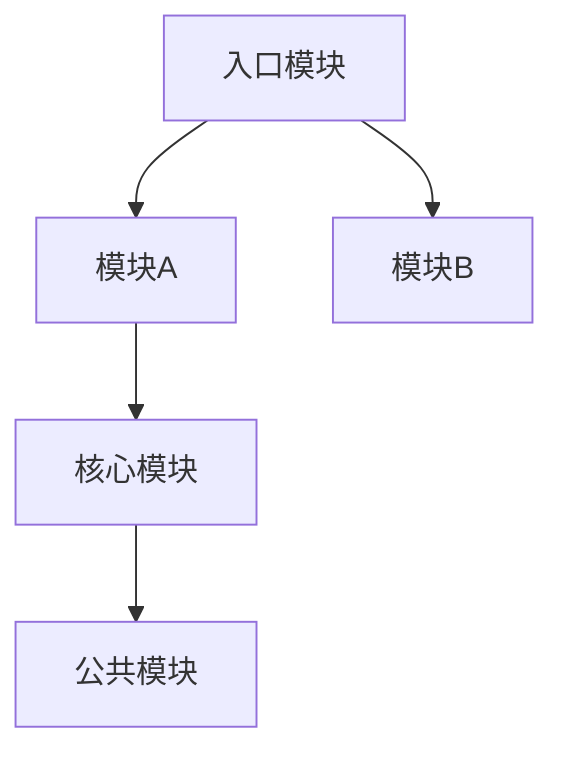
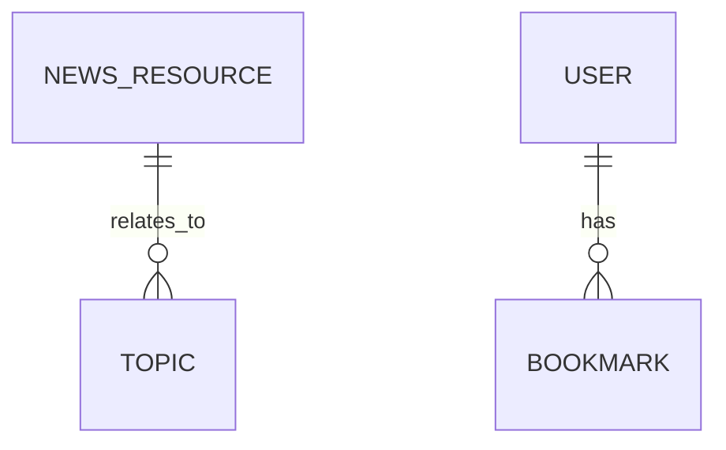
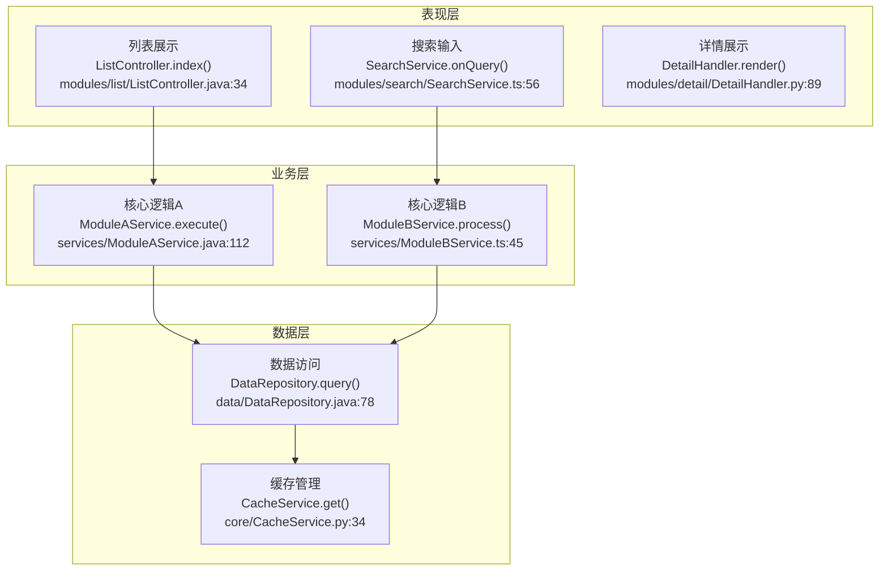
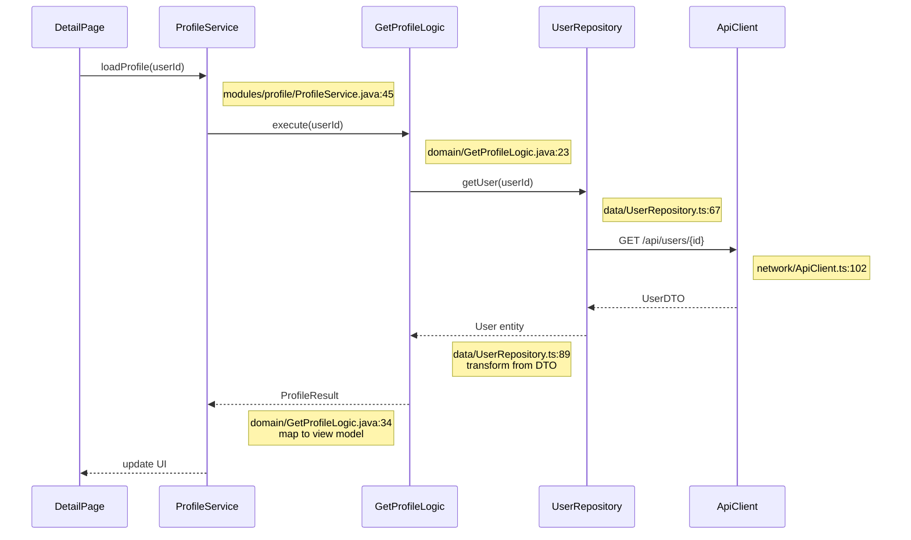
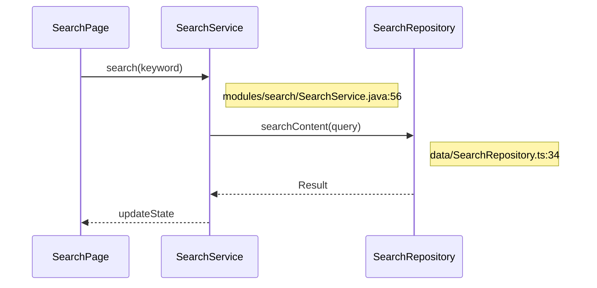
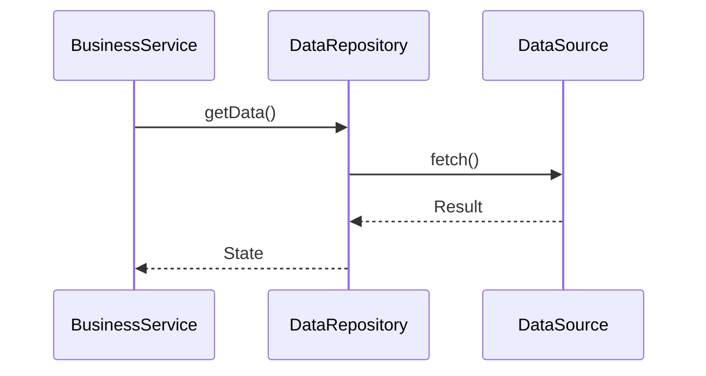
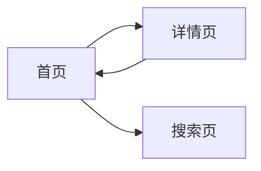
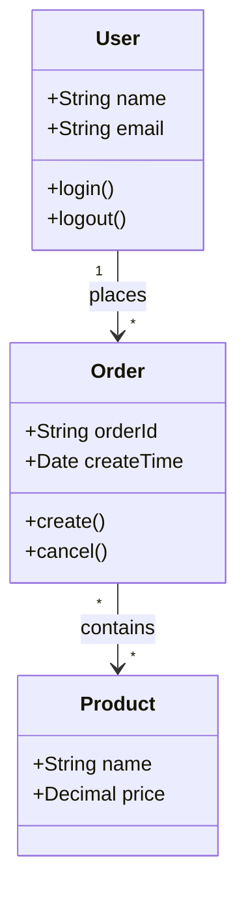

# Mermaid 图表规范

本文档定义项目架构逆向工程中使用的 Mermaid 图表语法规范。

> ⚠️ **核心原则**：流程图和时序图必须标注每个步骤对应的**方法/API 名称**、**代码文件路径**和**行号**，帮助开发者快速定位实现代码。

## 图表类型速查

| 图表    | 语法                          | 节点格式                                  |
| ----- | --------------------------- | ------------------------------------- |
| 依赖图   | `flowchart TD/LR`           | `A[名称] --> B[名称]`                     |
| 业务流程图 | `flowchart TB` + `subgraph` | `A[名称<br>方法+文件:行号]` + `subgraph` 分组   |
| 时序图   | `sequenceDiagram`           | `participant` + `->>` + `Note` 标注代码位置 |
| ER图   | `erDiagram`                 | `T1 \|\|--o{ T2 : rel`                |
| 流程图   | `flowchart LR/TB`           | `A[名称<br>方法+文件:行号]`                   |

## 模块依赖图

用于展示项目各模块之间的依赖关系。



### 语法说明

- `flowchart TD` - 从上到下的流程图
- `flowchart LR` - 从左到右的流程图
- 节点格式：`NodeID[显示文本]`
- 箭头：`A --> B` 表示 A 依赖 B

## 数据库ER图

用于展示数据库表结构和外键关系。



### 关系符号

| 符号       | 含义     |        |        |      |     |
| -------- | ------ | ------ | ------ | ---- | --- |
| \`       | <br /> | --     | <br /> | \`   | 一对一 |
| \`       | <br /> | --o{\` | 一对多    |      |     |
| `}o--o{` | 多对多    |        |        |      |     |
| \`       | <br /> | --     | {\`    | 一对唯一 |     |

> **注意**：ER 图实体名只能使用字母、数字和下划线，**不能包含连字符** **`-`**，否则会与关系语法 `--` 冲突。

## 业务流程图（含代码标注）⭐

用于展示业务处理流程，**每个节点必须标注对应的方法/API 和代码位置**。流程图下方必须附带**步骤API详解表**和**关键代码示例**。

### 格式规范

```
节点文本格式：[步骤名]<br>方法名<br>文件路径:行号
```



### 代码标注要求

- 使用 `<br>` 在节点内换行
- 第一行：步骤名称
- 第二行：`ClassName.methodName(params)` 核心方法
- 第三行：`相对路径:行号` 代码位置
- 节点文本过长时可用简写 `A["长文本内容"]`

### subgraph 分组

- 使用 `subgraph` 定义分组
- 分组内的节点会自动聚集

### 步骤API详解表格式（必需）★

每个流程图下方必须附带步骤API详解表：

| 步骤编号 | 步骤名称  | 核心方法/API                 | 输入参数             | 返回结果              | 代码位置      | 说明     |
| ---- | ----- | ------------------------ | ---------------- | ----------------- | --------- | ------ |
| 1    | {步骤名} | `ClassName.method(Type)` | `param`: 类型 — 含义 | `ReturnType` — 含义 | `文件路径:行号` | {步骤说明} |

### 关键代码示例（推荐）★

对于复杂步骤，应在步骤表下方提供关键代码片段：

```{语言}
// 文件路径:行号 - 功能说明
方法的关键实现代码
```

## 核心功能时序图（含代码标注）⭐

用于展示核心功能的调用时序，**每个调用必须用** **`Note`** **标注代码位置，箭头消息标注方法名**。时序图下方必须附带**步骤详解表**和**关键代码示例**。

### 格式规范

```
箭头消息格式：方法名(参数)
Note 标注格式：文件路径:行号
```



### 语法说明

- `participant X as Y` - 定义参与者（X为ID，Y为显示名）
- `->>` - 同步请求消息（标注方法名+参数）
- `-->>` - 返回消息
- `Note right of X` / `Note left of X` - **必须使用 Note 标注每个参与者的代码文件和行号**
- `Note over X,Y` - 标注跨参与者的信息
- **每个消息箭头都标注方法名，每个 participant 都用 Note 标注文件路径**

### 步骤详解表格式（必需）★

每个时序图下方必须附带步骤详解表：

| 步骤 | 调用者             | 被调用者            | 方法签名                         | 参数              | 返回               | 代码位置                                     | 说明       |
| -- | --------------- | --------------- | ---------------------------- | --------------- | ---------------- | ---------------------------------------- | -------- |
| 1  | DetailPage      | ProfileService  | `loadProfile(String userId)` | `userId`: 用户ID  | `void`           | `modules/profile/ProfileService.java:45` | 触发资料加载   |
| 2  | ProfileService  | GetProfileLogic | `execute(String userId)`     | `userId`: 用户ID  | `ProfileContext` | `domain/GetProfileLogic.java:23`         | 业务编排     |
| 3  | GetProfileLogic | UserRepository  | `getUser(String userId)`     | `userId`: 用户ID  | `UserEntity`     | `data/UserRepository.ts:67`              | 数据查询     |
| 4  | UserRepository  | ApiClient       | `GET /api/users/{id}`        | `id`: 路径参数      | `UserDTO`        | `network/ApiClient.ts:102`               | HTTP请求   |
| 5  | UserRepository  | (转换)            | `transform from DTO`         | `UserDTO`       | `UserEntity`     | `data/UserRepository.ts:89`              | DTO→实体映射 |
| 6  | GetProfileLogic | (映射)            | `map to view model`          | `UserEntity`    | `ProfileResult`  | `domain/GetProfileLogic.java:34`         | 实体→视图模型  |
| 7  | ProfileService  | (更新)            | `update UI`                  | `ProfileResult` | `void`           | -                                        | 渲染更新     |

### 关键代码示例（推荐）★

```java
// 📁 data/UserRepository.ts:89 - DTO转换
public UserEntity getUser(String userId) {
    UserDTO dto = apiClient.get("/api/users/" + userId);       // L91
    return new UserEntity(                                      // L93
        dto.getId(),
        dto.getName(),
        dto.getEmail()
    );
}
```

### 简化版时序图（模块文档用）

当参与者较少时，可简化箭头消息中的入参。同样需要附带步骤详解表：



**步骤详解**：

| 步骤 | 调用者           | 被调用者             | 方法签名                      | 参数             | 返回             | 代码位置                                   | 说明     |
| -- | ------------- | ---------------- | ------------------------- | -------------- | -------------- | -------------------------------------- | ------ |
| 1  | SearchPage    | SearchService    | `search(String keyword)`  | `keyword`: 搜索词 | `void`         | `modules/search/SearchService.java:56` | 触发搜索   |
| 2  | SearchService | SearchRepository | `searchContent(String q)` | `q`: 查询字符串     | `SearchResult` | `data/SearchRepository.ts:34`          | 数据检索   |
| 3  | SearchService | (更新)             | `updateState`             | -              | `void`         | -                                      | 更新UI状态 |

## 数据流图

用于展示数据在各组件间的流转过程。



## 导航流程图

用于展示页面跳转关系。



## 类图

用于展示核心数据类之间的关系。



### 语法说明

- `class 类名` - 定义类
- `+成员` - public 成员
- `-成员` - private 成员
- `ClassA --> ClassB` - 关联关系

