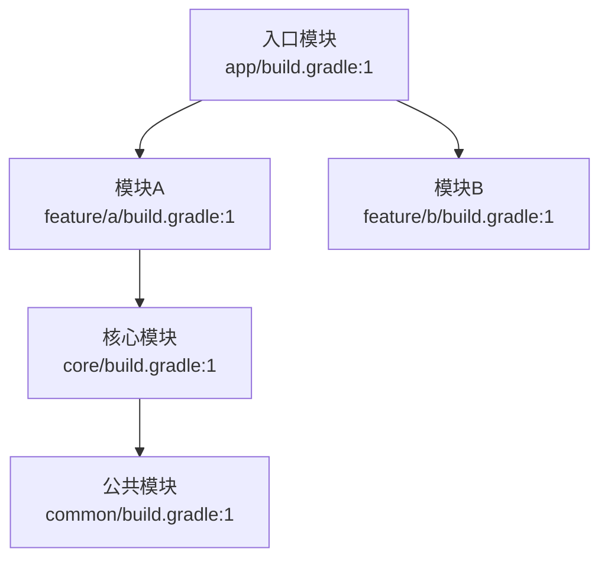
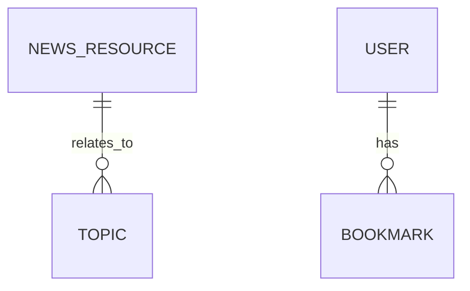
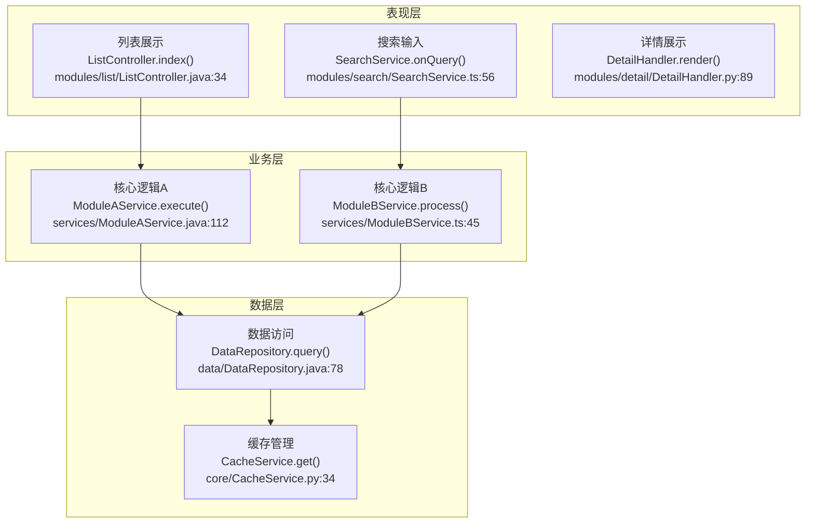
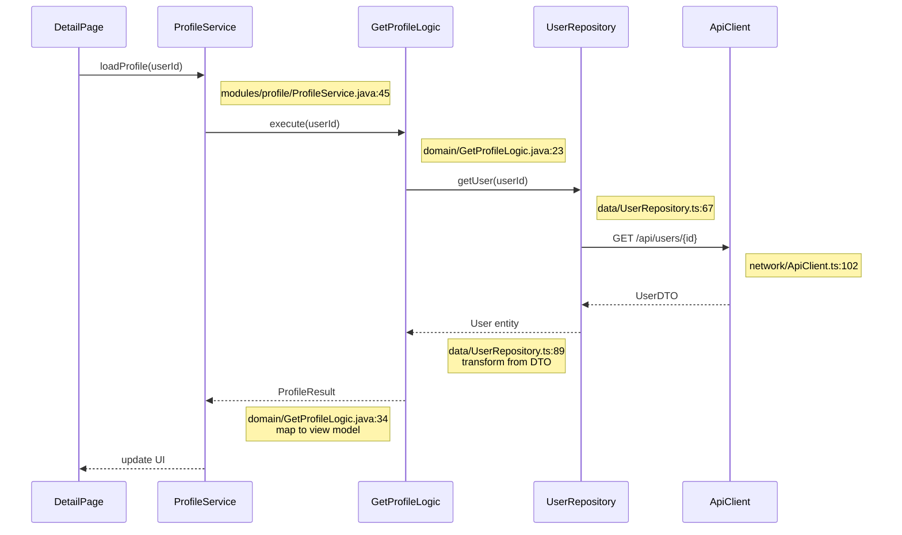
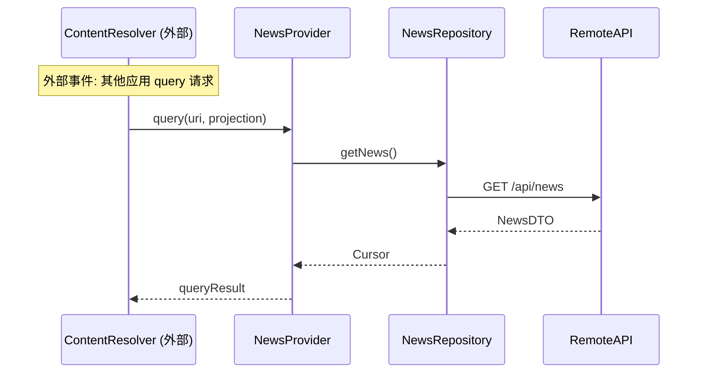
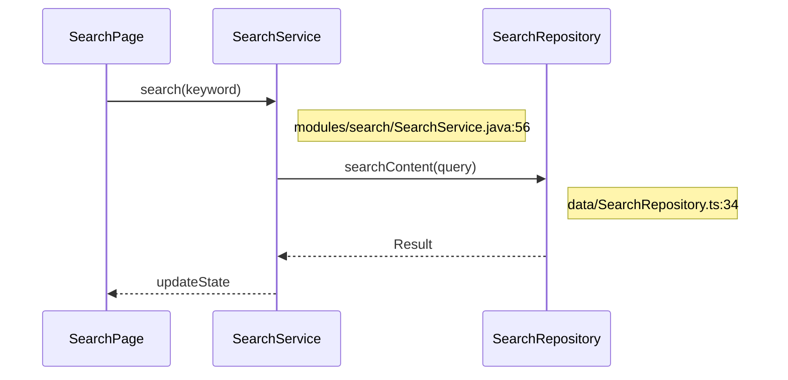
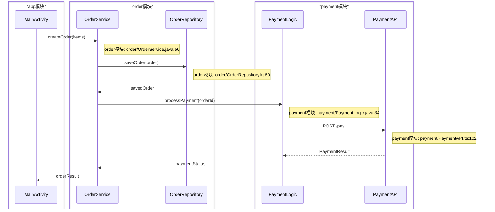
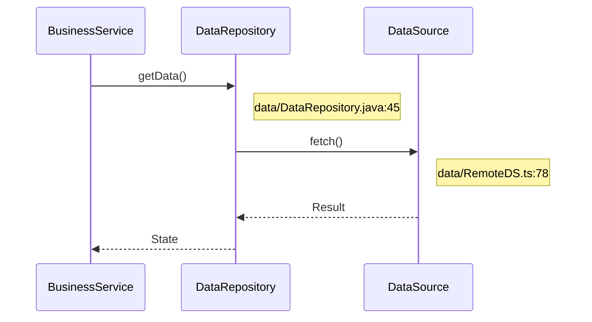
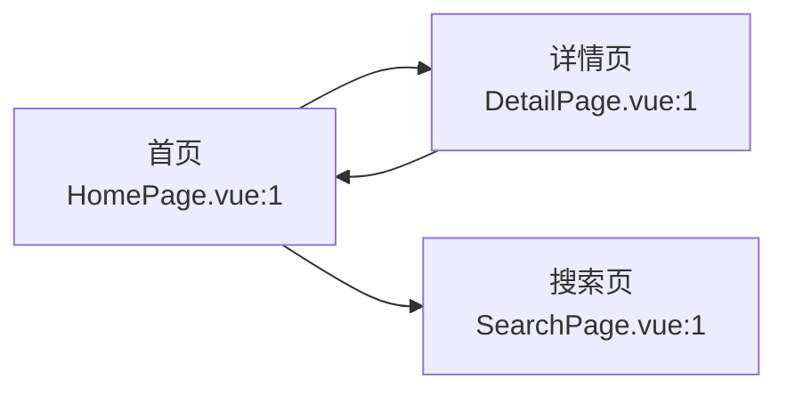
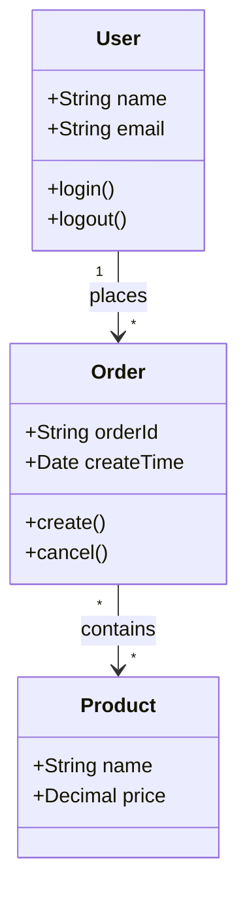

# Mermaid 图表规范

本文档定义项目架构逆向工程中使用的 Mermaid 图表语法规范。

> ⚠️ **核心原则**：流程图和时序图必须标注每个步骤对应的**方法/API 名称**、**代码文件路径**和**行号**，帮助开发者快速定位实现代码。

## 图表类型速查

| 图表    | 语法                          | 节点格式                                  |
| ----- | --------------------------- | ------------------------------------- |
| 依赖图   | `flowchart TD/LR`           | `A[名称] --> B[名称]`                     |
| 业务流程图 | `flowchart TB` + `subgraph` | `A[名称<br>方法+文件:行号]` + `subgraph` 分组   |
| 时序图   | `sequenceDiagram`           | `participant` + `->>` + `Note` 标注代码位置 |
| ER图   | `erDiagram`                 | `T1 \|\|--o{ T2 : rel`                |
| 流程图   | `flowchart LR/TB`           | `A[名称<br>方法+文件:行号]`                   |

## 模块依赖图

用于展示项目各模块之间的依赖关系。**每个模块节点必须标注对应的构建文件路径和行号**。



### 语法说明

- `flowchart TD` - 从上到下的流程图
- `flowchart LR` - 从左到右的流程图
- 节点格式：`NodeID["模块名<br>构建文件路径:行号"]`
- 箭头：`A --> B` 表示 A 依赖 B
- ⚠️ **每个模块节点必须标注构建文件位置**（如 `build.gradle:1`、`package.json:1`），标注方式同业务流程图

## 数据库ER图

用于展示数据库表结构和外键关系。ER 图下方必须附带**表结构说明表**，标注每个表的代码位置（建表语句/迁移文件/实体类路径:行号）。



> ⚠️ ER 图本身不直接标注代码位置（Mermaid erDiagram 语法限制），但**必须在 ER 图下方附带表结构说明表**，包含每个表对应的代码位置（如建表 SQL 文件路径、Entity 类文件路径:行号）。

### 关系符号

| 符号       | 含义     |        |        |      |     |
| -------- | ------ | ------ | ------ | ---- | --- |
| \`       | <br /> | --     | <br /> | \`   | 一对一 |
| \`       | <br /> | --o{\` | 一对多    |      |     |
| `}o--o{` | 多对多    |        |        |      |     |
| \`       | <br /> | --     | {\`    | 一对唯一 |     |

> **注意**：ER 图实体名只能使用字母、数字和下划线，**不能包含连字符** **`-`**，否则会与关系语法 `--` 冲突。

## 业务流程图（含代码标注）⭐

用于展示业务处理流程，**每个节点必须标注对应的方法/API 和代码位置**。流程图下方必须附带**步骤API详解表**和**关键代码示例**。

### 格式规范

```
节点文本格式：[步骤名]<br>方法名<br>文件路径:行号
```



### 代码标注要求

- 使用 `<br>` 在节点内换行
- 第一行：步骤名称
- 第二行：`ClassName.methodName(params)` 核心方法
- 第三行：`相对路径:行号` 代码位置
- 节点文本过长时可用简写 `A["长文本内容"]`
- ⚠️ **禁止使用圆柱体形状** `[( )]`：当方法名含 `()` 时，`[( )]` 括号冲突导致解析失败。始终使用矩形 `["..."]` 代替
- ⚠️ **节点文本含 `()` 时必须用双引号包裹**：`AUTH[认证<br>AuthService.login()]` 中的 `()` 会被 Mermaid 解析器当作圆角矩形语法 `(...)` 处理，导致 `got 'PS'` 错误。必须写为 `AUTH["认证<br>AuthService.login()"]`
- ⚠️ **所有箭头引用的节点 ID 必须在前面定义**：未定义的节点 ID（如 `CONFIG --> AUTH` 但 CONFIG 未声明）会导致解析错误 `got 'PS'`
- ⚠️ **节点文本首尾不要用裸括号** `()`：如 `["(MySQL...)"]` 可能被误解析为圆角矩形语法，改为 `["MySQL..."]`
- ⚠️ **节点文本中括号必须成对匹配**：方法名如 `KafkaProducer.send()` 的括号正常，但文本末尾不能有多余的 `)`

### subgraph 分组

- 使用 `subgraph` 定义分组
- 分组内的节点会自动聚集

### 步骤API详解表格式（必需）★

每个流程图下方必须附带步骤API详解表：

| 步骤编号 | 步骤名称  | 核心方法/API                 | 输入参数             | 返回结果              | 代码位置      | 说明     |
| ---- | ----- | ------------------------ | ---------------- | ----------------- | --------- | ------ |
| 1    | {步骤名} | `ClassName.method(Type)` | `param`: 类型 — 含义 | `ReturnType` — 含义 | `文件路径:行号` | {步骤说明} |

### 关键代码示例（必需）★

对于**所有涉及代码的步骤**，必须在步骤表下方提供关键代码片段：

```{语言}
// 文件路径:行号 - 功能说明
方法的关键实现代码
```

## 核心功能时序图（含代码标注）⭐

用于展示核心功能的调用时序，**每个核心功能/能力必须有独立的时序图**，不允许合并或简化。每个调用必须用 **`Note`** **标注代码位置**，箭头消息标注方法名。时序图下方必须附带**步骤详解表**和**关键代码示例**。

### 详细度要求 ★

| 维度 | 最低要求 | 说明 |
|------|----------|------|
| 调用步骤数 | ≥6步（不含返回箭头） | 覆盖完整的调用链路，不允许省略中间层 |
| 参与者数量 | ≥4个 | 展示跨组件/跨层交互（UI→Service→Logic→Repo→DS） |
| 分层覆盖 | 表现层→业务层→数据层 | 不能跳层（如 `UI->>Repo` 跳过 Service） |
| 返回消息 | 每个请求有对应返回 | 关键返回须标注转换逻辑（如 `Note left of Repo: DTO→Entity 转换`） |
| 步骤详解表 | 必需 | 每个时序图下方必须附带 |
| 关键代码示例 | 必需 | 每个核心步骤展示代码片段 |

> 🔴 **禁止粗略时序图**：不允许生成只有3-4步的简化时序图，不允许将多个核心功能合并为一个时序图。每个核心功能/能力都必须有独立的、足够详细的时序图。

### 禁止的粗略模式

> 以下为**错误示例**，禁止在时序图中出现：

❌ **跳层 + 步骤过少 + 参与者不足**（错误）：
```
sequenceDiagram
    participant UI as Page
    participant Repo as Repository
    UI->>Repo: getData()           %% 跳过Service层，只有2个参与者
    Repo-->>UI: Data               %% 只有1个请求+1个返回，太粗略
```

❌ **多个功能合并为一个时序图**（错误）：
```
sequenceDiagram
    participant UI as Page
    participant Service as Service
    UI->>Service: login()           %% 登录功能
    UI->>Service: search()          %% 搜索功能（不应合并）
```

❌ **只有3-4步的简化时序图**（错误）：
```
sequenceDiagram
    participant UI as Page
    participant Service as Service
    participant Repo as Repository
    UI->>Service: loadData()
    Service->>Repo: fetch()
    Repo-->>UI: Data                %% 跳过Service返回，步骤不足
```

### 格式规范

```
箭头消息格式：方法名(参数)
Note 标注格式：文件路径:行号
```



### 语法说明

- `participant X as Y` - 定义参与者（X为ID，Y为显示名）
- `->>` - 同步请求消息（标注方法名+参数）
- `-->>` - 返回消息
- `Note right of X` / `Note left of X` - **必须使用 Note 标注每个参与者的代码文件和行号**
- `Note over X,Y` - 标注跨参与者的信息
- **每个消息箭头都标注方法名，每个 participant 都用 Note 标注文件路径**

### 入口标注规范 ★

> 时序图首步必须标注入口的触发类型和条件，让调用链可追溯到真正的系统起点。

**三种入口标注格式**：

```mermaid
%% UI触发入口
Note over UI: UI触发: 按钮点击 / 页面进入 / 表单提交

%% 系统触发入口
Note over Sys: 系统触发: 网络可用 / 定时任务(cron) / 后台拉取

%% 外部事件入口
Note over Ext: 外部事件: FCM推送 / Kafka消息 / URL Scheme
```

**入口参与者命名规范**：
- UI触发 → participant 为具体的 UI 组件（Page/Composable/Activity）
- 系统触发 → participant 为系统调度器名称（WorkManager/@Scheduled/BGTaskScheduler）
- 外部事件 → participant 为事件源名称（FCM/Kafka/BroadcastReceiver）

**入口标注示例（Android ContentProvider）**：


### 步骤详解表格式（必需）★

每个时序图下方必须附带步骤详解表：

| 步骤 | 调用者             | 被调用者            | 方法签名                         | 参数              | 返回               | 代码位置                                     | 说明       |
| -- | --------------- | --------------- | ---------------------------- | --------------- | ---------------- | ---------------------------------------- | -------- |
| 1  | DetailPage      | ProfileService  | `loadProfile(String userId)` | `userId`: 用户ID  | `void`           | `modules/profile/ProfileService.java:45` | 触发资料加载   |
| 2  | ProfileService  | GetProfileLogic | `execute(String userId)`     | `userId`: 用户ID  | `ProfileContext` | `domain/GetProfileLogic.java:23`         | 业务编排     |
| 3  | GetProfileLogic | UserRepository  | `getUser(String userId)`     | `userId`: 用户ID  | `UserEntity`     | `data/UserRepository.ts:67`              | 数据查询     |
| 4  | UserRepository  | ApiClient       | `GET /api/users/{id}`        | `id`: 路径参数      | `UserDTO`        | `network/ApiClient.ts:102`               | HTTP请求   |
| 5  | UserRepository  | (转换)            | `transform from DTO`         | `UserDTO`       | `UserEntity`     | `data/UserRepository.ts:89`              | DTO→实体映射 |
| 6  | GetProfileLogic | (映射)            | `map to view model`          | `UserEntity`    | `ProfileResult`  | `domain/GetProfileLogic.java:34`         | 实体→视图模型  |
| 7  | ProfileService  | (更新)            | `update UI`                  | `ProfileResult` | `void`           | -                                        | 渲染更新     |

### 关键代码示例（必需）★

对于**所有涉及代码的调用步骤**，必须在步骤表下方提供关键代码片段：

```java
// 📁 data/UserRepository.ts:89 - DTO转换
public UserEntity getUser(String userId) {
    UserDTO dto = apiClient.get("/api/users/" + userId);       // L91
    return new UserEntity(                                      // L93
        dto.getId(),
        dto.getName(),
        dto.getEmail()
    );
}
```

### 简化版时序图（模块文档用）

当参与者较少时，可简化箭头消息中的入参，但**步骤数和分层要求不变**。同样需要附带步骤详解表和关键代码示例：

> ⚠️ "简化版"仅指入参可以省略类型信息，**不意味着步骤数可以减少、分层可以跳过**。仍然必须满足 ≥6步、≥4参与者、完整分层的要求。



**步骤详解**：

| 步骤 | 调用者           | 被调用者             | 方法签名                      | 参数             | 返回             | 代码位置                                   | 说明     |
| -- | ------------- | ---------------- | ------------------------- | -------------- | -------------- | -------------------------------------- | ------ |
| 1  | SearchPage    | SearchService    | `search(String keyword)`  | `keyword`: 搜索词 | `void`         | `modules/search/SearchService.java:56` | 触发搜索   |
| 2  | SearchService | SearchRepository | `searchContent(String q)` | `q`: 查询字符串     | `SearchResult` | `data/SearchRepository.ts:34`          | 数据检索   |
| 3  | SearchService | (更新)             | `updateState`             | -              | `void`         | -                                      | 更新UI状态 |

## 跨模块时序图（根文档 §12.4 用）★

用于展示跨越多个模块的端到端业务流程。参与者来自不同模块，用 `box` 分组标注所属模块。

### 格式要求

```
- 参与者数量：≥ 4 个，来自 ≥ 2 个模块
- box 分组：按模块对参与者分组，如 `box "order模块" ... end`
- 消息标注：方法名 + `所属模块: 文件路径:行号`
- 步骤详解表：新增"所属模块"列为第 2 列（共 9 列）
- 调用步骤数：≥ 6 步（不含返回箭头）
- 分层覆盖：跨模块但每模块内完整分层（表现层→业务层→数据层）
```

### 示例



### 步骤详解表（9 列）★

| 步骤 | 所属模块 | 调用者 | 被调用者 | 方法签名 | 参数 | 返回 | 代码位置 | 说明 |
|------|----------|--------|----------|----------|------|------|----------|------|
| 1 | app | MainActivity | OrderService | `createOrder(items)` | `items`: 订单项 | `void` | `order/OrderService.java:56` | 触发下单 |
| 2 | order | OrderService | OrderRepository | `saveOrder(order)` | `order`: 订单对象 | `OrderEntity` | `order/OrderRepository.kt:89` | 持久化订单 |
| 3 | order | OrderRepository | OrderService | (返回) | — | `savedOrder` | — | 返回已保存订单 |
| 4 | order | OrderService | PaymentLogic | `processPayment(orderId)` | `orderId`: 订单ID | `void` | `payment/PaymentLogic.java:34` | 发起支付 |
| 5 | payment | PaymentLogic | PaymentAPI | `POST /pay` | `body`: 支付请求 | `PaymentDTO` | `payment/PaymentAPI.ts:102` | HTTP 支付请求 |
| 6 | payment | PaymentAPI | PaymentLogic | (返回) | — | `PaymentResult` | — | 支付结果 |
| 7 | payment | PaymentLogic | OrderService | (返回) | — | `paymentStatus` | — | 支付状态 |
| 8 | order | OrderService | MainActivity | (返回) | — | `orderResult` | — | 结果回传 |

### 关键代码示例（必需）★

```java
// 📁 order模块: order/OrderService.java:56 - 下单入口
public void createOrder(List<Item> items) {
    Order order = new Order(items);
    OrderEntity entity = orderRepository.saveOrder(order);  // L58
    PaymentLogic.processPayment(entity.getId());            // L59
}
```

```java
// 📁 payment模块: payment/PaymentLogic.java:34 - 支付处理
public PaymentResult processPayment(String orderId) {
    PaymentRequest req = new PaymentRequest(orderId);
    PaymentDTO dto = paymentAPI.execute(req);              // L36
    return new PaymentResult(dto);                          // L37
}
```

## 数据流图

用于展示数据在各组件间的流转过程。**每条消息必须标注方法名，每个参与者必须用 Note 标注代码位置**。



> ⚠️ 数据流图与核心功能时序图格式一致，每条消息和参与者都必须标注代码位置，并附带步骤详解表和关键代码示例。

## 导航流程图

用于展示页面跳转关系。**每个页面节点必须标注路由配置的代码位置**。



> ⚠️ 导航流程图中每个页面节点必须标注对应的文件路径和行号，标注方式同业务流程图。

## 类图

用于展示核心数据类之间的关系。**每个类必须标注对应的文件路径和行号**，关键方法需在文档中展示代码片段。



> ⚠️ 类图中每个类必须通过注释 `%% 文件路径:行号` 或在类图下方的**类说明表**中标注代码位置。类图下方必须附带类说明表和关键类的代码示例。

### 语法说明

- `class 类名` - 定义类
- `+成员` - public 成员
- `-成员` - private 成员
- `ClassA --> ClassB` - 关联关系

