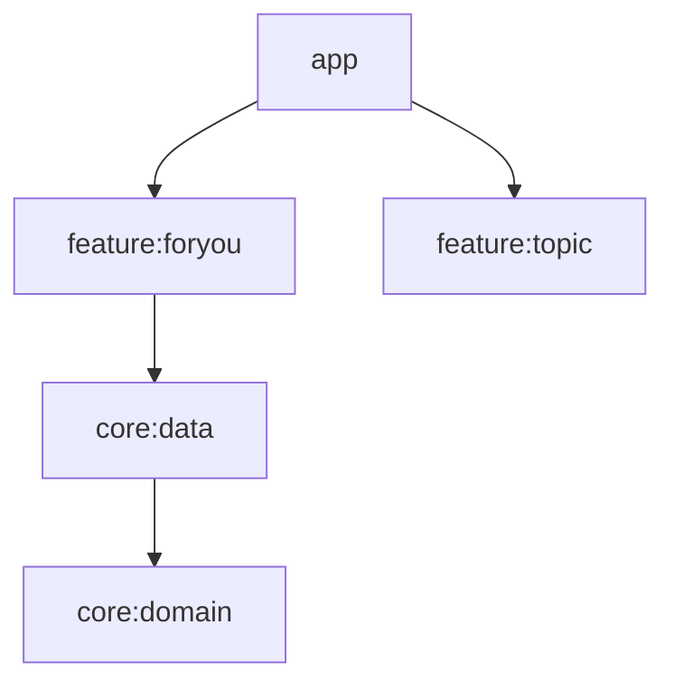
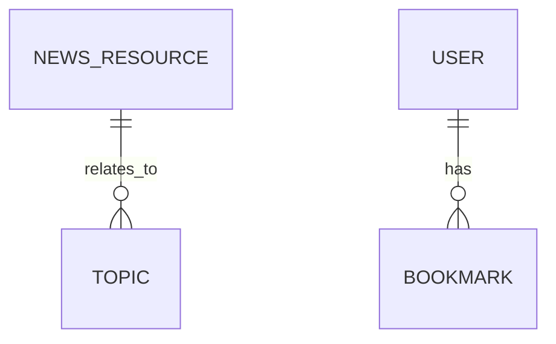
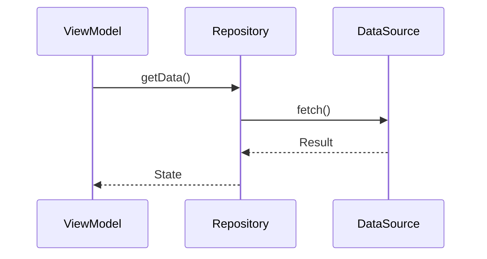
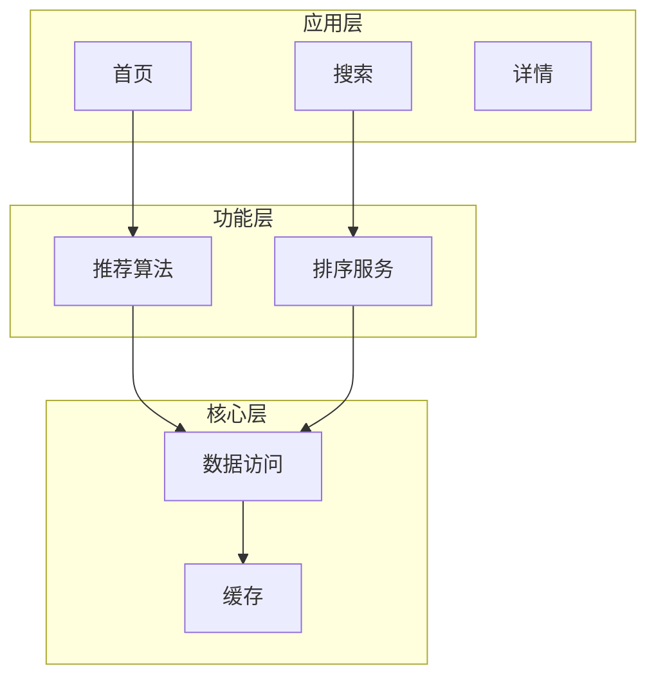
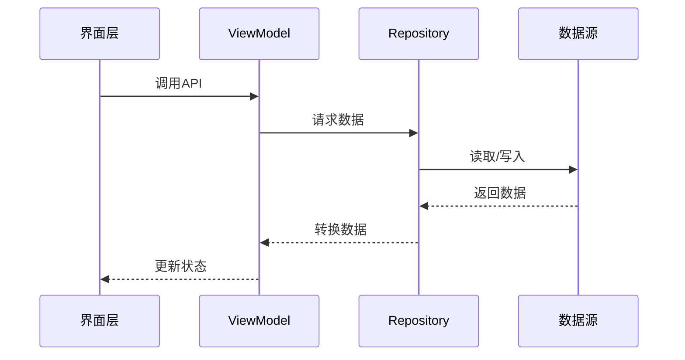
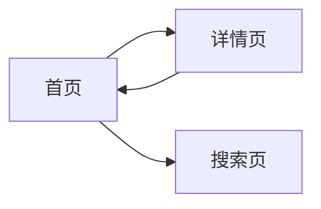
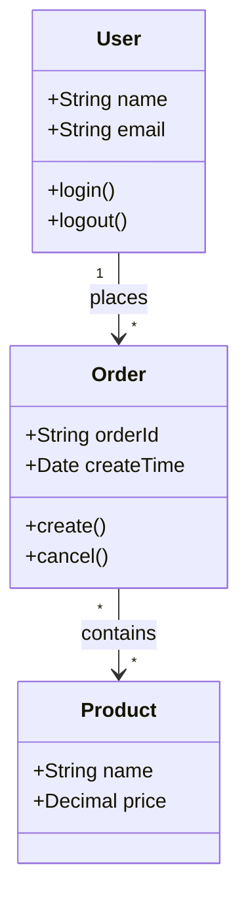

# Mermaid 图表规范

本文档定义项目架构逆向工程中使用的 Mermaid 图表语法规范。

## 图表类型速查

| 图表 | 语法 | 节点格式 |
|------|------|----------|
| 依赖图 | `graph TD/LR` | `A[名称] --> B[名称]` |
| 业务流程图 | `flowchart TB/SUB` | `A[名称] --> B[名称]` + `subgraph` |
| 时序图 | `sequenceDiagram` | `participant` + `->>` |
| ER图 | `erDiagram` | `T1 \|\|--o{ T2 : rel` |
| 流程图 | `flowchart LR/TB` | `A[名称] --> B[名称]` |

## 模块依赖图

用于展示项目各模块之间的依赖关系。

### 语法说明
- `graph TD` - 从上到下的有向图
- `graph LR` - 从左到右的有向图
- 节点格式：`NodeID[显示文本]`
- 箭头：`A --> B` 表示 A 依赖 B

## 数据库ER图

用于展示数据库表结构和外键关系。

### 关系符号
| 符号 | 含义 |
|------|------|
| `||--||` | 一对一 |
| `||--o{` | 一对多 |
| `o{}--o{}` | 多对多 |
| `||--\|{` | 一对唯一 |

## 数据流图

用于展示数据在各组件间的流转过程。

### 语法说明
- `participant X as Y` - 定义参与者（X为ID，Y为显示名）
- `->>` - 同步消息
- `-->>` - 返回消息

## 业务流程图

用于展示业务处理流程。

### subgraph 分组
- 使用 `subgraph` 定义分组
- 分组内的节点会自动聚集

## 核心功能时序图

用于展示核心功能的调用时序。

## 导航流程图

用于展示页面跳转关系。

## 类图

用于展示核心数据类之间的关系。

### 语法说明
- `class 类名` - 定义类
- `+成员` - public 成员
- `-成员` - private 成员
- `ClassA --> ClassB` - 关联关系
