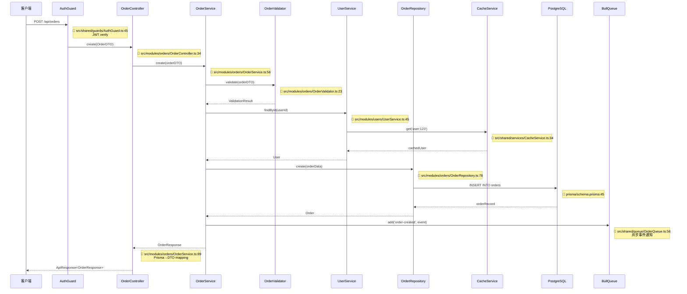
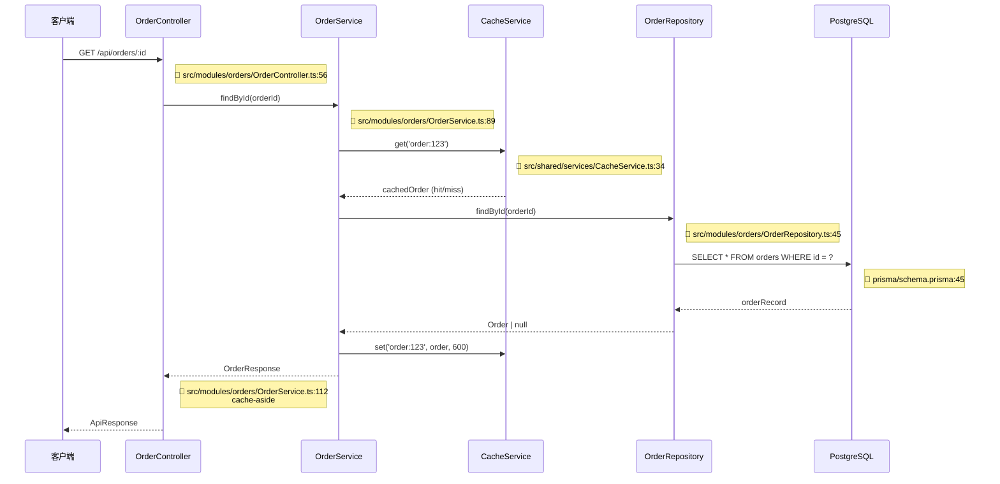
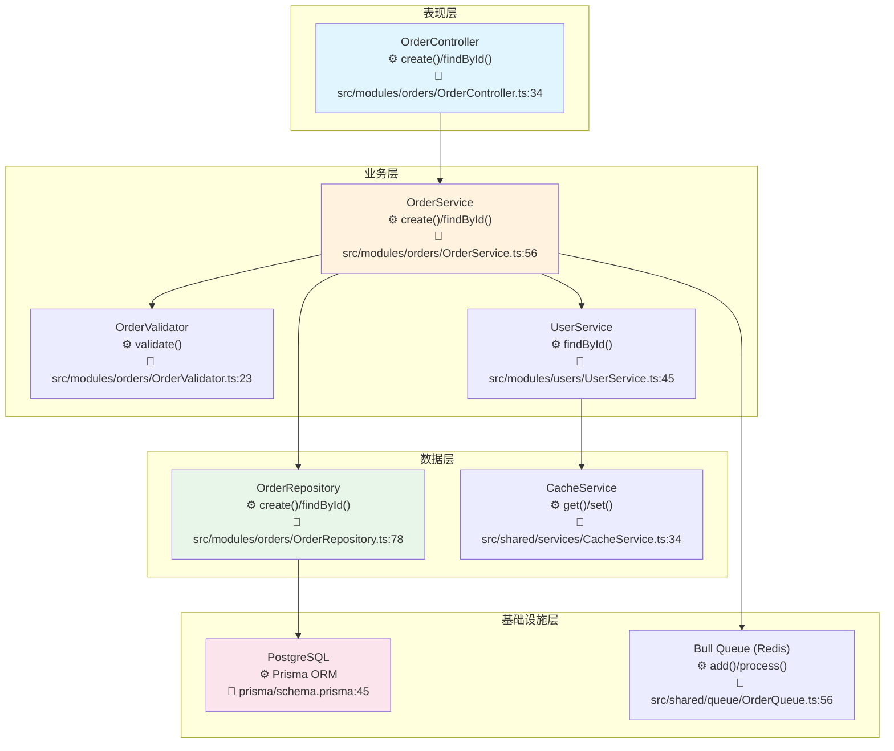

# Node.js 后端项目架构模板

本文档为 Node.js 后端项目提供详细的架构文档模板。

## Node.js 特定章节

### N1. 技术栈详情

| 类别 | 技术 | 版本 | 说明 |
|------|------|------|------|
| 运行时 | Node.js | 20.x LTS | JavaScript 运行时 |
| 框架 | Express / NestJS / Fastify | - | Web 框架 |
| 语言 | TypeScript | 5.x | 类型系统 |
| ORM | Prisma / TypeORM / Sequelize | - | 数据库 ORM |
| 验证 | Zod / Joi / class-validator | - | 数据验证 |
| 认证 | Passport / jwt | - | 身份认证 |
| 日志 | Winston / Pino | - | 日志框架 |
| 缓存 | Redis / Memcached | - | 缓存 |
| 消息队列 | Bull / Kafka / RabbitMQ | - | 消息队列 |
| API 文档 | Swagger / OpenAPI | - | API 文档 |
| 测试 | Jest / Mocha | - | 测试框架 |
| 包管理 | npm / pnpm / yarn | - | 包管理器 |

### N2. 架构模式

#### MVC / 三层架构 (以 Express 为例)
```
┌─────────────────────────────────────────┐
│             Routes / Controllers        │
│  ┌─────────────────────────────────┐    │
│  │  app.get('/users', userCtrl)   │    │
│  │  处理请求路由和参数验证         │    │
│  └─────────────────────────────────┘    │
└─────────────────────────────────────────┘
                    │
┌─────────────────────────────────────────┐
│              Services                    │
│  ┌─────────────────────────────────┐    │
│  │  Business Logic                 │    │
│  │  userService.create(),          │    │
│  │  userService.findAll()          │    │
│  └─────────────────────────────────┘    │
└─────────────────────────────────────────┘
                    │
┌─────────────────────────────────────────┐
│             Repositories                 │
│  ┌─────────────────────────────────┐    │
│  │  Data Access Layer             │    │
│  │  userRepository.create(),      │    │
│  │  userRepository.findById()     │    │
│  └─────────────────────────────────┘    │
└─────────────────────────────────────────┘
```

#### NestJS 模块化架构
```
┌─────────────────────────────────────────┐
│              Modules                     │
│  ┌──────────┐  ┌──────────┐  ┌──────┐  │
│  │   Users  │  │  Orders  │  │ Auth │  │
│  │  Module  │  │  Module  │  │Module│  │
│  └──────────┘  └──────────┘  └──────┘  │
└─────────────────────────────────────────┘
                    │
┌─────────────────────────────────────────┐
│           Shared Modules                 │
│  ┌──────────┐  ┌──────────┐  ┌──────┐  │
│  │ Database │  │   Auth   │  │Logger│  │
│  │  Module  │  │  Guard   │  │Module│  │
│  └──────────┘  └──────────┘  └──────┘  │
└─────────────────────────────────────────┘
```

### N3. 目录结构 (Express)

```
src/
├── config/             # 配置文件
├── controllers/         # 控制器
│   └── user.controller.ts
├── services/            # 业务逻辑
│   └── user.service.ts
├── repositories/        # 数据访问
│   └── user.repository.ts
├── models/              # 数据模型
│   ├── user.model.ts
│   └── index.ts
├── routes/              # 路由定义
│   ├── index.ts
│   └── user.routes.ts
├── middlewares/         # 中间件
│   ├── auth.middleware.ts
│   └── error.middleware.ts
├── utils/               # 工具函数
├── types/               # 类型定义
├── constants/           # 常量
└── app.ts               # 应用入口
```

### N4. 目录结构 (NestJS)

```
src/
├── modules/              # 功能模块
│   ├── users/
│   │   ├── users.controller.ts
│   │   ├── users.service.ts
│   │   ├── users.module.ts
│   │   ├── dto/
│   │   └── entities/
│   ├── orders/
│   └── auth/
├── shared/              # 共享模块
│   ├── guards/
│   ├── decorators/
│   ├── filters/
│   └── interceptors/
├── config/              # 配置
├── database/            # 数据库
└── main.ts              # 入口
```

### N5. API 端点分析

#### RESTful 端点
```typescript
// users.controller.ts
@Controller('users')
export class UserController {
  @Get()           // GET /users
  async findAll(): Promise<User[]>

  @Get(':id')     // GET /users/:id
  async findOne(@Param('id') id: string): Promise<User>

  @Post()          // POST /users
  async create(@Body() createUserDto: CreateUserDto): Promise<User>

  @Patch(':id')    // PATCH /users/:id
  async update(
    @Param('id') id: string,
    @Body() updateUserDto: UpdateUserDto
  ): Promise<User>

  @Delete(':id')  // DELETE /users/:id
  async remove(@Param('id') id: string): Promise<void>
}
```

### N6. 中间件配置

```typescript
// Express 中间件链
const express = require('express')
const app = express()

app.use(helmet())                    // 安全头
app.use(cors())                       // 跨域
app.use(compression())               // 压缩
app.use(express.json())              // JSON 解析
app.use(requestLogger())             // 请求日志
app.use(authMiddleware())            // 认证
app.use('/api', routes)              // 路由
app.use(errorHandler())              // 错误处理
```

### N7. 缓存策略

| 缓存级别 | 技术 | 场景 | TTL |
|----------|------|------|-----|
| 进程缓存 | node-cache | 热点数据 | 5min |
| 分布式缓存 | Redis | 共享数据 | 30min |
| 查询缓存 | Redis | 数据库查询 | 10min |

### N8. 日志方案

```typescript
// Winston 配置
const logger = winston.createLogger({
  level: 'info',
  format: winston.format.combine(
    winston.format.timestamp(),
    winston.format.json()
  ),
  transports: [
    new winston.transports.File({ filename: 'error.log', level: 'error' }),
    new winston.transports.File({ filename: 'combined.log' }),
  ],
})
```

### N9. 监控与可观测性

```typescript
// Prometheus metrics
const httpRequestDuration = new Histogram({
  name: 'http_request_duration_seconds',
  help: 'Duration of HTTP requests',
  labelNames: ['method', 'route', 'status_code']
})
```

### N10. 主要业务流程图 ★

> ⚠️ **每个节点必须标注方法名和代码位置（文件:行号）**。以下为 NestJS 项目典型业务流程示例。

#### 12.1 项目整体业务流程

```mermaid
flowchart TB
    subgraph Request[请求入口]
        CLIENT[客户端请求<br/>⚙️ HTTP Request → main.ts<br/>📁 src/main.ts:12]
        GUARD[守卫<br/>⚙️ AuthGuard.canActivate()<br/>📁 src/shared/guards/AuthGuard.ts:23]
        INTERCEPTOR[拦截器<br/>⚙️ LogInterceptor.intercept()<br/>📁 src/shared/interceptors/LogInterceptor.ts:34]
        CLIENT --> GUARD
        GUARD --> INTERCEPTOR
    end

    subgraph Controller[控制层]
        INTERCEPTOR --> CTRL[UserController<br/>⚙️ findAll()/create()<br/>📁 src/modules/users/UserController.ts:56]
        CTRL --> PIPE[参数管道<br/>⚙️ @Body(ValidationPipe)<br/>📁 src/modules/users/dto/CreateUserDTO.ts:23]
    end

    subgraph Service[业务层]
        PIPE --> SVC[UserService<br/>⚙️ findAll()/create()<br/>📁 src/modules/users/UserService.ts:78]
        SVC --> CACHE[缓存检查<br/>⚙️ CacheService.get()<br/>📁 src/shared/services/CacheService.ts:89]
    end

    subgraph Data[数据层]
        CACHE --> REPO[UserRepository<br/>⚙️ findMany()/create()<br/>📁 src/modules/users/UserRepository.ts:112]
        REPO --> DB[(PostgreSQL<br/>⚙️ Prisma ORM<br/>📁 prisma/schema.prisma:45)]
        REPO --> MQ[消息队列<br/>⚙️ BullQueue.add()<br/>📁 src/shared/queue/UserQueue.ts:56)]
    end

    subgraph External[外部服务]
        MQ --> CONSUMER[Bull Consumer<br/>⚙️ UserProcessor.handle()<br/>📁 src/shared/queue/UserProcessor.ts:78]
    end
```

##### 12.1.1 业务流程步骤详解 ★

| 步骤编号 | 步骤名称 | 核心方法/API | 输入参数 | 返回结果 | 代码位置 | 说明 |
|----------|----------|-------------|----------|----------|----------|------|
| 1 | 请求入口 | `bootstrap()` NestFactory.create | - | `Promise<void>` | `src/main.ts:12` | NestJS 启动监听 |
| 2 | 认证守卫 | `AuthGuard.canActivate(context)` | `ExecutionContext` | `boolean \| Promise<boolean>` | `src/shared/guards/AuthGuard.ts:23` | JWT Token 校验 |
| 3 | 日志拦截器 | `LogInterceptor.intercept(context, next)` | `ExecutionContext`, `CallHandler` | `Observable` | `src/shared/interceptors/LogInterceptor.ts:34` | 请求日志记录 |
| 4 | 控制器 | `UserController.findAll(@Query() query)` | `query`: 查询参数 | `Promise<User[]>` | `src/modules/users/UserController.ts:56` | REST 端点 |
| 5 | 参数校验 | `@Body(ValidationPipe) CreateUserDTO` | `dto`: 请求体 | `CreateUserDTO` (validated) | `src/modules/users/dto/CreateUserDTO.ts:23` | class-validator 装饰器 |
| 6 | 业务逻辑 | `UserService.findAll(query)` | `query`: 查询条件 | `Promise<User[]>` | `src/modules/users/UserService.ts:78` | 核心业务处理 |
| 7 | 缓存检查 | `CacheService.get(key)` | `key`: string | `Promise<T \| null>` | `src/shared/services/CacheService.ts:89` | Redis 缓存命中检查 |
| 8 | 数据仓储 | `UserRepository.findMany(where, options)` | `where`, `options` | `Promise<User[]>` | `src/modules/users/UserRepository.ts:112` | Prisma 查询 |
| 9 | 数据库 | `prisma.user.findMany(...)` | PrismaQuery | `Promise<User[]>` | `prisma/schema.prisma:45` | Prisma ORM |
| 10 | 消息队列 | `UserQueue.add(jobName, data)` | `jobName`, `data` | `Promise<Job>` | `src/shared/queue/UserQueue.ts:56` | Bull 队列 |
| 11 | 事件消费 | `UserProcessor.handle(job)` | `job`: Job | `Promise<void>` | `src/shared/queue/UserProcessor.ts:78` | Bull Processor |

##### 12.1.2 关键步骤代码示例

###### 步骤 4：Controller 层

```typescript
// 📁 src/modules/users/UserController.ts:56
@Controller('users')
@UseGuards(AuthGuard)
export class UserController {
  constructor(private readonly userService: UserService) {}

  @Get()
  async findAll(@Query() query: FindUsersQuery): Promise<ApiResponse<User[]>> {
    const users = await this.userService.findAll(query);            // L62: → UserService
    return ApiResponse.success(users);                              // L63
  }

  @Post()
  async create(@Body(ValidationPipe) dto: CreateUserDTO): Promise<ApiResponse<User>> {
    const user = await this.userService.create(dto);                // L68: → UserService
    return ApiResponse.success(user);                               // L69
  }
}
```

###### 步骤 6：Service 层业务逻辑

```typescript
// 📁 src/modules/users/UserService.ts:78
@Injectable()
export class UserService {
  constructor(
    private readonly userRepo: UserRepository,
    private readonly cache: CacheService,
  ) {}

  async findAll(query: FindUsersQuery): Promise<User[]> {
    const cacheKey = `users:${JSON.stringify(query)}`;              // L83
    const cached = await this.cache.get<User[]>(cacheKey);          // L84: 查 Redis
    if (cached) return cached;                                       // L85: 命中

    const users = await this.userRepo.findMany({                    // L88: Prisma 查询
      where: { status: 'ACTIVE' },
      skip: query.offset,
      take: query.limit,
    });
    await this.cache.set(cacheKey, users, 300);                     // L93: 回写(5min TTL)
    return users;
  }
}
```

#### 12.2 核心功能模块流程（时序图）★

##### 订单创建流程



**步骤详解**：

| 步骤 | 调用者 | 被调用者 | 方法签名 | 参数 | 返回 | 代码位置 | 说明 |
|------|--------|----------|----------|------|------|----------|------|
| 1 | 客户端 | AuthGuard | `canActivate(ctx: ExecutionContext)` | `ExecutionContext` | `Promise<boolean>` | `src/shared/guards/AuthGuard.ts:45` | JWT verify |
| 2 | Guard | OrderController | `create(@Body() dto: OrderDTO)` | `dto`: OrderDTO | `Promise<ApiResponse>` | `src/modules/orders/OrderController.ts:34` | REST 端点 |
| 3 | Controller | OrderService | `create(dto: OrderDTO)` | `dto`: OrderDTO | `Promise<OrderResponse>` | `src/modules/orders/OrderService.ts:56` | 业务编排 |
| 4 | Service | OrderValidator | `validate(dto: OrderDTO)` | `dto`: 订单数据 | `Promise<ValidationResult>` | `src/modules/orders/OrderValidator.ts:23` | Zod/class-validator |
| 5 | Service | UserService | `findById(userId: string)` | `userId`: 用户ID | `Promise<User>` | `src/modules/users/UserService.ts:45` | 获取用户 |
| 6 | UserService | CacheService | `get('user:' + id)` | `key`: 缓存键 | `Promise<T>` | `src/shared/services/CacheService.ts:34` | Redis 查询 |
| 7 | Service | OrderRepository | `create(data: Prisma.OrderCreateInput)` | `data`: Prisma create input | `Promise<Order>` | `src/modules/orders/OrderRepository.ts:78` | Prisma create |
| 8 | Repository | PostgreSQL | `prisma.order.create(...)` | Prisma query | `Promise<Order>` | `prisma/schema.prisma:45` | 数据库写入 |
| 9 | Service | BullQueue | `add('order-created', event)` | `jobName`, `data` | `Promise<Job>` | `src/shared/queue/OrderQueue.ts:56` | 领域事件 |

**关键代码示例**：

```typescript
// 📁 src/modules/orders/OrderService.ts:56 - 订单创建核心
@Injectable()
export class OrderService {
  constructor(
    private readonly orderRepo: OrderRepository,
    private readonly userService: UserService,
    private readonly orderValidator: OrderValidator,
    @InjectQueue('orders') private readonly orderQueue: Queue,
  ) {}

  async create(dto: OrderDTO): Promise<OrderResponse> {
    await this.orderValidator.validate(dto);                         // L63: 业务校验
    const user = await this.userService.findById(dto.userId);       // L64: → UserService
    const order = await this.orderRepo.create({                     // L66: Prisma create
      user: { connect: { id: dto.userId } },
      items: { create: dto.items.map(item => ({ ...item })) },
      totalAmount: dto.items.reduce((sum, i) => sum + i.price, 0),
    });
    await this.orderQueue.add('order-created', {                    // L72: 队列事件
      orderId: order.id, userId: user.id,
    });
    return this.mapToResponse(order);                                // L76: Order→DTO
  }
}
```

##### 订单查询流程



**关键代码示例**：

```typescript
// 📁 src/modules/orders/OrderService.ts:89 - Cache-Aside 模式
async findById(orderId: string): Promise<OrderResponse> {
  const cacheKey = `order:${orderId}`;                               // L92
  const cached = await this.cache.get<Order>(cacheKey);             // L93: Redis
  if (cached) return this.mapToResponse(cached);                     // L94: 命中

  const order = await this.orderRepo.findById(orderId);             // L97: Prisma
  if (!order) throw new NotFoundException(`Order ${orderId} not found`); // L98
  await this.cache.set(cacheKey, order, 600);                        // L99: 回写(10min)
  return this.mapToResponse(order);                                  // L100
}
```

#### 12.3 核心功能流程图（分层）★

##### 订单处理分层流程



**步骤与API详解**：

| 步骤 | 组件 | 核心方法 | 参数类型 | 返回类型 | 代码位置 | 关键逻辑 |
|------|------|----------|----------|----------|----------|----------|
| 1 | OrderController | `create(@Body() dto: OrderDTO)` | `OrderDTO` | `Promise<ApiResponse>` | `src/modules/orders/OrderController.ts:34` | @Post() 端点 |
| 2 | OrderService | `create(dto: OrderDTO)` | `OrderDTO` | `Promise<OrderResponse>` | `src/modules/orders/OrderService.ts:56` | 业务编排入口 |
| 3 | OrderValidator | `validate(dto: OrderDTO)` | `OrderDTO` | `Promise<ValidationResult>` | `src/modules/orders/OrderValidator.ts:23` | Zod schema 校验 |
| 4 | UserService | `findById(userId: string)` | `string` | `Promise<User>` | `src/modules/users/UserService.ts:45` | 含 Redis 缓存 |
| 5 | OrderRepository | `create(data)` | `Prisma.OrderCreateInput` | `Promise<Order>` | `src/modules/orders/OrderRepository.ts:78` | prisma.order.create() |
| 6 | PostgreSQL | `INSERT INTO orders ...` | Prisma SQL | `Order record` | `prisma/schema.prisma:45` | 持久化 |
| 7 | BullQueue | `add('order-created', event)` | `jobName`, `data` | `Promise<Job>` | `src/shared/queue/OrderQueue.ts:56` | 异步事件入队 |

#### 12.4 业务流程说明（含代码位置、API详情）★

| 流程名称 | 涉及模块 | 入口方法 | 核心API链路 | 参数/返回 | 代码位置 | 功能描述 |
|----------|----------|----------|-------------|-----------|----------|----------|
| 用户认证 | auth | `AuthController.login()` | `AuthService.validateUser()` → `UserRepo.findByEmail()` → `JwtService.sign()` | `LoginDTO` → `TokenResponse` | `src/modules/auth/AuthController.ts:34` | JWT 签发 |
| 订单创建 | orders | `OrderController.create()` | `OrderService.create()` → `OrderValidator.validate()` → `OrderRepo.create()` → `BullQueue.add()` | `OrderDTO` → `OrderResponse` | `src/modules/orders/OrderController.ts:34` | Prisma事务+队列事件 |
| 订单查询 | orders | `OrderController.findById()` | `OrderService.findById()` → `CacheService.get()` → `OrderRepo.findById()` | `string` → `OrderResponse` | `src/modules/orders/OrderController.ts:56` | Cache-Aside 模式 |
| 用户列表 | users | `UserController.findAll()` | `UserService.findAll()` → `CacheService.get()` → `UserRepo.findMany()` | `FindUsersQuery` → `User[]` | `src/modules/users/UserController.ts:56` | Redis 缓存分页 |
| 事件消费 | queue | `OrderProcessor.handle()` | `OrderEventHandler.process()` → `NotificationService.send()` | `Job<OrderEvent>` → `void` | `src/shared/queue/OrderProcessor.ts:78` | Bull 事件驱动处理 |

## 标准章节参考

详见 [template.md](./template.md) 中的标准章节结构。
