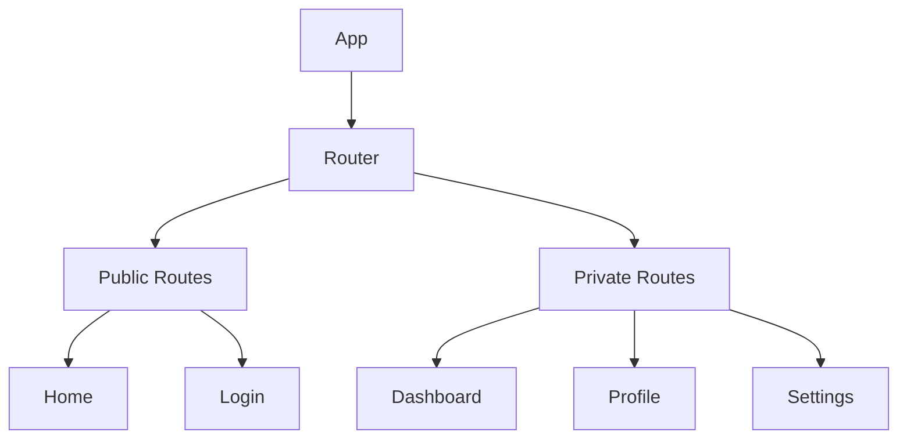
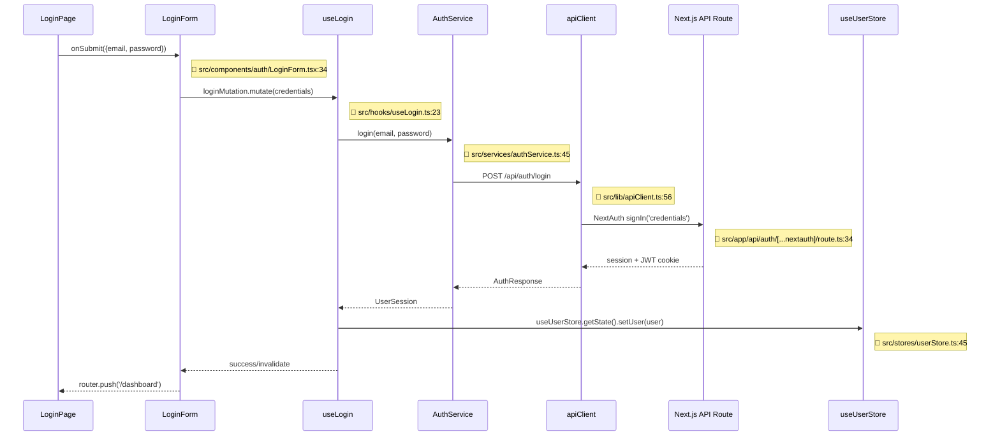
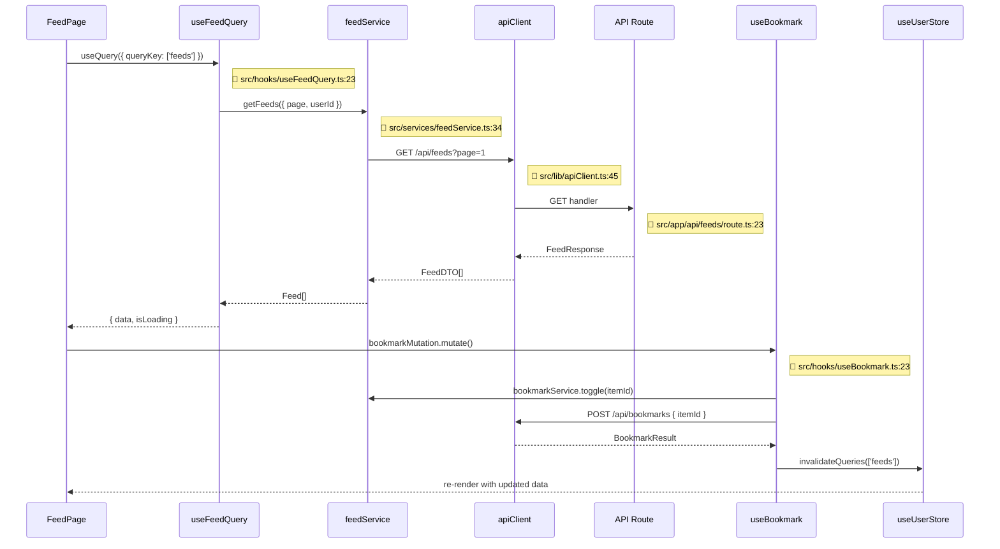
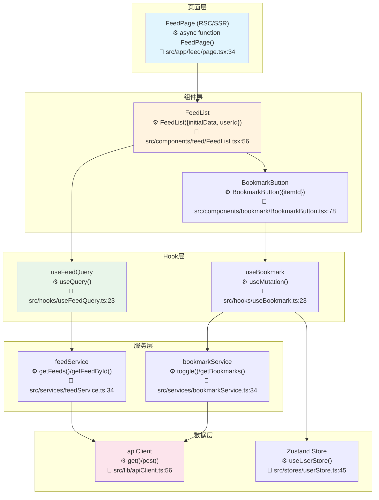

# React 前端项目架构模板

本文档为 React 前端项目提供详细的架构文档模板。

## React 特定章节

### R1. 技术栈详情

| 类别 | 技术 | 版本 | 说明 |
|------|------|------|------|
| 框架 | React | 18.x | UI 库 |
| 元框架 | Next.js | 14.x | SSR/SSG 框架 |
| 路由 | React Router | 6.x | 路由管理 |
| 状态管理 | Redux Toolkit / Zustand | - | 状态管理 |
| 样式 | Styled Components / Tailwind CSS | - | CSS 方案 |
| HTTP | Axios / React Query | - | 数据获取 |
| 表单 | React Hook Form | 7.x | 表单处理 |
| 类型 | TypeScript | 5.x | 类型系统 |
| 测试 | Jest + React Testing Library | - | 测试 |
| 构建 | Vite / Webpack | 5.x / 5.x | 打包工具 |

### R2. 架构模式

#### Feature-Based Architecture
```
┌─────────────────────────────────────────┐
│               Pages                     │
│  ┌─────────────────────────────────┐    │
│  │  Route Components               │    │
│  │  HomePage, ProductPage          │    │
│  └─────────────────────────────────┘    │
└─────────────────────────────────────────┘
                    │
┌─────────────────────────────────────────┐
│             Features                    │
│  ┌─────────────────────────────────┐    │
│  │  Feature:User                   │    │
│  │  ├── components/                │    │
│  │  ├── hooks/                    │    │
│  │  ├── services/                 │    │
│  │  └── types/                    │    │
│  └─────────────────────────────────┘    │
└─────────────────────────────────────────┘
                    │
┌─────────────────────────────────────────┐
│              Shared                      │
│  ┌─────────────────────────────────┐    │
│  │  components/ (Button, Input)    │    │
│  │  hooks/ (useAuth, useTheme)     │    │
│  │  utils/                        │    │
│  └─────────────────────────────────┘    │
└─────────────────────────────────────────┘
```

### R3. 目录结构

```
src/
├── app/                 # Next.js App Router
│   ├── (auth)/         # 路由组
│   ├── (dashboard)/
│   └── api/            # API 路由
├── components/         # 共享组件
│   ├── ui/            # 基础 UI 组件
│   └── layout/        # 布局组件
├── features/          # 功能模块
│   ├── users/
│   ├── products/
│   └── orders/
├── hooks/             # 共享 hooks
├── lib/               # 工具库
├── services/          # API 服务
├── store/            # 状态管理
├── types/            # 类型定义
└── styles/           # 全局样式
```

### R4. 路由结构



### R5. 状态管理方案

#### Redux Toolkit
```typescript
// store/slices/userSlice.ts
const userSlice = createSlice({
  name: 'user',
  initialState: { users: [], loading: false },
  reducers: {
    setUsers: (state, action) => {
      state.users = action.payload
    }
  }
})
```

#### Zustand (轻量方案)
```typescript
// stores/useUserStore.ts
const useUserStore = create((set) => ({
  users: [],
  fetchUsers: async () => {
    const res = await api.getUsers()
    set({ users: res.data })
  }
}))
```

### R6. 样式方案

#### CSS Modules
```css
/* Button.module.css */
.button {
  padding: 8px 16px;
  border-radius: 4px;
}
```
```tsx
// Button.tsx
import styles from './Button.module.css'
export const Button = () => <button className={styles.button}>Click</button>
```

#### Tailwind CSS
```tsx
<button className="px-4 py-2 bg-blue-500 text-white rounded">
  Click
</button>
```

### R7. 主要业务流程图 ★

> ⚠️ **每个节点必须标注方法名和代码位置（文件:行号）**。以下为 React 项目典型业务流程示例（基于 Next.js App Router）。

#### 12.1 项目整体业务流程

```mermaid
flowchart TB
    subgraph App[应用启动]
        LAUNCH[页面加载<br/>⚙️ RootLayout({children})<br/>📁 src/app/layout.tsx:12]
        INIT[Provider初始化<br/>⚙️ Providers({children})<br/>📁 src/app/providers.tsx:23]
        LOAD[加载用户会话<br/>⚙️ useSession() → getServerSession()<br/>📁 src/lib/auth.ts:45]
        LAUNCH --> INIT
        INIT --> LOAD
    end

    subgraph HomeFlow[首页流程]
        LOAD --> HOME[首页渲染<br/>⚙️ HomePage()<br/>📁 src/app/(main)/page.tsx:34]
        HOME --> FEED[内容列表<br/>⚙️ FeedList({data})<br/>📁 src/components/feed/FeedList.tsx:56]
        HOME --> SEARCH[搜索<br/>⚙️ SearchBar({onSearch})<br/>📁 src/components/search/SearchBar.tsx:45]
    end

    subgraph FeatureFlow[功能流程]
        FEED --> DETAIL[内容详情<br/>⚙️ DetailPage({params})<br/>📁 src/app/feed/[id]/page.tsx:67]
        DETAIL --> BOOKMARK[收藏<br/>⚙️ BookmarkButton({itemId})<br/>📁 src/components/bookmark/BookmarkButton.tsx:78]
    end

    subgraph DataFlow[数据流程]
        BOOKMARK --> QUERY[React Query<br/>⚙️ useMutation(bookmarkFn)<br/>📁 src/hooks/useBookmark.ts:23]
        QUERY --> API[API Service<br/>⚙️ bookmarkService.toggle()<br/>📁 src/services/bookmarkService.ts:34]
        API --> REMOTE[Fetch/axios<br/>⚙️ POST /api/bookmarks<br/>📁 src/lib/apiClient.ts:56]
    end

    subgraph State[状态管理]
        QUERY --> STORE[Zustand Store<br/>⚙️ useUserStore()<br/>📁 src/stores/userStore.ts:45]
    end
```

##### 12.1.1 业务流程步骤详解 ★

| 步骤编号 | 步骤名称 | 核心方法/API | 输入参数 | 返回结果 | 代码位置 | 说明 |
|----------|----------|-------------|----------|----------|----------|------|
| 1 | 页面加载 | `RootLayout({ children })` | `children`: ReactNode | `JSX.Element` | `src/app/layout.tsx:12` | Next.js 根布局 |
| 2 | Provider初始化 | `Providers({ children })` | `children`: ReactNode | `JSX.Element` | `src/app/providers.tsx:23` | QueryClient + Zustand 包裹 |
| 3 | 加载用户会话 | `useSession()` 或 `getServerSession()` | - | `Session \| null` | `src/lib/auth.ts:45` | NextAuth 服务端会话 |
| 4 | 首页渲染 | `HomePage()` | - | `JSX.Element` | `src/app/(main)/page.tsx:34` | SSR/ISR 渲染首页 |
| 5 | 内容列表 | `FeedList({ data })` | `data`: Feed[] | `JSX.Element` | `src/components/feed/FeedList.tsx:56` | 列表渲染 |
| 6 | 搜索 | `SearchBar({ onSearch: (q) => void })` | `onSearch`: 回调 | `JSX.Element` | `src/components/search/SearchBar.tsx:45` | 搜索输入 |
| 7 | 内容详情 | `DetailPage({ params: { id } })` | `params`: route params | `JSX.Element` | `src/app/feed/[id]/page.tsx:67` | 动态路由页面 |
| 8 | 收藏操作 | `useMutation({ mutationFn: toggleBookmark })` | `itemId`: string | `{ mutate }` | `src/hooks/useBookmark.ts:23` | TanStack Query mutation |
| 9 | API调用 | `bookmarkService.toggle(itemId)` | `itemId`: string | `Promise<BookmarkResult>` | `src/services/bookmarkService.ts:34` | API Service 层 |
| 10 | HTTP请求 | `apiClient.post('/api/bookmarks', { itemId })` | `body`: JSON | `Promise<Response>` | `src/lib/apiClient.ts:56` | fetch/axios 封装 |

##### 12.1.2 关键步骤代码示例

###### 步骤 4：首页渲染 (Next.js SSR)

```tsx
// 📁 src/app/(main)/page.tsx:34
export default async function HomePage() {
  const feeds = await feedService.getFeeds();                       // L36: 服务端获取
  const session = await getServerSession(authOptions);              // L37: 服务端会话

  return (
    <main>
      <HeroSection />
      {session ? (                                                    // L42: 条件渲染
        <FeedList initialData={feeds} userId={session.user.id} />
      ) : (
        <WelcomeBanner />
      )}
    </main>
  );
}
```

###### 步骤 8：收藏操作 (React Query)

```tsx
// 📁 src/hooks/useBookmark.ts:23
export function useBookmark(itemId: string) {
  const queryClient = useQueryClient();

  return useMutation({
    mutationFn: () => bookmarkService.toggle(itemId),              // L27: API调用
    onMutate: async () => {
      await queryClient.cancelQueries({ queryKey: ['feed', itemId] }); // L29
      const prev = queryClient.getQueryData<Feed>(['feed', itemId]);   // L30: 乐观更新快照
      queryClient.setQueryData(['feed', itemId], (old: Feed) => ({ // L31
        ...old, isBookmarked: !old.isBookmarked
      }));
      return { prev };                                              // L34: rollback context
    },
    onError: (_err, _vars, context) => {
      queryClient.setQueryData(['feed', itemId], context?.prev);   // L37: 回滚
    },
    onSettled: () => {
      queryClient.invalidateQueries({ queryKey: ['feed', itemId] }); // L40: 最终刷新
    },
  });
}
```

#### 12.2 核心功能模块流程（时序图）★

##### 用户认证流程



**步骤详解**：

| 步骤 | 调用者 | 被调用者 | 方法签名 | 参数 | 返回 | 代码位置 | 说明 |
|------|--------|----------|----------|------|------|----------|------|
| 1 | LoginPage | LoginForm | `onSubmit(data: LoginFormData)` | `{email, password}` | `void` | `src/components/auth/LoginForm.tsx:34` | react-hook-form submit |
| 2 | LoginForm | useLogin | `loginMutation.mutate(credentials)` | `LoginCredentials` | `void` | `src/hooks/useLogin.ts:23` | TanStack Query mutate |
| 3 | useLogin | AuthService | `login(email: string, password: string)` | `email`, `password` | `Promise<AuthResponse>` | `src/services/authService.ts:45` | Service 层封装 |
| 4 | AuthService | apiClient | `POST /api/auth/login` | `{email, password}` | `Promise<Response>` | `src/lib/apiClient.ts:56` | fetch/axios |
| 5 | apiClient | Backend | `signIn('credentials', credentials)` | `credentials` | `Promise<Session>` | `src/app/api/auth/[..].ts:34` | NextAuth handler |
| 6 | useLogin | Zustand | `setUser(user: UserSession)` | `user`: 用户会话 | `void` | `src/stores/userStore.ts:45` | 全局状态更新 |

**关键代码示例**：

```tsx
// 📁 src/hooks/useLogin.ts:23 - 登录 Hook
export function useLogin() {
  const router = useRouter();
  const setUser = useUserStore((s) => s.setUser);

  return useMutation({
    mutationFn: (credentials: LoginCredentials) =>
      authService.login(credentials.email, credentials.password),   // L29
    onSuccess: (data) => {
      setUser(data.user);                                            // L31: Zustand store
      router.push('/dashboard');                                     // L32: 路由跳转
    },
    onError: (error: Error) => {
      toast.error(error.message);                                    // L35: 错误提示
    },
  });
}
```

##### 内容加载与收藏流程



**步骤详解**：

| 步骤 | 调用者 | 被调用者 | 方法签名 | 参数 | 返回 | 代码位置 | 说明 |
|------|--------|----------|----------|------|------|----------|------|
| 1 | FeedPage | useFeedQuery | `useQuery({ queryKey, queryFn })` | `queryKey`, `queryFn` | `UseQueryResult` | `src/hooks/useFeedQuery.ts:23` | TanStack Query |
| 2 | useFeedQuery | feedService | `getFeeds(params: FeedParams)` | `{page, userId}` | `Promise<Feed[]>` | `src/services/feedService.ts:34` | Service 层 |
| 3 | feedService | apiClient | `GET /api/feeds?page=1` | query params | `Promise<FeedDTO[]>` | `src/lib/apiClient.ts:45` | HTTP GET |
| 4 | FeedPage | useBookmark | `bookmarkMutation.mutate()` | - | `void` | `src/hooks/useBookmark.ts:23` | 乐观更新 |
| 5 | useBookmark | bookmarkService | `toggle(itemId: string)` | `itemId` | `Promise<BookmarkResult>` | `src/services/bookmarkService.ts:34` | Service 层 |
| 6 | bookmarkService | apiClient | `POST /api/bookmarks` | `{itemId}` | `Promise<Response>` | `src/lib/apiClient.ts:56` | HTTP POST |

#### 12.3 核心功能流程图（分层）★

##### 内容流分层流程



**步骤与API详解**：

| 步骤 | 组件 | 核心方法 | 参数类型 | 返回类型 | 代码位置 | 关键逻辑 |
|------|------|----------|----------|----------|----------|----------|
| 1 | FeedPage | `async function FeedPage()` | - | `Promise<JSX.Element>` | `src/app/feed/page.tsx:34` | Next.js RSC SSR |
| 2 | FeedList | `FeedList({initialData, userId})` | `initialData: Feed[]`, `userId: string` | `JSX.Element` | `src/components/feed/FeedList.tsx:56` | 客户端交互组件 |
| 3 | BookmarkButton | `BookmarkButton({itemId})` | `itemId: string` | `JSX.Element` | `src/components/bookmark/BookmarkButton.tsx:78` | 收藏按钮 |
| 4 | useFeedQuery | `useQuery({queryKey, queryFn})` | `queryKey`, `queryFn` | `UseQueryResult<Feed[]>` | `src/hooks/useFeedQuery.ts:23` | TanStack Query |
| 5 | useBookmark | `useMutation({mutationFn, onMutate})` | `mutationFn`, `onMutate` | `UseMutationResult` | `src/hooks/useBookmark.ts:23` | 乐观更新 |
| 6 | feedService | `getFeeds(params: FeedParams)` | `FeedParams` | `Promise<Feed[]>` | `src/services/feedService.ts:34` | Service 调用 |
| 7 | apiClient | `POST /api/bookmarks` | `{itemId}` | `Promise<Response>` | `src/lib/apiClient.ts:56` | fetch 封装 |

#### 12.4 业务流程说明（含代码位置、API详情）★

| 流程名称 | 涉及模块 | 入口方法 | 核心API链路 | 参数/返回 | 代码位置 | 功能描述 |
|----------|----------|----------|-------------|-----------|----------|----------|
| 用户认证 | auth | `LoginForm.onSubmit()` | `useLogin.mutate()` → `authService.login()` → `POST /api/auth/login` → NextAuth | `{email, password}` → `Session` | `src/components/auth/LoginForm.tsx:34` | NextAuth 凭证认证 |
| 首页加载 | feed | `FeedPage()` | `feedService.getFeeds()` → `GET /api/feeds` → SSR render | - → `JSX.Element` | `src/app/feed/page.tsx:34` | RSC 服务端渲染 |
| 内容详情 | feed | `DetailPage({params})` | `feedService.getFeedById(id)` → `GET /api/feeds/[id]` → Client render | `id: string` → `JSX.Element` | `src/app/feed/[id]/page.tsx:67` | 动态路由 |
| 搜索功能 | search | `SearchBar.onSearch()` | `useSearch.debounce()` → `searchService.search()` → `GET /api/search?q=` | `q: string` → `SearchResult[]` | `src/components/search/SearchBar.tsx:45` | 防抖搜索 |
| 收藏操作 | bookmark | `BookmarkButton.onClick()` | `useBookmark.mutate()` → `bookmarkService.toggle()` → `POST /api/bookmarks` | `itemId: string` → `void` | `src/components/bookmark/BookmarkButton.tsx:78` | 乐观更新+回滚 |
| 状态管理 | store | `useUserStore()` | `Zustand.create()` → `setUser()`/`clearUser()` → React re-render | - → `void` | `src/stores/userStore.ts:45` | Zustand 全局状态 |

## 标准章节参考

详见 [template.md](./template.md) 中的标准章节结构。
