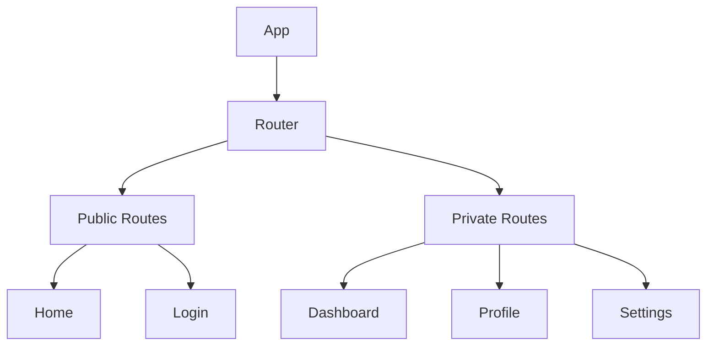

# React 前端项目架构模板

本文档为 React 前端项目提供详细的架构文档模板。

## React 特定章节

### R1. 技术栈详情

| 类别 | 技术 | 版本 | 说明 |
|------|------|------|------|
| 框架 | React | 18.x | UI 库 |
| 元框架 | Next.js | 14.x | SSR/SSG 框架 |
| 路由 | React Router | 6.x | 路由管理 |
| 状态管理 | Redux Toolkit / Zustand | - | 状态管理 |
| 样式 | Styled Components / Tailwind CSS | - | CSS 方案 |
| HTTP | Axios / React Query | - | 数据获取 |
| 表单 | React Hook Form | 7.x | 表单处理 |
| 类型 | TypeScript | 5.x | 类型系统 |
| 测试 | Jest + React Testing Library | - | 测试 |
| 构建 | Vite / Webpack | 5.x / 5.x | 打包工具 |

### R2. 架构模式

#### Feature-Based Architecture
```
┌─────────────────────────────────────────┐
│               Pages                     │
│  ┌─────────────────────────────────┐    │
│  │  Route Components               │    │
│  │  HomePage, ProductPage          │    │
│  └─────────────────────────────────┘    │
└─────────────────────────────────────────┘
                    │
┌─────────────────────────────────────────┐
│             Features                    │
│  ┌─────────────────────────────────┐    │
│  │  Feature:User                   │    │
│  │  ├── components/                │    │
│  │  ├── hooks/                    │    │
│  │  ├── services/                 │    │
│  │  └── types/                    │    │
│  └─────────────────────────────────┘    │
└─────────────────────────────────────────┘
                    │
┌─────────────────────────────────────────┐
│              Shared                      │
│  ┌─────────────────────────────────┐    │
│  │  components/ (Button, Input)    │    │
│  │  hooks/ (useAuth, useTheme)     │    │
│  │  utils/                        │    │
│  └─────────────────────────────────┘    │
└─────────────────────────────────────────┘
```

### R3. 目录结构

```
src/
├── app/                 # Next.js App Router
│   ├── (auth)/         # 路由组
│   ├── (dashboard)/
│   └── api/            # API 路由
├── components/         # 共享组件
│   ├── ui/            # 基础 UI 组件
│   └── layout/        # 布局组件
├── features/          # 功能模块
│   ├── users/
│   ├── products/
│   └── orders/
├── hooks/             # 共享 hooks
├── lib/               # 工具库
├── services/          # API 服务
├── store/            # 状态管理
├── types/            # 类型定义
└── styles/           # 全局样式
```

### R4. 路由结构



### R5. 状态管理方案

#### Redux Toolkit
```typescript
// store/slices/userSlice.ts
const userSlice = createSlice({
  name: 'user',
  initialState: { users: [], loading: false },
  reducers: {
    setUsers: (state, action) => {
      state.users = action.payload
    }
  }
})
```

#### Zustand (轻量方案)
```typescript
// stores/useUserStore.ts
const useUserStore = create((set) => ({
  users: [],
  fetchUsers: async () => {
    const res = await api.getUsers()
    set({ users: res.data })
  }
}))
```

### R6. 样式方案

#### CSS Modules
```css
/* Button.module.css */
.button {
  padding: 8px 16px;
  border-radius: 4px;
}
```
```tsx
// Button.tsx
import styles from './Button.module.css'
export const Button = () => <button className={styles.button}>Click</button>
```

#### Tailwind CSS
```tsx
<button className="px-4 py-2 bg-blue-500 text-white rounded">
  Click
</button>
```

## 标准章节参考

详见 [template.md](./template.md) 中的标准章节结构。
