# 项目架构文档模板

本文档提供项目架构文档的详细模板，包含完整的章节结构。

## 章节结构

### 1. 文档修订历史

| 版本 | 修订人 | 修订时间 | 修订内容 |
|------|--------|----------|----------|
| v1.0 | - | - | 初始版本 |

### 2. 项目架构概览

#### 系统定位
{项目在整体系统中的位置和角色}

#### 架构愿景
{架构设计的长期目标和愿景}

#### 设计原则
- {原则1}
- {原则2}
- {原则3}

#### 质量属性
- **性能**：{性能指标}
- **可扩展性**：{扩展性说明}
- **可维护性**：{可维护性说明}
- **安全性**：{安全性要求}

### 3. 项目简介

#### 业务背景
{项目产生的业务背景和需求}

#### 目标用户
{项目的目标用户群体}

#### 核心功能
- {核心功能1}
- {核心功能2}
- {核心功能3}

#### 系统边界
{系统的边界定义，明确范围}

### 4. 术语与缩略语

| 术语 | 解释 |
|------|------|
| - | - |

### 5. 技术栈

| 类别 | 技术 | 版本 | 用途 |
|------|------|------|------|
| 编程语言 | - | - | - |
| 框架 | - | - | - |
| 构建工具 | - | - | - |
| 数据库 | - | - | - |
| 中间件 | - | - | - |

### 6. 模块依赖关系图

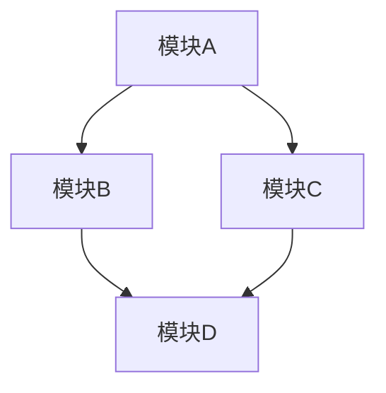

### 7. 依赖关系分析

#### 依赖方向检查
{分析模块间的依赖方向是否符合架构原则}

#### 循环依赖检测报告
{检测结果：无循环依赖 / 存在循环依赖}

#### 依赖优化建议
{针对检测到的依赖问题的优化建议}

### 8. 模块简略介绍

| 模块名称 | 层级 | 核心职责 |
|----------|------|----------|
| - | - | - |

### 9. 主要组件功能介绍

#### 核心组件
| 组件名 | 职责 | 关键接口 |
|--------|------|----------|
| - | - | - |

#### 关键服务
| 服务名 | 职责 | 协议 |
|--------|------|------|
| - | - | - |

### 10. 主页面架构

#### 页面导航结构
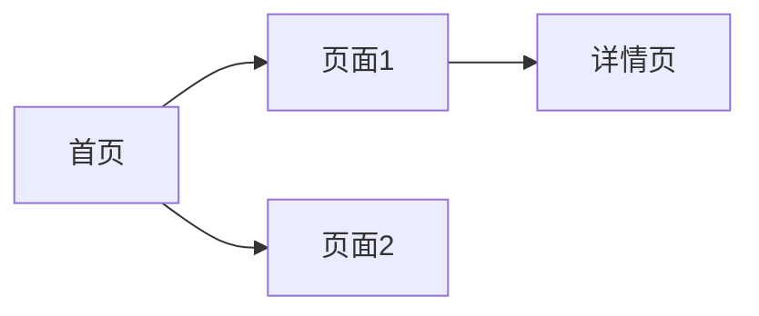

#### UI组件层次
{描述UI组件的层次结构}

### 11. 页面跳转详情

| 源页面 | 目标页面 | 路由 | 参数 | 说明 |
|--------|----------|------|------|------|
| 首页 | 详情页 | /detail/{id} | id | 跳转详情 |
| 首页 | 搜索页 | /search | keyword | 搜索内容 |

### 12. 主要业务流程图

> ⚠️ **重要**：每个流程节点必须标注**方法名**和**代码位置（文件:行号）**，帮助开发者直接定位实现代码。详见 [references/mermaid-spec.md](references/mermaid-spec.md)。

#### 12.1 项目整体业务流程

```mermaid
flowchart TB
    subgraph Init[初始化阶段]
        START["启动<br>MainEntry.init()<br>app/MainEntry.java:23"]
        CONFIG --> AUTH[认证授权<br>AuthService.login()<br>auth/AuthService.java:56]
    end
    subgraph Core[核心业务]
        HOME["业务首页<br>HomeController.index()<br>modules/home/HomeController.py:78"]
        FEATURE_A["功能模块A<br>ModuleAService.handle()<br>modules/featureA/ModuleAService.java:45"]
        FEATURE_B["功能模块B<br>ModuleBService.handle()<br>modules/featureB/ModuleBService.ts:32"]
        DETAIL["详情流程<br>DetailHandler.show()<br>modules/detail/DetailHandler.py:67"]
        HOME --> FEATURE_A
        HOME --> FEATURE_B
        FEATURE_A --> DETAIL
        FEATURE_B --> DETAIL
    end
    subgraph Data[数据层]
        REPO["数据仓储<br>DataRepository.fetch()<br>data/DataRepository.java:89"]
        LOCAL["本地存储<br>LocalDS.query()<br>data/local/LocalDS.ts:45"]
        REMOTE["远程服务<br>RemoteDS.request()<br>data/remote/RemoteDS.go:112"]
        REPO --> LOCAL
        REPO --> REMOTE
    end
    subgraph Background[后台任务]
        SYNC["数据同步<br>SyncManager.sync()<br>core/SyncManager.py:56"]
        NOTIFY["通知推送<br>NotifyService.push()<br>core/NotifyService.java:78"]
        SYNC --> NOTIFY
    end


AUTH --> HOME


DETAIL --> REPO


REPO --> SYNC
```

##### 12.1.1 业务流程步骤详解 ★

> 每个流程节点对应的具体方法、API、参数和返回值，帮助开发者快速理解每个步骤的实现细节。

| 步骤编号 | 步骤名称 | 核心方法/API | 输入参数 | 返回结果 | 代码位置 | 说明 |
|----------|----------|-------------|----------|----------|----------|------|
| 1 | 应用启动 | `MainEntry.init(String[] args)` | `args`: 命令行参数 | `void` | `app/MainEntry.java:23` | 初始化框架、注册全局组件 |
| 2 | 加载配置 | `ConfigLoader.load(String env)` | `env`: 环境标识(dev/staging/prod) | `AppConfig` | `core/ConfigLoader.ts:34` | 从配置文件/配置中心加载 |
| 3 | 认证授权 | `AuthService.login(String token)` | `token`: 认证令牌 | `AuthResult` | `auth/AuthService.java:56` | 校验令牌、建立会话上下文 |
| 4 | 业务首页 | `HomeController.index(Request req)` | `req`: HTTP请求 | `PageResponse` | `modules/home/HomeController.py:78` | 聚合首页数据、渲染主页面 |
| 5 | 功能模块A | `ModuleAService.handle(Params p)` | `p`: 业务参数 | `Result<Data>` | `modules/featureA/ModuleAService.java:45` | 核心业务处理入口 |
| 6 | 功能模块B | `ModuleBService.handle(Request r)` | `r`: 请求对象 | `Response` | `modules/featureB/ModuleBService.ts:32` | 辅助业务处理 |
| 7 | 详情流程 | `DetailHandler.show(Long id)` | `id`: 实体ID | `DetailVO` | `modules/detail/DetailHandler.py:67` | 获取并展示详情数据 |
| 8 | 数据仓储 | `DataRepository.fetch(Query q)` | `q`: 查询条件 | `DataResult` | `data/DataRepository.java:89` | 统一数据访问入口 |
| 9 | 本地存储 | `LocalDS.query(SqlQuery sql)` | `sql`: 查询语句 | `RowSet` | `data/local/LocalDS.ts:45` | 本地数据库查询 |
| 10 | 远程服务 | `RemoteDS.request(ApiCall call)` | `call`: API调用描述 | `ApiResponse` | `data/remote/RemoteDS.go:112` | 远程API请求 |
| 11 | 数据同步 | `SyncManager.sync(SyncConfig c)` | `c`: 同步配置 | `SyncReport` | `core/SyncManager.py:56` | 后台定时数据同步 |
| 12 | 通知推送 | `NotifyService.push(Message m)` | `m`: 消息对象 | `void` | `core/NotifyService.java:78` | 推送通知给用户 |

##### 12.1.2 关键步骤代码示例

###### 步骤 3：认证授权

```java
// 📁 auth/AuthService.java:56
public AuthResult login(String token) {
    // 1. 校验令牌有效性
    TokenPayload payload = tokenValidator.verify(token);        // L58: TokenValidator.verify()
    // 2. 构建会话上下文
    SessionContext ctx = sessionFactory.create(payload);        // L62: SessionFactory.create()
    // 3. 缓存会话信息
    cacheService.set("session:" + ctx.getId(), ctx, Duration.ofHours(2));  // L66: CacheService.set()
    return AuthResult.success(ctx);
}
```

###### 步骤 8：数据仓储（本地+远程合并策略）

```java
// 📁 data/DataRepository.java:89
public DataResult fetch(Query query) {
    // 1. 先查本地缓存
    DataResult local = localDS.query(query.toSqlQuery());       // L92: LocalDataSource.query()
    if (local.isComplete()) return local;
    // 2. 缓存未命中，请求远程
    ApiResponse remote = remoteDS.request(query.toApiCall());   // L96: RemoteDataSource.request()
    // 3. 合并本地+远程结果
    DataResult merged = mergeStrategy.merge(local, remote);     // L100: MergeStrategy.merge()
    // 4. 回写本地缓存
    localDS.insert(merged.getNewRecords());                     // L103: LocalDataSource.insert()
    return merged;
}
```

#### 12.2 核心功能模块流程（时序图）★

核心业务功能必须使用时序图表达，每个调用标注方法名和代码位置。每个时序图下方附带**步骤详解表**和**关键代码示例**。

##### 12.2.1 模块A数据流时序

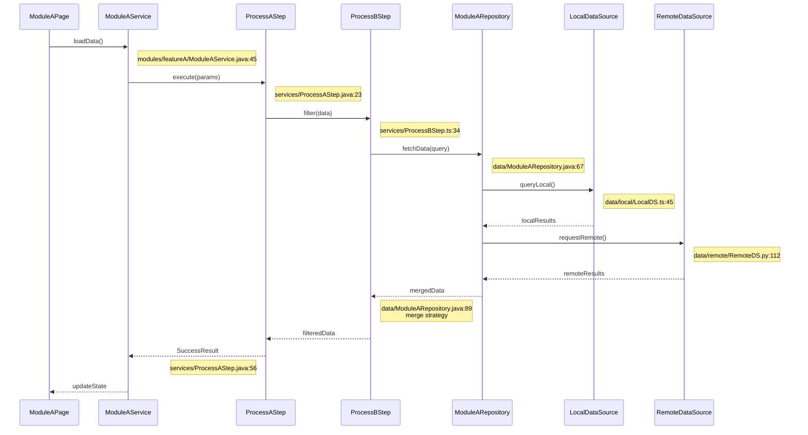

**步骤详解**：

| 步骤 | 调用者 | 被调用者 | 方法签名 | 参数 | 返回 | 代码位置 | 说明 |
|------|--------|----------|----------|------|------|----------|------|
| 1 | ModuleAPage | ModuleAService | `loadData()` | - | `void` | `modules/featureA/ModuleAService.java:45` | UI触发数据加载 |
| 2 | ModuleAService | ProcessAStep | `execute(Params p)` | `p`: 业务参数对象 | `ProcessContext` | `services/ProcessAStep.java:23` | 编排处理链路 |
| 3 | ProcessAStep | ProcessBStep | `filter(Data data)` | `data`: 原始数据 | `FilteredData` | `services/ProcessBStep.ts:34` | 数据过滤/转换 |
| 4 | ProcessBStep | ModuleARepository | `fetchData(Query q)` | `q`: 查询条件 | `RawData` | `data/ModuleARepository.java:67` | 统一数据获取 |
| 5 | ModuleARepository | LocalDataSource | `queryLocal()` | - | `RowSet` | `data/local/LocalDS.ts:45` | 查询本地缓存 |
| 6 | ModuleARepository | RemoteDataSource | `requestRemote()` | - | `ApiResponse` | `data/remote/RemoteDS.py:112` | 调用远程API |

**关键代码示例**：

```java
// 📁 data/ModuleARepository.java:89 - 合并策略
public RawData fetchData(Query query) {
    RowSet localResults = localDS.queryLocal();             // L92
    if (localResults.isComplete()) return localResults;
    ApiResponse remoteResults = remoteDS.requestRemote();   // L96
    return mergeStrategy.merge(localResults, remoteResults);// L100: 本地优先，远程补充
}
```

##### 12.2.2 模块B搜索流程时序

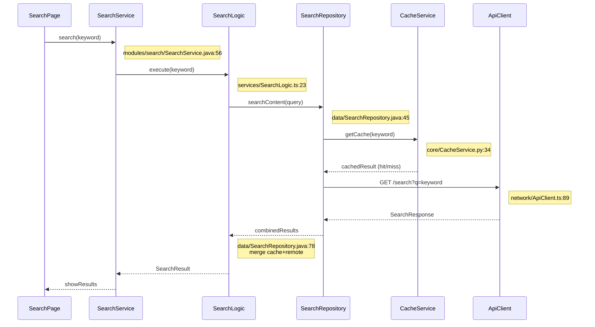

**步骤详解**：

| 步骤 | 调用者 | 被调用者 | 方法签名 | 参数 | 返回 | 代码位置 | 说明 |
|------|--------|----------|----------|------|------|----------|------|
| 1 | SearchPage | SearchService | `search(String keyword)` | `keyword`: 搜索词 | `void` | `modules/search/SearchService.java:56` | 触发搜索 |
| 2 | SearchService | SearchLogic | `execute(String kw)` | `kw`: 搜索关键词 | `SearchContext` | `services/SearchLogic.ts:23` | 搜索编排 |
| 3 | SearchLogic | SearchRepository | `searchContent(String q)` | `q`: 查询字符串 | `SearchResult` | `data/SearchRepository.java:45` | 数据查询 |
| 4 | SearchRepository | CacheService | `getCache(String key)` | `key`: 缓存键 | `CacheHit?` | `core/CacheService.py:34` | 检查缓存 |
| 5 | SearchRepository | ApiClient | `GET /search?q={keyword}` | `q`: 查询参数 | `SearchResponse` | `network/ApiClient.ts:89` | HTTP检索请求 |

**关键代码示例**：

```typescript
// 📁 data/SearchRepository.java:78 - 缓存+远程合并
public SearchResult searchContent(String query) {
    CacheHit cacheResult = cacheService.getCache(query);          // L80: 先查缓存
    if (cacheResult.isHit()) return cacheResult.getData();
    SearchResponse remote = apiClient.get("/search", {q: query}); // L84: 缓存未命中，请求远程
    cacheService.setCache(query, remote, TTL_10MIN);              // L86: 回写缓存
    return remote.toSearchResult();                               // L88: 转换结果
}
```

#### 12.3 核心功能流程图 ★

每个核心功能提供**分层流程图 + 配套时序图 + 步骤API详解 + 关键代码**四合一展示。

##### 12.3.1 模块A核心功能流程

**分层流程图**：

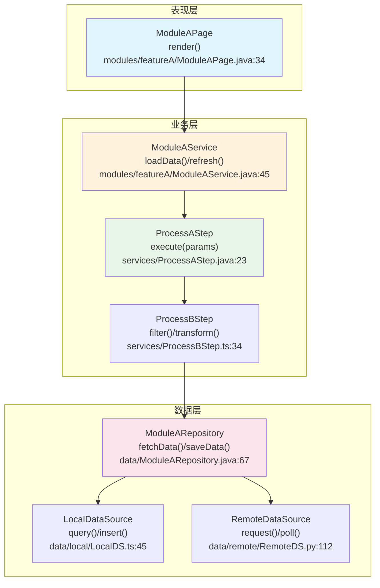

**配套时序图**：

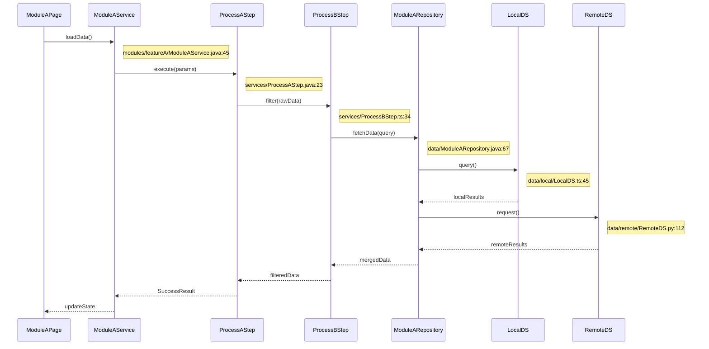

**步骤与API详解**：

| 步骤 | 组件 | 核心方法 | 参数类型 | 返回类型 | 代码位置 | 关键逻辑 |
|------|------|----------|----------|----------|----------|----------|
| 1 | ModuleAPage | `render()` | - | `void` | `modules/featureA/ModuleAPage.java:34` | 触发页面渲染，调用Service加载 |
| 2 | ModuleAService | `loadData()` | `QueryParams` | `void` | `modules/featureA/ModuleAService.java:45` | 编排数据处理链路 |
| 3 | ProcessAStep | `execute(Params)` | `Params` | `ProcessContext` | `services/ProcessAStep.java:23` | 核心处理编排，调用过滤步骤 |
| 4 | ProcessBStep | `filter(Data)` | `Data` | `FilteredData` | `services/ProcessBStep.ts:34` | 数据过滤与转换 |
| 5 | ModuleARepository | `fetchData(Query)` | `Query` | `RawData` | `data/ModuleARepository.java:67` | 统一数据访问（本地+远程） |
| 6 | LocalDataSource | `query()` | - | `RowSet` | `data/local/LocalDS.ts:45` | 本地数据库/缓存查询 |
| 7 | RemoteDataSource | `request()` | - | `ApiResponse` | `data/remote/RemoteDS.py:112` | HTTP远程API请求 |

**关键代码**：

```java
// 📁 services/ProcessAStep.java:23 - 业务编排核心
public SuccessResult execute(Params params) {
    params.validate();                                          // L26: 参数校验
    FilteredData data = componentB.filter(params.toData());    // L30: → ProcessBStep.filter()
    return SuccessResult.of(data.aggregate());                  // L34: 聚合结果
}
```

#### 12.4 业务流程说明（含代码位置、API详情）★

| 流程名称 | 涉及模块 | 入口方法 | 核心API | 参数/返回 | 代码位置 | 功能描述 |
|----------|----------|----------|---------|-----------|----------|----------|
| {流程1} | {模块A} | `{Service.method()}` | `{Service}.loadData()` → `{Repo}.fetch()` | `Params` → `Result` | `{文件路径:行号}` | {描述} |
| {流程2} | {模块B} | `{Logic.execute()}` | `{Logic}.execute()` → `{Repo}.query()` | `String` → `Data` | `{文件路径:行号}` | {描述} |
| {流程3} | {模块C} | `{Repository.fetch()}` | `{Repo}.fetch()` → `GET /api/endpoint` | `Query` → `Response` | `{文件路径:行号}` | {描述} |

#### 12.5 模块间调用流程（时序图）★

展示跨模块调用的完整时序，标注模块边界和代码位置。

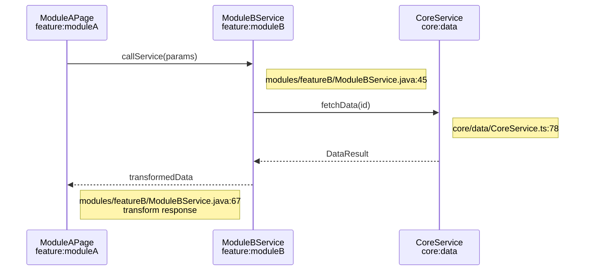

### 13. 数据库设计

#### 13.1 ER图
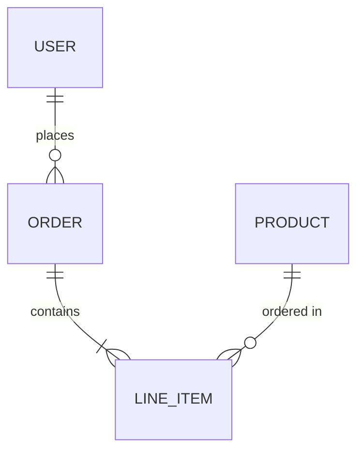

#### 13.2 数据表结构

| 表名 | 字段名 | 类型 | 约束 | 外键 | 索引 | 说明 |
|------|--------|------|------|------|------|------|
| - | - | - | - | - | - | - |

#### 13.3 外键关联关系

| 父表 | 父字段 | 子表 | 子字段 | 关系类型 | 级联操作 |
|------|--------|------|--------|----------|----------|
| - | - | - | - | - | - |

#### 13.4 索引设计

| 表名 | 索引名 | 字段 | 类型 | 说明 |
|------|--------|------|------|------|
| - | - | - | 普通/唯一/复合 | - |

### 14. 核心数据类关系图

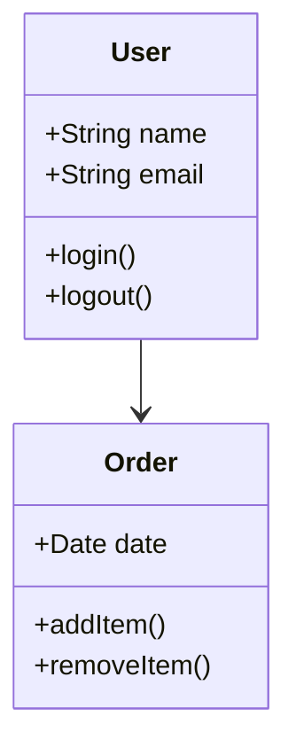

### 15. 架构决策记录（ADR）

#### ADR-001: {决策标题}
- **背景**：{决策的背景}
- **决策**：{做出的决策}
- **权衡**：{考虑的权衡因素}
- **后果**：{决策的后果}

### 16. 接口设计

#### 内部接口
| 接口名 | 协议 | 说明 |
|--------|------|------|
| - | - | - |

#### 外部接口
| 接口名 | 协议 | 说明 |
|--------|------|------|
| - | - | - |

### 17. 部署与运维方案

#### 部署架构
{部署架构描述}

#### 监控与日志
{监控方案和日志规范}

### 18. 安全设计

#### 认证鉴权
{认证和鉴权方案}

#### 数据加密
{数据加密策略}

### 19. 风险与应对措施

| 风险类型 | 风险描述 | 应对措施 |
|----------|----------|----------|
| 技术风险 | - | - |
| 业务风险 | - | - |

### 20. 模块文档索引

{各模块详细文档的链接索引}

| 模块 | 文档路径 |
|------|----------|
| {模块A} | docs/architecture/modules/{模块A}/{模块A名称}模块架构.md |
| {模块B} | docs/architecture/modules/{模块B}/{模块B名称}模块架构.md |

### 21. 项目编译指南

{各项目类型的编译目标、用途和命令}

| 项目类型 | 编译目标 | 用途 | 命令 |
|----------|----------|------|------|
| Android | assembleDebug | 开发调试构建 | `./gradlew assembleDebug` |
| iOS | xcodebuild | iOS 构建 | `xcodebuild` |
| Java | mvn package | 打包构建 | `mvn package` |

---

## 模块文档模板（12章）

> 每个模块生成一份独立的模块架构文档，保存到 `docs/architecture/modules/{模块名}/` 目录下。
> ⚠️ 流程图的每个步骤必须标注**方法名和代码位置（文件:行号）**。

### 1. 模块概述

- **模块名称**：{模块名}
- **所在层级**：{App/Feature/Core层}
- **核心职责**：{一句话描述}
- **模块类型**：{功能模块 / 工具模块 / 服务模块 / UI模块}

#### 主要功能
- {功能1}
- {功能2}
- {功能3}

### 2. 模块 UI 组件清单

> 列出本模块使用的 UI 框架和关键组件，帮助理解模块的前端实现。

#### 使用的 UI 框架 / 组件库

| UI 框架 / 组件库 | 版本 | 用途 |
|------------------|------|------|
| {框架名，如 Material3 / TDesign / Ant Design} | {版本} | {说明} |

#### 本模块使用的关键 UI 组件

| 组件名称 | 所属框架/库 | 用途 | 所在文件（相对路径） |
|----------|------------|------|---------------------|
| {组件名} | {框架名} | {说明} | `{路径/文件}` |
| {组件名} | {框架名} | {说明} | `{路径/文件}` |

#### UX 设计要点

- **交互模式**：{描述本模块的核心交互模式，如 列表+详情、表单提交、Tab 切换}
- **导航方式**：{底部Tab / 侧边栏 / 顶部导航 / 模态弹出}
- **状态反馈**：{Loading骨架屏 / Toast提示 / Snackbar / 空状态占位图 / 错误重试}
- **适配策略**：{响应式断点 / 横竖屏适配 / 深色模式 / 无障碍支持}

### 3. 依赖关系

| 依赖模块 | 依赖类型 | 说明 |
|----------|----------|------|
| {模块A} | implementation | {说明} |
| {模块B} | api | {说明} |
| {第三方库} | - | {说明} |

### 4. 业务流程（含代码标注）★

> 使用流程图展示模块内的核心业务处理流程，每个节点标注方法名和代码位置。流程图下方附带**步骤API详解**和**关键代码示例**。

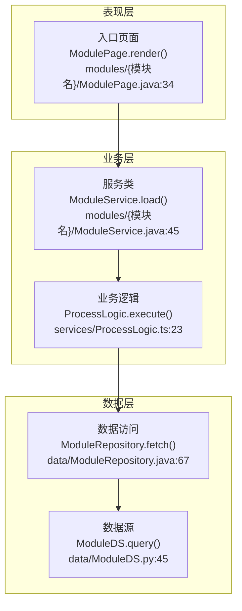

#### 3.1 步骤API详解

| 步骤 | 组件 | 核心方法 | 输入参数 | 返回类型 | 代码位置 | 关键逻辑 |
|------|------|----------|----------|----------|----------|----------|
| 1 | ModulePage | `render()` | - | `void` | `modules/{模块名}/ModulePage.java:34` | {描述} |
| 2 | ModuleService | `load(Params)` | `Params` | `Result<Data>` | `modules/{模块名}/ModuleService.java:45` | {描述} |
| 3 | ProcessLogic | `execute(Context)` | `Context` | `ProcessedData` | `services/ProcessLogic.ts:23` | {描述} |
| 4 | ModuleRepository | `fetch(Query)` | `Query` | `RawData` | `data/ModuleRepository.java:67` | {描述} |
| 5 | ModuleDS | `query()` | - | `RowSet` | `data/ModuleDS.py:45` | {描述} |

#### 3.2 关键代码示例

```{语言}
// 📁 {文件路径:行号} - {功能说明}
{关键方法实现代码片段}
```

### 5. 数据流（时序图）★

> 使用时序图展示模块内数据请求到渲染的完整流程，每条消息标注方法名，每个参与者用 Note 标注文件路径。下方附带**步骤详解表**。

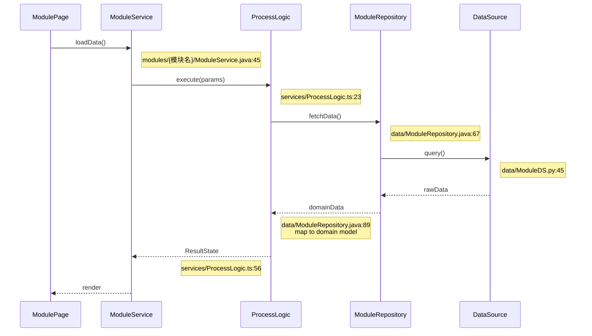

#### 4.1 步骤详解

| 步骤 | 调用者 | 被调用者 | 方法签名 | 参数 | 返回 | 代码位置 | 说明 |
|------|--------|----------|----------|------|------|----------|------|
| 1 | ModulePage | ModuleService | `loadData()` | - | `void` | `modules/{模块名}/ModuleService.java:45` | 触发数据加载 |
| 2 | ModuleService | ProcessLogic | `execute(Params)` | `Params` | `ProcessContext` | `services/ProcessLogic.ts:23` | 业务逻辑编排 |
| 3 | ProcessLogic | ModuleRepository | `fetchData()` | - | `RawData` | `data/ModuleRepository.java:67` | 数据查询 |
| 4 | ModuleRepository | DataSource | `query()` | - | `RowSet` | `data/ModuleDS.py:45` | 底层数据源查询 |
| 5 | DataSource | (返回) | `rawData` | - | `RowSet` | - | 原始数据返回 |
| 6 | ModuleRepository | (转换) | `domainData` | - | `DomainModel` | `data/ModuleRepository.java:89` | DTO→领域模型映射 |
| 7 | ProcessLogic | (返回) | `ResultState` | - | `Result<Data>` | `services/ProcessLogic.ts:56` | 业务处理结果 |
| 8 | ModuleService | (更新UI) | `render` | - | `void` | - | 渲染到界面 |
```

### 6. 核心功能流程图 ★

> 每个核心功能提供**流程图 + 时序图 + 步骤API详解 + 关键代码**四合一展示。

#### 5.1 {功能A}流程

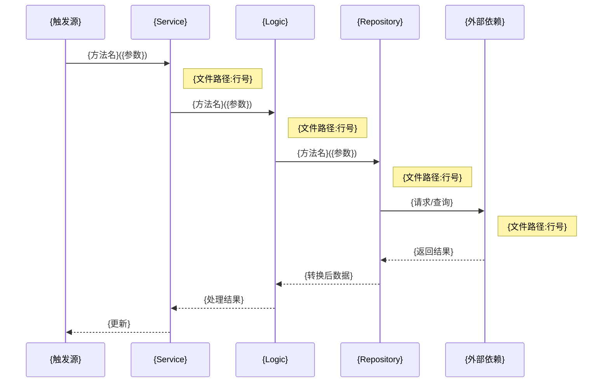

**步骤API详解**：

| 步骤 | 调用者 | 被调用者 | 方法签名 | 参数 | 返回 | 代码位置 | 说明 |
|------|--------|----------|----------|------|------|----------|------|
| 1 | {触发源} | {Service} | `{方法}({参数类型})` | {参数说明} | {返回说明} | `{文件路径}:{行号}` | {步骤说明} |
| 2 | {Service} | {Logic} | `{方法}({参数类型})` | {参数说明} | {返回说明} | `{文件路径}:{行号}` | {步骤说明} |
| 3 | {Logic} | {Repository} | `{方法}({参数类型})` | {参数说明} | {返回说明} | `{文件路径}:{行号}` | {步骤说明} |
| 4 | {Repository} | {外部依赖} | `{API或方法}` | {参数说明} | {返回说明} | `{文件路径}:{行号}` | {步骤说明} |

**关键代码示例**：

```{语言}
// 📁 {文件路径:行号} - {核心方法说明}
{方法实现的关键代码片段}
```

#### 5.2 {功能B}流程（同上格式）
#### 5.3 {功能C}流程（同上格式）

### 7. 数据依赖关系

| 数据实体 | 来源模块 | 使用方式 | 说明 |
|----------|----------|----------|------|
| {实体1} | {来源模块} | 依赖注入 / 直接引用 | {说明} |
| {实体2} | {外部服务} | API 调用 | {说明} |

### 8. 依赖场景说明

| 场景 | 被依赖模块 | 调用的接口/方法 | 优化建议 |
|------|------------|----------------|----------|
| {场景1} | {模块A} | `{类.方法()}` | {建议} |
| {场景2} | {模块B} | `{接口}` | {建议} |

### 9. 页面与路由

| 页面/组件 | 路由路径 | 参数 | 所属文件 | 说明 |
|------------|----------|------|----------|------|
| {页面A} | `{路由路径}` | `{参数}` | `{文件路径:行号}` | {说明} |
| {页面B} | `{路由路径}` | `{参数}` | `{文件路径:行号}` | {说明} |

### 10. 导航调用示例

```{语言}
// 跳转到 {目标页面}
{导航代码示例}
// 文件位置：{文件路径:行号}
```

### 11. 关键类和方法 ★

> 每个类必须标注**文件路径和行号范围**，关键方法标注**完整签名、参数类型、返回类型、调用链和功能说明**。

| 类名 | 文件路径 | 行范围 | 关键方法 | 功能说明 |
|------|----------|--------|----------|----------|
| `{类A}` | `{文件路径}` | L{start}-{end} | `loadData(QueryParams): Result<Data>`<br>`refresh()`<br>`clearCache()` | 数据加载与状态管理 |
| `{类B}` | `{文件路径}` | L{start}-{end} | `execute(Params): ProcessContext`<br>`validate()`<br>`aggregate()` | 核心业务逻辑执行 |
| `{类C}` | `{文件路径}` | L{start}-{end} | `fetch(Query): RawData`<br>`save(Entity): void`<br>`delete(Long): void` | 数据访问与持久化 |

#### 10.1 核心方法详细说明 ★

##### `{类A}.loadData()` — 📁 {文件路径}:{行号}

| 属性 | 说明 |
|------|------|
| **功能** | {一段话描述方法做什么，什么场景调用} |
| **完整签名** | `{返回类型} loadData({参数类型} {参数名})` |
| **参数** | `{参数名}: {类型}` — {参数含义和约束} |
| **返回** | `{返回类型}` — {返回值含义，各种状态码/枚举值} |
| **前置条件** | {调用前需要满足的条件，如需要登录、需要网络等} |
| **副作用** | {对系统状态的改变：更新缓存、触发通知、写入数据库等} |
| **异常处理** | {可能抛出的异常类型和处理策略} |
| **调用链** | `ModulePage.render()` → `ModuleService.load(Params)` → `{类A}.loadData()` → `{类B}.execute()` → `{类C}.fetch()` |
| **代码示例** | 见下方 |

```{语言}
// 📁 {文件路径}:{行号范围}
{完整方法实现的关键代码片段}
```

##### `{类B}.execute()` — 📁 {文件路径}:{行号}

| 属性 | 说明 |
|------|------|
| **功能** | {一段话描述方法做什么} |
| **完整签名** | `{返回类型} execute({参数类型} {参数名})` |
| **参数** | `{参数名}: {类型}` — {说明} |
| **返回** | `{返回类型}` — {说明} |
| **调用链** | `{类A}.loadData()` → `{类B}.execute()` → `{类C}.fetch()` → `DataSource.query()` |
| **代码示例** | 见下方 |

```{语言}
// 📁 {文件路径}:{行号范围}
{方法实现的关键代码片段}
```

##### `{类C}.fetch()` — 📁 {文件路径}:{行号}

| 属性 | 说明 |
|------|------|
| **功能** | {一段话描述} |
| **完整签名** | `{返回类型} fetch({参数类型} {参数名})` |
| **参数** | `{参数名}: {类型}` — {说明} |
| **返回** | `{返回类型}` — {说明} |
| **涉及的API/数据源** | `GET /api/{endpoint}` / `{表名}表查询` |
| **调用链** | `{类B}.execute()` → `{类C}.fetch()` → `LocalDataSource.query()` → `RemoteDataSource.request()` |

### 12. 测试策略

#### 单元测试覆盖
| 测试文件 | 覆盖类 | 测试类型 | 关键场景 |
|----------|--------|----------|----------|
| `{测试文件}.java` | `{类名}` | 单元测试 | {场景描述} |

#### 测试示例
```{语言}
{关键测试代码示例}
```

---

## 核心日志文档模板（5章）

> 每个核心模块生成一份核心日志文档，保存到 `docs/logs/{模块名}/` 目录下，文件名为 `{模块名}_核心日志.md`。
> ⚠️ **仅核心模块需要生成**此文档。核心模块 = 用户可达界面所在模块 + 后台运行能力所在模块 + 复杂度高的模块 + 用户手动指定的模块。非核心模块（构建脚本、纯工具库、测试模块等，且复杂度低且用户未指定）不需要日志文档。

### 1. 文档修订历史

| 版本 | 修订人 | 修订时间 | 修订内容 |
|------|--------|----------|----------|
| v1.0 | - | {日期} | 初始版本，基于代码扫描自动提取 |

### 2. 核心模块与核心功能定义

> ⚠️ 本章是 AI 后续检索代码时判断核心模块/功能的依据。不在此范围内的模块或功能不应被视为核心。

#### 2.1 核心判定标准

| 判定维度 | 判定条件 | 非核心反例 |
|----------|----------|------------|
| **用户界面可达** ★ | 该模块包含用户通过 UI 直接或间接到达的页面/界面 | 纯后端 API 模块、数据库模块、日志模块 |
| **后台运行能力** ★ | 该模块包含 Service/Worker/定时任务/推送处理/数据同步 | 仅被用户手动触发的单次工具操作 |
| **模块复杂度高** ★ | 代码规模大（>20 文件或 >5000 行）、内含多层抽象/设计模式/算法、承载关键业务规则或数据处理中枢 | 仅 3-5 个简单工具类的薄模块 |
| **用户手动指定** ★ | 用户明确告知该模块为核心模块 | — |
| 非核心（排除） | 构建脚本、Gradle 插件、纯工具库（无UI无后台且复杂度低且用户未指定）、测试模块 | — |

> **本模块判定结果**：{核心模块 / 非核心模块}，判定依据：{简述满足的条件（可能同时满足多条）}
> 
> 💡 注意：满足**任一**维度即为核心模块。如用户手动指定，则无需满足其他条件。

#### 2.2 本模块用户可达界面清单

> 列出本模块中用户可以通过 UI 操作直接或间接到达的所有界面/页面。

| 序号 | 界面/页面名称 | 入口方式 | 入口代码位置 | 涉及的核心类/方法 |
|------|-------------|----------|-------------|------------------|
| 1 | {页面A} | 底部Tab / 侧边栏 / 推送 / 深层链接 | `{文件路径}:{行号}` | `{类.方法()}` |
| 2 | {页面B} | 导航跳转 / 模态弹出 | `{文件路径}:{行号}` | `{类.方法()}` |

#### 2.3 本模块后台运行能力清单

> 列出本模块中后台独立运行的能力（不依赖用户 UI 操作即可触发）。

| 序号 | 能力名称 | 触发方式 | 入口代码位置 | 运行频率 |
|------|----------|----------|-------------|----------|
| 1 | {SyncWorker} | 定时任务 / WakeLock / 推送触发 / 系统广播 | `{文件路径}:{行号}` | 每15分钟 / 开机时 |
| 2 | {PushHandler} | FCM/APNs/Push Kit 推送 | `{文件路径}:{行号}` | 事件驱动 |

### 3. 核心功能日志清单 ★

> ⚠️ 本章通过扫描核心功能的代码提取关键日志语句，用于线上问题排查。每个日志必须标注完整代码位置。

#### 3.1 {核心功能A} 日志

**功能说明**：{一句话描述该功能，涉及的用户操作或后台触发}

**入口方法**：`{完整方法签名}` — `{文件路径}:{行号}`

**关键日志一览**：

| 序号 | 日志级别 | 平台API调用 | 日志内容摘要 | 所在方法 | 代码位置 | 含义/触发场景 |
|------|----------|------------|-------------|----------|----------|--------------|
| 1 | INFO | `Log.i(TAG, "...userId=%s")` | "User login started, userId={}" | `LoginViewModel.login()` | `LoginViewModel.kt:45` | 用户点击登录按钮，记录用户ID |
| 2 | ERROR | `Log.e(TAG, "...", throwable)` | "Login failed: network timeout" | `AuthRepository.login()` | `AuthRepository.kt:89` | 网络超时导致登录失败 |
| 3 | DEBUG | `Logger.d("cache hit: %s", key)` | "cache hit: session_token" | `SessionManager.get()` | `SessionManager.kt:112` | 缓存命中，跳过远程请求 |

> 💡 **日志提取指引**：扫描核心功能涉及的所有方法，提取其中调用的日志API（见表4.1），记录日志级别、内容和代码位置。不要遗漏 try-catch 块中的 ERROR 日志和关键分支中的 INFO/WARN 日志。

#### 3.2 {核心功能B} 日志

**功能说明**：{描述}

**入口方法**：`{完整方法签名}` — `{文件路径}:{行号}`

| 序号 | 日志级别 | 平台API调用 | 日志内容摘要 | 所在方法 | 代码位置 | 含义/触发场景 |
|------|----------|------------|-------------|----------|----------|--------------|
| 1 | - | - | - | - | - | - |

#### 3.3 {核心功能C} 日志

（同上格式，每个核心功能一个子章节）

### 4. 日志级别说明与排查过滤

#### 4.1 各平台日志API对照

| 平台/语言 | DEBUG | INFO | WARN | ERROR | 所在文件路径模式 |
|-----------|-------|------|------|-------|----------------|
| Android (Kotlin/Java) | `Log.d(TAG, msg)` | `Log.i(TAG, msg)` | `Log.w(TAG, msg)` | `Log.e(TAG, msg, throwable)` | `*.kt`, `*.java` |
| iOS (Swift) | `os_log(.debug, ...)` | `os_log(.info, ...)` / `Logger.info` | `os_log(.error, ...)` | `os_log(.fault, ...)` | `*.swift` |
| Flutter (Dart) | `debugPrint()` | `log()` / `logger.i()` | `logger.w()` | `logger.e()` | `*.dart` |
| HarmonyOS (ArkTS) | `hilog.debug()` | `hilog.info()` | `hilog.warn()` | `hilog.error()` | `*.ets`, `*.ts` |
| Vue/React (JS/TS) | `console.debug()` | `console.log()` / `console.info()` | `console.warn()` | `console.error()` | `*.js`, `*.ts`, `*.vue`, `*.tsx` |
| Java 后端 | `log.debug()` / `LOGGER.debug()` | `log.info()` | `log.warn()` | `log.error()` | `*.java` |
| Node.js 后端 | `console.debug()` / `logger.debug()` | `console.log()` / `logger.info()` | `console.warn()` / `logger.warn()` | `console.error()` / `logger.error()` | `*.js`, `*.ts` |
| Python | `logging.debug()` | `logging.info()` | `logging.warning()` | `logging.error()` | `*.py` |
| Go | `log.Debug()` | `log.Info()` | `log.Warn()` | `log.Error()` | `*.go` |

#### 4.2 日志级别用途

| 日志级别 | 用途 | 排查场景 |
|----------|------|----------|
| DEBUG | 详细调试信息，开发环境使用 | 开发阶段追踪变量、方法调用细节 |
| INFO | 关键业务流程节点 | 追踪用户操作路径、状态变更、定时任务执行 |
| WARN | 可恢复的异常和降级 | 性能警告、降级触发、配置缺失但有默认值 |
| ERROR | 不可恢复的错误 | 线上故障排查、崩溃分析、数据不一致 |

#### 4.3 推荐排查过滤命令

```
# Android (adb logcat)
adb logcat | grep -E "{TAG关键字1}|{TAG关键字2}|{模块包名}"

# iOS (Console.app / log stream)
log stream --predicate 'subsystem == "{BundleID}"' --level debug

# Web 浏览器控制台
# 在 DevTools Console 中过滤: {关键字1} {关键字2} {模块名}

# Java 后端
grep -E "ERROR|WARN.*{模块名}" /var/log/{应用名}.log | tail -100

# Node.js 后端
grep -E "error|warn.*{模块名}" /var/log/{应用名}.log | tail -100
```

### 5. 常见问题排查指南 ★

> 基于核心功能日志，归纳常见问题的排查步骤。帮助运维和开发人员通过日志快速定位问题。

| 序号 | 问题现象 | 相关核心功能 | 排查关键词 | 关键日志代码位置 | 排查步骤 |
|------|----------|-------------|------------|----------------|----------|
| 1 | {问题描述，如：用户登录失败} | {功能A} | `{关键词1}`, `{关键词2}` | `{文件}:{行号}` | 1. 搜索关键词<br>2. 检查日志级别<br>3. {具体步骤} |
| 2 | {数据加载异常} | {功能B} | `{关键词}` | `{文件}:{行号}` | 1. {步骤}... |
| 3 | {推送未触发} | {功能C} | `{关键词}` | `{文件}:{行号}` | 1. {步骤}... |

#### 5.1 {问题1} 排查步骤详解

```
步骤1: 确认日志级别 — 检查 {方法名} 是否有 ERROR 日志输出
步骤2: 定位日志输出 — 查看 {文件:行号} 附近的完整上下文
步骤3: 分析调用链 — 追溯 {入口方法1} → {中间方法} → {问题方法} 的完整链路
步骤4: 检查上游 — 确认 {上游依赖} 状态是否正常
步骤5: 查看相关日志 — 检索同时间段 {关联模块} 的日志
```

#### 5.2 {问题2} 排查步骤详解

（同上格式）
```
