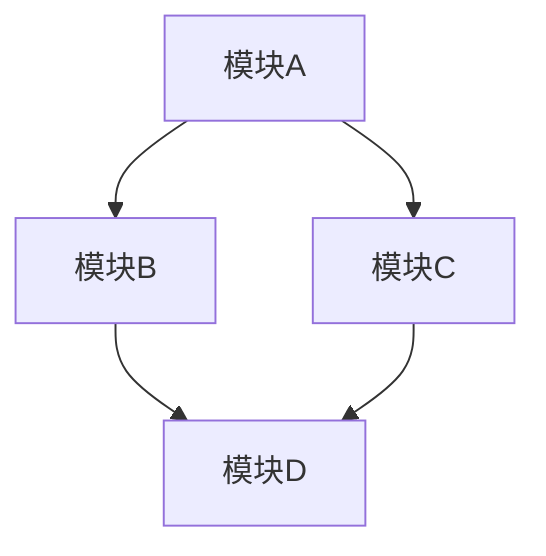
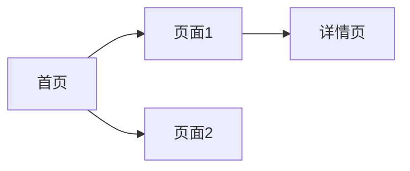
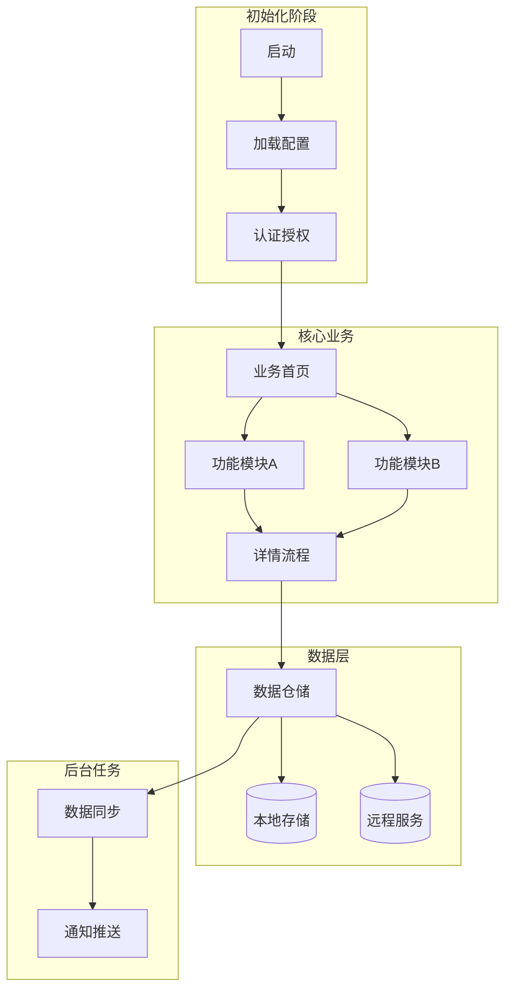
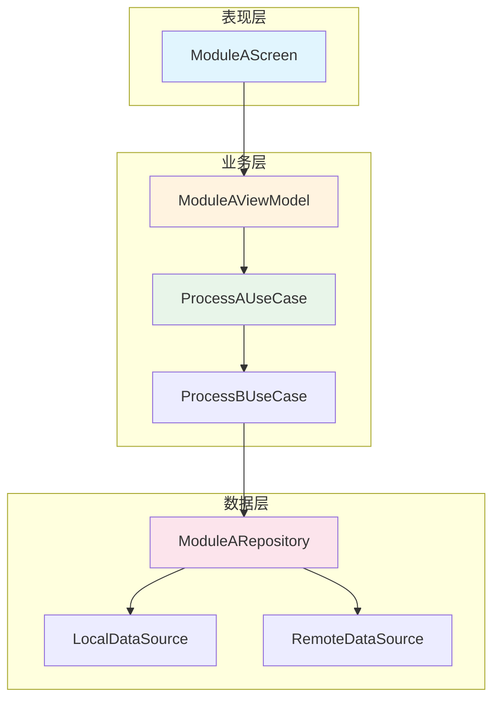
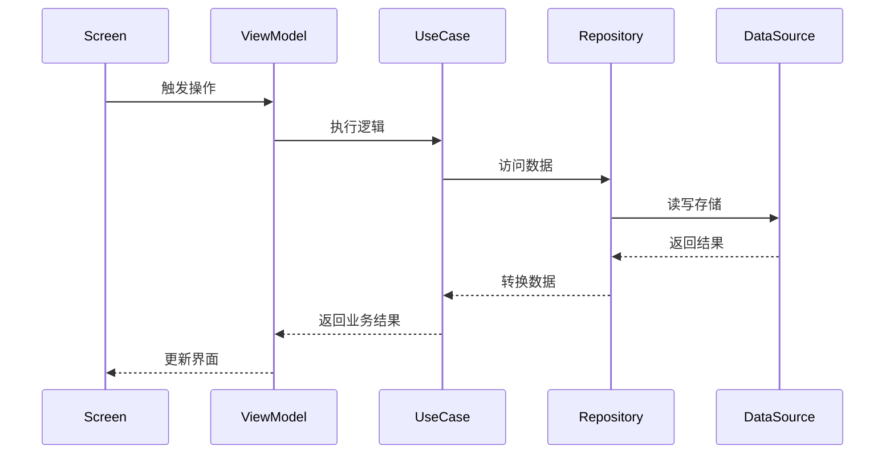
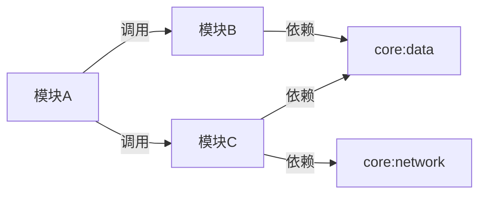
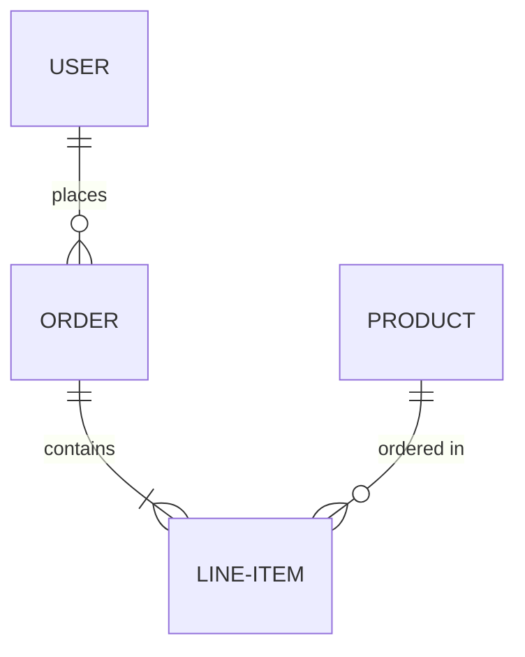
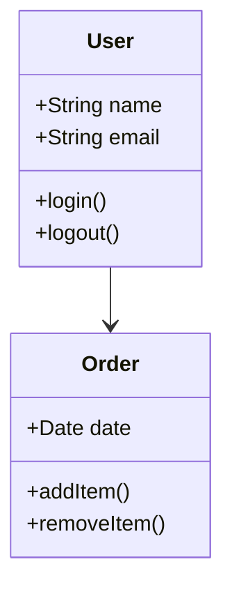

# 项目架构文档模板

本文档提供项目架构文档的详细模板，包含完整的章节结构。

## 章节结构

### 1. 文档修订历史

| 版本 | 修订人 | 修订时间 | 修订内容 |
|------|--------|----------|----------|
| v1.0 | - | - | 初始版本 |

### 2. 项目架构概览

#### 系统定位
{项目在整体系统中的位置和角色}

#### 架构愿景
{架构设计的长期目标和愿景}

#### 设计原则
- {原则1}
- {原则2}
- {原则3}

#### 质量属性
- **性能**：{性能指标}
- **可扩展性**：{扩展性说明}
- **可维护性**：{可维护性说明}
- **安全性**：{安全性要求}

### 3. 项目简介

#### 业务背景
{项目产生的业务背景和需求}

#### 目标用户
{项目的目标用户群体}

#### 核心功能
- {核心功能1}
- {核心功能2}
- {核心功能3}

#### 系统边界
{系统的边界定义，明确范围}

### 4. 术语与缩略语

| 术语 | 解释 |
|------|------|
| - | - |

### 5. 技术栈

| 类别 | 技术 | 版本 | 用途 |
|------|------|------|------|
| 编程语言 | - | - | - |
| 框架 | - | - | - |
| 构建工具 | - | - | - |
| 数据库 | - | - | - |
| 中间件 | - | - | - |

### 6. 模块依赖关系图

### 7. 依赖关系分析

#### 依赖方向检查
{分析模块间的依赖方向是否符合架构原则}

#### 循环依赖检测报告
{检测结果：无循环依赖 / 存在循环依赖}

#### 依赖优化建议
{针对检测到的依赖问题的优化建议}

### 8. 模块简略介绍

| 模块名称 | 层级 | 核心职责 |
|----------|------|----------|
| - | - | - |

### 9. 主要组件功能介绍

#### 核心组件
| 组件名 | 职责 | 关键接口 |
|--------|------|----------|
| - | - | - |

#### 关键服务
| 服务名 | 职责 | 协议 |
|--------|------|------|
| - | - | - |

### 10. 主页面架构

#### 页面导航结构

#### UI组件层次
{描述UI组件的层次结构}

### 11. 页面跳转详情

| 源页面 | 目标页面 | 路由 | 参数 | 说明 |
|--------|----------|------|------|------|
| 首页 | 详情页 | /detail/{id} | id | 跳转详情 |
| 首页 | 搜索页 | /search | keyword | 搜索内容 |

### 12. 主要业务流程图

#### 11.1 项目整体业务流程

#### 11.2 核心功能模块流程

##### 11.2.1 模块A核心流程

##### 11.2.2 模块B核心流程

#### 11.3 业务流程说明

| 流程名称 | 涉及模块 | 核心类/方法 | 功能描述 |
|----------|----------|-------------|----------|
| {流程1} | {模块} | {类.方法()} | {描述} |
| {流程2} | {模块} | {类.方法()} | {描述} |
| {流程3} | {模块} | {类.方法()} | {描述} |

#### 11.4 模块间依赖流程

### 13. 数据库设计

#### 13.1 ER图

#### 13.2 数据表结构

| 表名 | 字段名 | 类型 | 约束 | 外键 | 索引 | 说明 |
|------|--------|------|------|------|------|------|
| - | - | - | - | - | - | - |

#### 13.3 外键关联关系

| 父表 | 父字段 | 子表 | 子字段 | 关系类型 | 级联操作 |
|------|--------|------|--------|----------|----------|
| - | - | - | - | - | - |

#### 13.4 索引设计

| 表名 | 索引名 | 字段 | 类型 | 说明 |
|------|--------|------|------|------|
| - | - | - | 普通/唯一/复合 | - |

### 14. 核心数据类关系图

### 15. 架构决策记录（ADR）

#### ADR-001: {决策标题}
- **背景**：{决策的背景}
- **决策**：{做出的决策}
- **权衡**：{考虑的权衡因素}
- **后果**：{决策的后果}

### 16. 接口设计

#### 内部接口
| 接口名 | 协议 | 说明 |
|--------|------|------|
| - | - | - |

#### 外部接口
| 接口名 | 协议 | 说明 |
|--------|------|------|
| - | - | - |

### 17. 部署与运维方案

#### 部署架构
{部署架构描述}

#### 监控与日志
{监控方案和日志规范}

### 18. 安全设计

#### 认证鉴权
{认证和鉴权方案}

#### 数据加密
{数据加密策略}

### 19. 风险与应对措施

| 风险类型 | 风险描述 | 应对措施 |
|----------|----------|----------|
| 技术风险 | - | - |
| 业务风险 | - | - |

### 20. 模块文档索引

{各模块详细文档的链接索引}

| 模块 | 文档路径 |
|------|----------|
| {模块A} | docs/modules/{模块A}/{模块A名称}模块架构.md |
| {模块B} | docs/modules/{模块B}/{模块B名称}模块架构.md |

### 21. 项目编译指南

{各项目类型的编译目标、用途和命令}

| 项目类型 | 编译目标 | 用途 | 命令 |
|----------|----------|------|------|
| Android | assembleDebug | 开发调试构建 | `./gradlew assembleDebug` |
| iOS | xcodebuild | iOS 构建 | `xcodebuild` |
| Java | mvn package | 打包构建 | `mvn package` |
