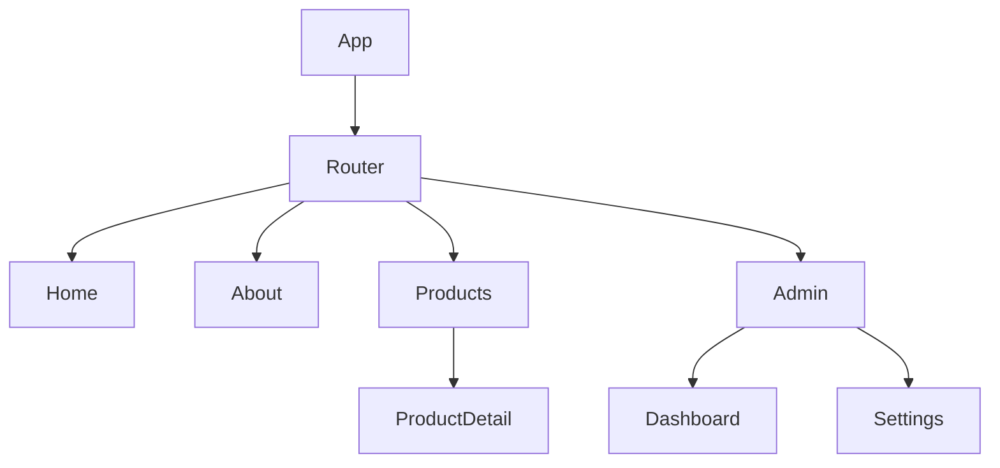

# Vue.js 前端项目架构模板

本文档为 Vue.js 前端项目提供详细的架构文档模板。

## Vue.js 特定章节

### V1. 技术栈详情

| 类别 | 技术 | 版本 | 说明 |
|------|------|------|------|
| 框架 | Vue.js | 3.4+ | 渐进式 JavaScript 框架 |
| 构建工具 | Vite | 5.x | 下一代前端构建工具 |
| 路由 | Vue Router | 4.x | 官方路由管理 |
| 状态管理 | Pinia | 2.x | 官方推荐状态管理 |
| UI 组件 | Element Plus / Ant Design Vue | - | UI 组件库 |
| HTTP | Axios | 1.x | HTTP 客户端 |
| 样式 | SCSS / Tailwind CSS | - | CSS 预处理器 |
| 类型 | TypeScript | 5.x | 类型系统 |
| 测试 | Vitest + Vue Test Utils | - | 单元测试 |
| E2E | Playwright / Cypress | - | 端到端测试 |

### V2. 架构模式

#### Composition API 架构
```
┌─────────────────────────────────────────┐
│              Views                      │
│  ┌─────────────────────────────────┐    │
│  │  Pages / Views                  │    │
│  │  页面组件，组合其他组件          │    │
│  └─────────────────────────────────┘    │
└─────────────────────────────────────────┘
                    │
┌─────────────────────────────────────────┐
│           Components                    │
│  ┌─────────────────────────────────┐    │
│  │  可复用组件                      │    │
│  │  使用 Composition API           │    │
│  └─────────────────────────────────┘    │
└─────────────────────────────────────────┘
                    │
┌─────────────────────────────────────────┐
│            Composables                  │
│  ┌─────────────────────────────────┐    │
│  │  可复用逻辑函数                  │    │
│  │  useXxx() 命名约定              │    │
│  └─────────────────────────────────┘    │
└─────────────────────────────────────────┘
                    │
┌─────────────────────────────────────────┐
│             Stores                      │
│  ┌─────────────────────────────────┐    │
│  │  Pinia Store                   │    │
│  │  状态管理                        │    │
│  └─────────────────────────────────┘    │
└─────────────────────────────────────────┘
```

### V3. 目录结构

```
src/
├── assets/          # 静态资源
├── components/      # 可复用组件
│   ├── common/      # 通用组件
│   └── business/    # 业务组件
├── composables/     # 组合式函数
├── layouts/         # 布局组件
├── pages/           # 页面
├── router/          # 路由配置
├── stores/          # Pinia stores
├── services/       # API 服务
├── types/          # TypeScript 类型
└── utils/          # 工具函数
```

### V4. 路由结构



### V5. 状态管理 (Pinia)

#### Store 示例
```typescript
// stores/user.ts
export const useUserStore = defineStore('user', {
  state: () => ({
    users: [] as User[],
    loading: false
  }),
  getters: {
    userCount: (state) => state.users.length
  },
  actions: {
    async fetchUsers() {
      this.loading = true
      // ...
      this.loading = false
    }
  }
})
```

### V6. 组件层次结构 (Atomic Design)

| 层级 | 示例 | 说明 |
|------|------|------|
| Atoms | Button, Input, Icon | 最小单元 |
| Molecules | SearchBar, UserCard | 简单组合 |
| Organisms | Header, Sidebar, DataTable | 复杂组件 |
| Templates | PageLayout | 页面模板 |
| Pages | HomePage, ProfilePage | 完整页面 |

### V7. API 服务层

```typescript
// services/user.ts
export const userService = {
  getUsers: () => axios.get('/users'),
  getUserById: (id: number) => axios.get(`/users/${id}`),
  createUser: (data: CreateUserDTO) => axios.post('/users', data),
  updateUser: (id: number, data: UpdateUserDTO) => axios.put(`/users/${id}`, data),
  deleteUser: (id: number) => axios.delete(`/users/${id}`)
}
```

## 标准章节参考

详见 [template.md](./template.md) 中的标准章节结构。
