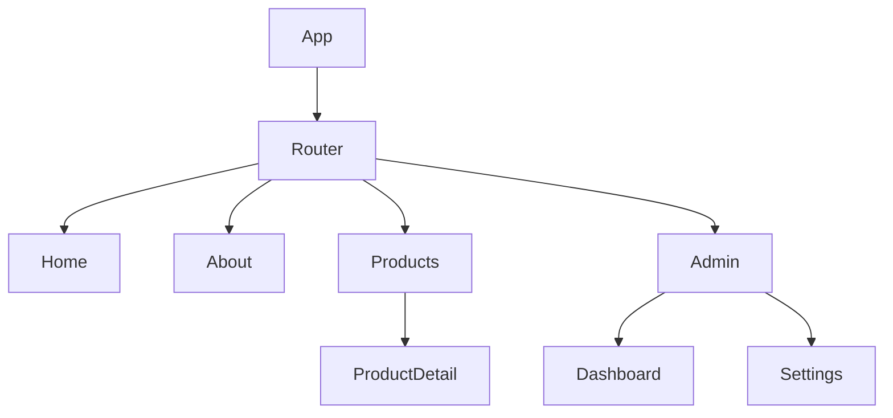
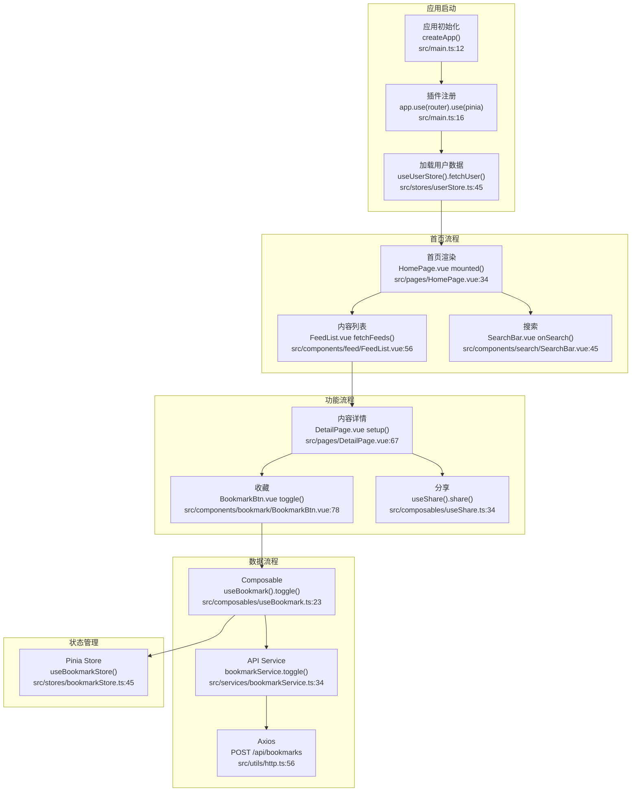
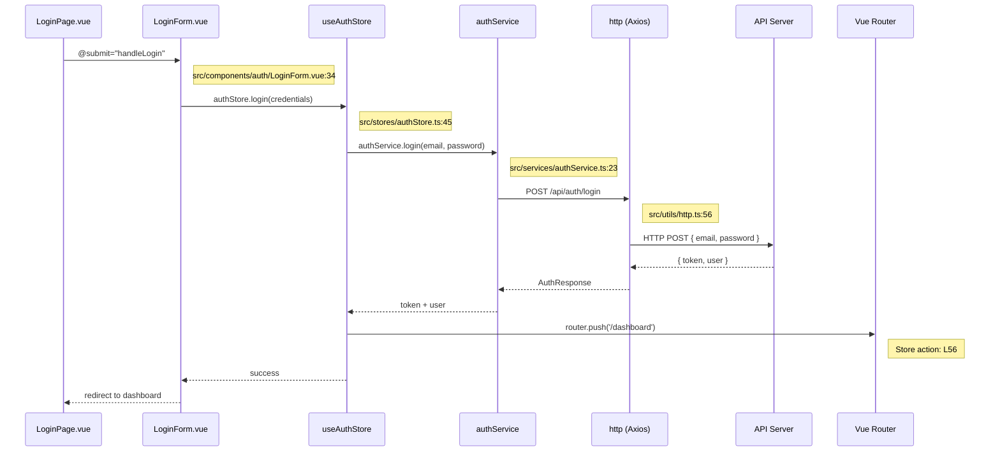
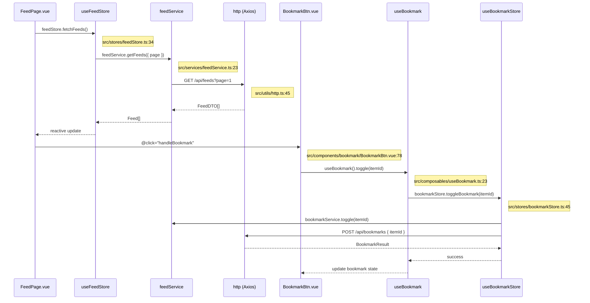
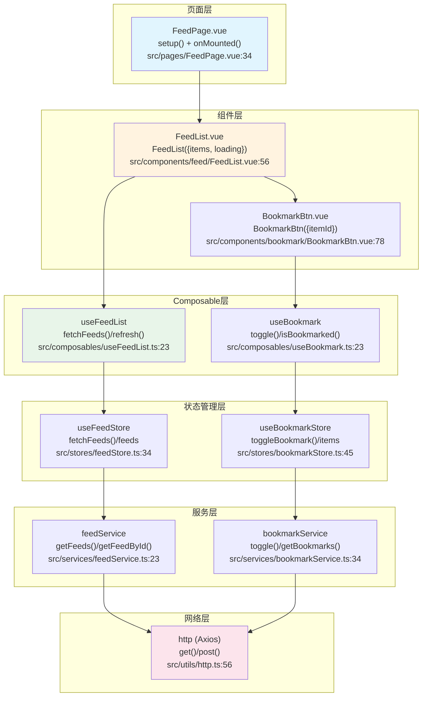

# Vue.js 前端项目架构模板

本文档为 Vue.js 前端项目提供详细的架构文档模板。

## Vue.js 特定章节

### V1. 技术栈详情

| 类别 | 技术 | 版本 | 说明 |
|------|------|------|------|
| 框架 | Vue.js | 3.4+ | 渐进式 JavaScript 框架 |
| 构建工具 | Vite | 5.x | 下一代前端构建工具 |
| 路由 | Vue Router | 4.x | 官方路由管理 |
| 状态管理 | Pinia | 2.x | 官方推荐状态管理 |
| UI 组件 | Element Plus / Ant Design Vue | - | UI 组件库 |
| HTTP | Axios | 1.x | HTTP 客户端 |
| 样式 | SCSS / Tailwind CSS | - | CSS 预处理器 |
| 类型 | TypeScript | 5.x | 类型系统 |
| 测试 | Vitest + Vue Test Utils | - | 单元测试 |
| E2E | Playwright / Cypress | - | 端到端测试 |

### V2. 架构模式

#### Composition API 架构
```
┌─────────────────────────────────────────┐
│              Views                      │
│  ┌─────────────────────────────────┐    │
│  │  Pages / Views                  │    │
│  │  页面组件，组合其他组件          │    │
│  └─────────────────────────────────┘    │
└─────────────────────────────────────────┘
                    │
┌─────────────────────────────────────────┐
│           Components                    │
│  ┌─────────────────────────────────┐    │
│  │  可复用组件                      │    │
│  │  使用 Composition API           │    │
│  └─────────────────────────────────┘    │
└─────────────────────────────────────────┘
                    │
┌─────────────────────────────────────────┐
│            Composables                  │
│  ┌─────────────────────────────────┐    │
│  │  可复用逻辑函数                  │    │
│  │  useXxx() 命名约定              │    │
│  └─────────────────────────────────┘    │
└─────────────────────────────────────────┘
                    │
┌─────────────────────────────────────────┐
│             Stores                      │
│  ┌─────────────────────────────────┐    │
│  │  Pinia Store                   │    │
│  │  状态管理                        │    │
│  └─────────────────────────────────┘    │
└─────────────────────────────────────────┘
```

### V3. 目录结构

```
src/
├── assets/          # 静态资源
├── components/      # 可复用组件
│   ├── common/      # 通用组件
│   └── business/    # 业务组件
├── composables/     # 组合式函数
├── layouts/         # 布局组件
├── pages/           # 页面
├── router/          # 路由配置
├── stores/          # Pinia stores
├── services/       # API 服务
├── types/          # TypeScript 类型
└── utils/          # 工具函数
```

### V4. 路由结构



### V5. 状态管理 (Pinia)

#### Store 示例
```typescript
// stores/user.ts
export const useUserStore = defineStore('user', {
  state: () => ({
    users: [] as User[],
    loading: false
  }),
  getters: {
    userCount: (state) => state.users.length
  },
  actions: {
    async fetchUsers() {
      this.loading = true
      // ...
      this.loading = false
    }
  }
})
```

### V6. 组件层次结构 (Atomic Design)

| 层级 | 示例 | 说明 |
|------|------|------|
| Atoms | Button, Input, Icon | 最小单元 |
| Molecules | SearchBar, UserCard | 简单组合 |
| Organisms | Header, Sidebar, DataTable | 复杂组件 |
| Templates | PageLayout | 页面模板 |
| Pages | HomePage, ProfilePage | 完整页面 |

### V7. API 服务层

```typescript
// services/user.ts
export const userService = {
  getUsers: () => axios.get('/users'),
  getUserById: (id: number) => axios.get(`/users/${id}`),
  createUser: (data: CreateUserDTO) => axios.post('/users', data),
  updateUser: (id: number, data: UpdateUserDTO) => axios.put(`/users/${id}`, data),
  deleteUser: (id: number) => axios.delete(`/users/${id}`)
}
```

### V8. 主要业务流程图 ★

> ⚠️ **每个节点必须标注方法名和代码位置（文件:行号）**。以下为 Vue 3 项目典型业务流程示例。

#### 12.1 项目整体业务流程



##### 12.1.1 业务流程步骤详解 ★

| 步骤编号 | 步骤名称 | 核心方法/API | 输入参数 | 返回结果 | 代码位置 | 说明 |
|----------|----------|-------------|----------|----------|----------|------|
| 1 | 应用初始化 | `createApp(App).mount('#app')` | `App`: 根组件, `#app`: 挂载点 | `App` 实例 | `src/main.ts:12` | Vue 3 应用入口 |
| 2 | 插件注册 | `app.use(router).use(createPinia())` | 各插件实例 | `App` 实例 | `src/main.ts:16` | 注册 Router/Pinia 等 |
| 3 | 加载用户数据 | `useUserStore().fetchUser()` | - | `Promise<void>` | `src/stores/userStore.ts:45` | 获取登录态 |
| 4 | 首页渲染 | `HomePage.vue onMounted()` | - | `void` | `src/pages/HomePage.vue:34` | 生命周期钩子触发数据加载 |
| 5 | 内容列表 | `FeedList.vue fetchFeeds()` | - | `void → ref feeds` | `src/components/feed/FeedList.vue:56` | 异步获取内容 |
| 6 | 搜索 | `SearchBar.vue emit('search', keyword)` | `keyword`: 搜索词 | `void` | `src/components/search/SearchBar.vue:45` | $emit 事件通知 |
| 7 | 内容详情 | `DetailPage.vue setup()` | `route.params.id` | `void` | `src/pages/DetailPage.vue:67` | Composition API setup |
| 8 | 收藏 | `BookmarkBtn.vue toggle()` | - | `void` | `src/components/bookmark/BookmarkBtn.vue:78` | 切换收藏状态 |
| 9 | Composable | `useBookmark().toggle(itemId)` | `itemId`: string | `Promise<void>` | `src/composables/useBookmark.ts:23` | 可复用逻辑 |
| 10 | API调用 | `bookmarkService.toggle(itemId)` | `itemId`: string | `Promise<BookmarkResult>` | `src/services/bookmarkService.ts:34` | Service 层 |
| 11 | HTTP请求 | `http.post('/api/bookmarks', { itemId })` | `body`: JSON | `Promise<AxiosResponse>` | `src/utils/http.ts:56` | Axios 实例 |

##### 12.1.2 关键步骤代码示例

###### 步骤 4：首页渲染

```vue
<!-- 📁 src/pages/HomePage.vue:34 -->
<script setup lang="ts">
import { onMounted, ref } from 'vue'
import { useFeedStore } from '@/stores/feedStore'

const feedStore = useFeedStore()
const isLoading = ref(false)                                         // L40

onMounted(async () => {                                              // L42
  isLoading.value = true
  await feedStore.fetchFeeds()                                       // L44: → Pinia action
  isLoading.value = false
})
</script>

<template>
  <main>
    <HeroBanner />
    <FeedList :items="feedStore.feeds" :loading="isLoading" />
  </main>
</template>
```

###### 步骤 9：收藏操作 (Composable)

```ts
// 📁 src/composables/useBookmark.ts:23
export function useBookmark() {
  const bookmarkStore = useBookmarkStore()
  const toast = useToast()

  const toggle = async (itemId: string) => {
    try {
      await bookmarkStore.toggleBookmark(itemId)                     // L29: → Pinia store
      toast.success('操作成功')                                        // L30
    } catch (error) {
      toast.error('操作失败')                                          // L32
    }
  }

  return { toggle, bookmarks: computed(() => bookmarkStore.items) }
}
```

###### Pinia Store 中的业务操作

```ts
// 📁 src/stores/bookmarkStore.ts:45
export const useBookmarkStore = defineStore('bookmark', {
  state: () => ({
    items: [] as Bookmark[],
    loading: false,
  }),
  actions: {
    async toggleBookmark(itemId: string) {
      this.loading = true                                            // L52
      try {
        await bookmarkService.toggle(itemId)                         // L54: → API Service
        await this.fetchBookmarks()                                  // L55: 刷新列表
      } finally {
        this.loading = false                                         // L57
      }
    },
    async fetchBookmarks() {
      this.items = await bookmarkService.getBookmarks()              // L61
    },
  },
})
```

#### 12.2 核心功能模块流程（时序图）★

##### 用户认证流程



**步骤详解**：

| 步骤 | 调用者 | 被调用者 | 方法签名 | 参数 | 返回 | 代码位置 | 说明 |
|------|--------|----------|----------|------|------|----------|------|
| 1 | LoginPage | LoginForm | `@submit="handleLogin(data)"` | `data: LoginFormData` | `void` | `src/components/auth/LoginForm.vue:34` | 表单提交 |
| 2 | LoginForm | useAuthStore | `authStore.login(credentials)` | `credentials: {email, password}` | `Promise<void>` | `src/stores/authStore.ts:45` | Pinia action |
| 3 | AuthStore | authService | `login(email, password)` | `email`, `password` | `Promise<AuthResponse>` | `src/services/authService.ts:23` | Service 层 |
| 4 | authService | http | `POST /api/auth/login` | `{email, password}` | `Promise<AxiosResponse>` | `src/utils/http.ts:56` | Axios POST |
| 5 | AuthStore | router | `router.push('/dashboard')` | `path`: string | `Promise<void>` | Store action L56 | 路由跳转 |

**关键代码示例**：

```ts
// 📁 src/stores/authStore.ts:45 - 认证 Store
export const useAuthStore = defineStore('auth', {
  state: () => ({
    user: null as User | null,
    token: '' as string,
    isAuthenticated: false,
  }),
  actions: {
    async login(credentials: { email: string; password: string }) {
      const { token, user } = await authService.login(              // L53
        credentials.email, credentials.password
      )
      this.token = token                                             // L55
      this.user = user                                               // L56
      this.isAuthenticated = true                                    // L57
      localStorage.setItem('token', token)                           // L58: 持久化
      await router.push('/dashboard')                                // L59: 路由跳转
    },
    logout() {
      this.$reset()                                                  // L62
      localStorage.removeItem('token')                               // L63
      router.push('/login')                                          // L64
    },
  },
})
```

##### 内容加载与收藏流程



**步骤详解**：

| 步骤 | 调用者 | 被调用者 | 方法签名 | 参数 | 返回 | 代码位置 | 说明 |
|------|--------|----------|----------|------|------|----------|------|
| 1 | FeedPage | useFeedStore | `feedStore.fetchFeeds()` | - | `Promise<void>` | `src/stores/feedStore.ts:34` | Pinia action |
| 2 | FeedStore | feedService | `getFeeds(params)` | `{page: number}` | `Promise<Feed[]>` | `src/services/feedService.ts:23` | Service 层 |
| 3 | feedService | http | `GET /api/feeds?page=1` | query params | `Promise<FeedDTO[]>` | `src/utils/http.ts:45` | Axios GET |
| 4 | BookmarkBtn | useBookmark | `useBookmark().toggle(itemId)` | `itemId: string` | `Promise<void>` | `src/composables/useBookmark.ts:23` | Composable |
| 5 | Composable | useBookmarkStore | `toggleBookmark(itemId)` | `itemId: string` | `Promise<void>` | `src/stores/bookmarkStore.ts:45` | Pinia action |
| 6 | BookmarkStore | bookmarkService | `toggle(itemId)` | `itemId: string` | `Promise<BookmarkResult>` | `src/services/bookmarkService.ts:34` | Service 层 |
| 7 | bookmarkService | http | `POST /api/bookmarks` | `{itemId}` | `Promise<Response>` | `src/utils/http.ts:56` | Axios POST |

#### 12.3 核心功能流程图（分层）★

##### 内容流分层流程



**步骤与API详解**：

| 步骤 | 组件 | 核心方法 | 参数类型 | 返回类型 | 代码位置 | 关键逻辑 |
|------|------|----------|----------|----------|----------|----------|
| 1 | FeedPage | `onMounted(() => fetchFeeds())` | - | `void` | `src/pages/FeedPage.vue:34` | Vue 生命周期钩子 |
| 2 | FeedList | `FeedList({items, loading})` | `items: Feed[]`, `loading: boolean` | 渲染列表 | `src/components/feed/FeedList.vue:56` | defineProps |
| 3 | BookmarkBtn | `BookmarkBtn({itemId})` | `itemId: string` | 收藏按钮 | `src/components/bookmark/BookmarkBtn.vue:78` | defineEmits/defineProps |
| 4 | useFeedList | `fetchFeeds()` | - | `void → ref feeds` | `src/composables/useFeedList.ts:23` | Composable 封装 |
| 5 | useBookmark | `toggle(itemId)` | `itemId: string` | `Promise<void>` | `src/composables/useBookmark.ts:23` | Composable 封装 |
| 6 | useFeedStore | `fetchFeeds()` | - | `Promise<void> → reactive feeds` | `src/stores/feedStore.ts:34` | Pinia action |
| 7 | feedService | `getFeeds(params)` | `FeedParams` | `Promise<Feed[]>` | `src/services/feedService.ts:23` | Axios 调用 |

#### 12.4 业务流程说明（含代码位置、API详情）★

| 流程名称 | 涉及模块 | 入口方法 | 核心API链路 | 参数/返回 | 代码位置 | 功能描述 |
|----------|----------|----------|-------------|-----------|----------|----------|
| 用户认证 | auth | `LoginForm @submit` | `authStore.login()` → `authService.login()` → `POST /api/auth/login` | `{email, password}` → `token + user` | `src/components/auth/LoginForm.vue:34` | Pinia + localStorage 持久化 |
| 首页加载 | feed | `FeedPage onMounted()` | `feedStore.fetchFeeds()` → `feedService.getFeeds()` → `GET /api/feeds` | `{page}` → `Feed[]` | `src/pages/FeedPage.vue:34` | 响应式数据绑定 |
| 内容详情 | detail | `DetailPage setup()` | `feedStore.fetchFeedById(route.params.id)` → `GET /api/feeds/:id` | `id: string` → `Feed` | `src/pages/DetailPage.vue:67` | Vue Router params |
| 搜索功能 | search | `SearchBar @search` | `useSearch().search(keyword)` → `searchService.search()` → `GET /api/search?q=` | `q: string` → `SearchResult[]` | `src/components/search/SearchBar.vue:45` | 防抖组合式函数 |
| 收藏操作 | bookmark | `BookmarkBtn @click` | `useBookmark().toggle()` → `bookmarkStore.toggleBookmark()` → `POST /api/bookmarks` | `itemId: string` → `void` | `src/components/bookmark/BookmarkBtn.vue:78` | Composable → Store → Service |
| 状态管理 | stores | `useXxxStore()` | `Pinia defineStore` → `actions` → `reactive state` | - → `reactive` | `src/stores/*.ts` | Pinia 响应式状态 |

## 标准章节参考

详见 [template.md](./template.md) 中的标准章节结构。
